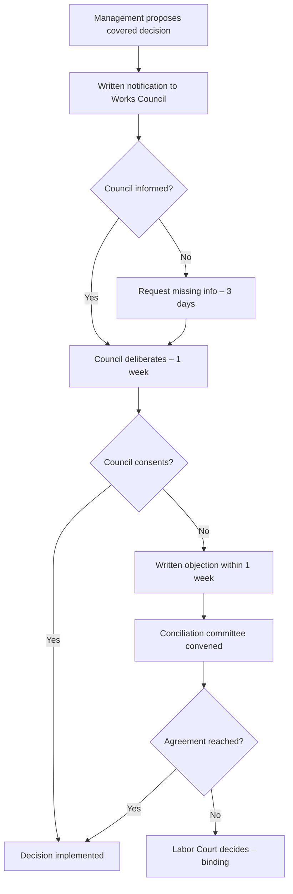

# Policy CORP-001: Works Council Charter (Betriebsrat Charta)

**Version:** 1.0
**Date:** 2026-07-18
**Status:** ACTIVE
**Owner:** Betriebsrat (Works Council)
**Classification:** INTERNAL - GOVERNANCE

---

## 1. Purpose & Legal Basis

This charter establishes the **Works Council (Betriebsrat)** as the legally mandated employee representation body per German Works Constitution Act (*Betriebsverfassungsgesetz - BetrVG*). The Works Council provides legally protected channels for employee feedback, whistleblowing, co-determination (*Mitbestimmung*), and veto rights over management decisions affecting working conditions.

**Legal Basis:**
- *Betriebsverfassungsgesetz (BetrVG)* §§ 1–130
- *Hinweisgeberschutzgesetz (HinSchG)* — Whistleblower Protection Act
- *Allgemeines Gleichbehandlungsgesetz (AGG)* — General Equal Treatment Act

---

## 2. Council Structure & Composition

### 2.1 Council Size (BetrVG § 9)

| Company Size (Employees) | Council Members | Deputy Members |
|--------------------------|-----------------|----------------|
| 5 – 20                   | 1               | 1              |
| 21 – 50                  | 3               | 2              |
| 51 – 150                 | 5               | 3              |
| 151 – 300                | 7               | 4              |
| 301 – 600                | 9               | 5              |
| 601 – 1,000              | 11              | 6              |
| 1,001 – 1,500            | 13              | 7              |
| 1,501 – 2,000            | 15              | 8              |
| 2,001 – 3,000            | 17              | 9              |
| 3,001 – 4,000            | 19              | 10             |
| 4,001 – 5,000            | 21              | 11             |
| 5,001 – 6,000            | 23              | 12             |
| 6,001 – 7,000            | 25              | 13             |
| 7,001 – 9,000            | 27              | 14             |
| 9,001 – 11,000           | 29              | 15             |
| 11,001 – 13,000          | 31              | 16             |
| 13,001 – 15,000          | 33              | 17             |
| 15,001 – 17,000          | 35              | 18             |

*Current company size: **51–150 employees → 5 council members + 3 deputies**.*

### 2.2 Election Cycle (BetrVG § 13–14)

| Parameter | Specification |
|-----------|---------------|
| Election cycle | Every 4 years (March–May) |
| Election period | March 1 – May 31 (election year) |
| Eligibility | All employees ≥ 18 years, employed ≥ 6 months |
| Candidacy | Employees ≥ 18 years, employed ≥ 6 months |
| Voting system | Proportional representation (listenwahl) or majority vote (personenwahl) |
| Term start | First working day after election results announced |
| Term end | Day before next election results announced |

### 2.3 Protected Status (BetrVG § 15, 103)

| Protection | Scope |
|------------|-------|
| Termination protection | Extraordinary termination only with Labor Court approval (§ 103 BetrVG) |
| Transfer protection | No transfer without council consent (§ 99 BetrVG) |
| Wage protection | Full wage continuation during council duties |
| Time off | Paid time off for council duties (§ 37 BetrVG) |
| Training budget | Employer-funded training per § 37(6) BetrVG (minimum 40 hrs/term per member) |
| Office & equipment | Employer provides office, IT, communication tools |

### 2.4 Council Leadership

| Role | Election | Term | Key Duties |
|------|----------|------|------------|
| Chairperson (*Vorsitzender*) | Elected by council | Council term | Chairs meetings, represents council externally, convenes meetings |
| Deputy Chairperson | Elected by council | Council term | Deputizes for chairperson |
| Secretary (*Schriftführer*) | Elected by council | Council term | Minutes, correspondence, document management |
| Treasurer (*Kassenwart*) | Elected by council | Council term | Budget management, expense tracking |

---

## 3. Co-Determination Rights (Mitbestimmungsrechte)

### 3.1 Enforceable Co-Determination (§ 87 BetrVG) — **Veto Right**

| Category | Specific Matters Requiring Council Consent |
|----------|--------------------------------------------|
| **Working Hours (§ 87(1) Nr. 1–3)** | Start/end times, break rules, overtime allocation, shift schedules, flex-time models, vacation planning principles |
| **Workplace Conduct (§ 87(1) Nr. 1)** | Dress code, behavioral rules, smoking/alcohol policies, private phone/internet use |
| **Compensation Systems (§ 87(1) Nr. 10–11)** | Bonus/commission schemes, performance pay models, piece-rate systems, suggestion schemes |
| **Health & Safety (§ 87(1) Nr. 7)** | Hazard assessments, PPE requirements, ergonomic standards, accident prevention |
| **Staffing Actions (§ 87(1) Nr. 6, § 99)** | Hiring criteria, job classifications, transfers, terminations, fixed-term contracts, temp workers |
| **Training (§ 87(1) Nr. 13)** | Training programs, qualification requirements, apprenticeship content |
| **IT Systems (§ 87(1) Nr. 6, 87(1a))** | Employee monitoring, performance tracking, AI tools, time-tracking, GPS, keystroke logging, video surveillance |
| **Social Facilities (§ 87(1) Nr. 9)** | Canteen rules, break rooms, parking, childcare |

> **Veto Mechanism:** If council withholds consent → mandatory conciliation committee (*Einigungsstelle*) → binding decision (§ 87(2) BetrVG).

### 3.2 Participation Rights (§ 80, 90–96 BetrVG) — **Consultation Only**

| Category | Management Obligation |
|----------|----------------------|
| Economic matters (§ 90) | Quarterly economic report, annual financial statements, investment plans |
| Personnel planning (§ 92) | Workforce planning, restructuring, mass layoffs (§ 17 KSchG) |
| Vocational training (§ 96) | Training plans, apprenticeship positions |
| Equal treatment (§ 80(1) Nr. 2a) | Gender equality, diversity, AGG compliance |
| Environmental protection (§ 80(1) Nr. 9) | Environmental impact of operations |

### 3.3 Information Rights (§ 80(2), 90 BetrVG)

- Monthly written report from management on economic/personnel matters
- Access to personnel files (anonymized for statistics)
- Access to wage/salary structures (anonymized)
- Right to inspect all documents relevant to co-determination

---

## 4. Veto Process (Widerspruchsverfahren)

### 4.1 Standard Veto Procedure (§ 87(2) BetrVG)



### 4.2 Timelines

| Step | Deadline | Legal Basis |
|------|----------|-------------|
| Management informs council | Before decision | § 87(2) BetrVG |
| Council requests missing info | 3 working days | § 80(2) BetrVG |
| Council deliberation period | 1 week (standard) / 2 weeks (terminations) | § 87(2), § 102 BetrVG |
| Written objection deadline | 1 week from full info | § 87(2) BetrVG |
| Conciliation committee convened | Within 1 week of objection | § 87(2) BetrVG |
| Conciliation decision | Typically 2–4 weeks | § 76 BetrVG |
| Labor Court appeal | 2 weeks from conciliation decision | § 87(2) BetrVG |

### 4.3 Conciliation Committee (*Einigungsstelle*)

| Composition | Chairperson (neutral) + equal employer/council representatives |
|-------------|----------------------------------------------------------------|
| Chair selection | By agreement; if none, Labor Court appoints |
| Decision | Binding on both parties |
| Costs | Borne by employer |
| Appeal | Labor Court (Arbeitsgericht) within 2 weeks |

---

## 5. Council Operations

### 5.1 Meetings

| Type | Frequency | Quorum | Notice |
|------|-----------|--------|--------|
| Ordinary meeting | Monthly (min. monthly) | ≥ 50% members | 3 working days, written agenda |
| Extraordinary meeting | On demand (chair or 1/4 members) | ≥ 50% members | 1 working day, stated purpose |
| Constitutive meeting | Within 1 week of election | All elected members | Called by election committee |

### 5.2 Decision Making

- Simple majority of members present
- Chair casts deciding vote on tie
- Minutes mandatory, signed by chair + secretary
- Minutes archived in `.opencode-state/betriebsrat/design/council-minutes/`

### 5.3 Committees (Standing)

| Committee | Members | Focus |
|-----------|---------|-------|
| Conciliation Committee (*Einigungsstelle*) | Chair + equal employer/council reps | Veto disputes |
| Health & Safety Committee (*Arbeitsschutzausschuss*) | 2 council + safety officer + company doctor | § 11 ASiG |
| Equal Opportunity Committee | 2 council + HR + management | § 80(1) Nr. 2a BetrVG |
| Youth & Trainee Representation (*JAV*) | Elected by <25yrs / trainees | § 60–73 BetrVG |

---

## 6. Budget & Resources

| Resource | Employer Obligation |
|----------|---------------------|
| Office space | Dedicated, lockable, accessible |
| Equipment | PC, printer, phone, video-conference |
| Budget | 0.15% of gross payroll (minimum €500/month) |
| Training | 40 hrs/term per member, paid + travel |
| Legal advice | External lawyer costs borne by employer (§ 40 BetrVG) |
| Expert consultants | For conciliation committee, technical assessments |

---

## 7. Documentation & State Management

### 7.1 Persistent State Directory

```
.opencode-state/betriebsrat/
├── design/
│   ├── council-structure.json
│   ├── co-determination-catalog.json
│   └── whistleblower-config.json
├── grievances/
│   └── BR-YYYYMMDD-HHMMSS-reporter.json
├── vetoes/
│   └── V-YYYYMMDD-HHMMSS-betriebsrat.json
└── minutes/
    └── BR-YYYYMMDD-minutes.json
```

### 7.2 ID Convention

| Artifact | ID Pattern |
|----------|------------|
| Grievance | `BR-YYYYMMDD-HHMMSS-reporter` |
| Veto | `V-YYYYMMDD-HHMMSS-betriebsrat` |
| Council minutes | `BR-YYYYMMDD-minutes` |

---

## 8. Version History

| Version | Date | Author | Changes |
|---------|------|--------|---------|
| 1.0 | 2026-07-18 | Betriebsrat Designer | Initial charter |
