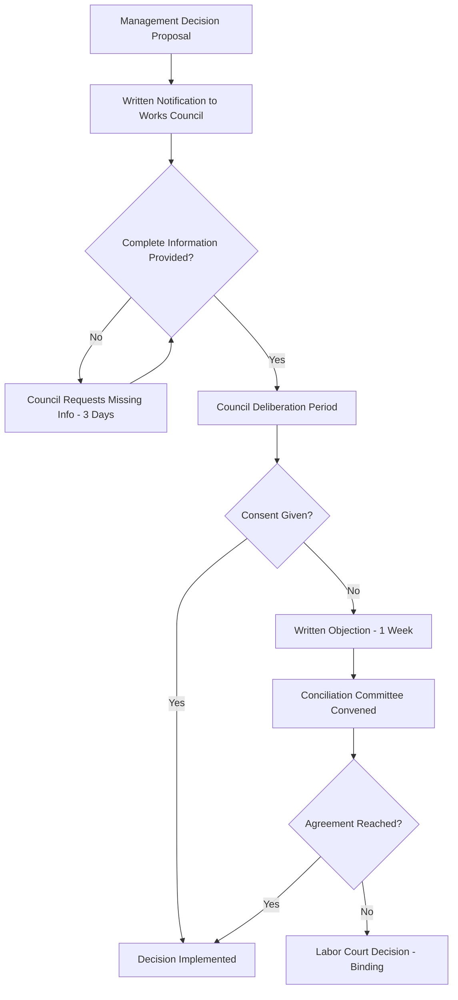

# SOP CORP-002: Veto Process (Widerspruchsverfahren)

**Version:** 1.0
**Date:** 2026-07-18
**Status:** ACTIVE
**Owner:** Betriebsrat / Works Council
**Classification:** INTERNAL - GOVERNANCE

---

## 1. Purpose & Legal Basis

This SOP defines the formal **veto procedure (*Widerspruchsverfahren*)** for Works Council co-determination rights under § 87 BetrVG. It ensures legally compliant objection handling, conciliation committee escalation, and binding dispute resolution.

**Legal Basis:**
- *Betriebsverfassungsgesetz (BetrVG)* § 87(2), § 76, § 80–87
- *Arbeitsgerichtsgesetz (ArbGG)* § 2a (Labor Court procedure)
- *Einigungsstellenverordnung* (Conciliation Committee Rules)

---

## 2. Scope — Matters Requiring Council Consent (§ 87 BetrVG)

| Category | § 87 Ref | Examples |
|----------|----------|----------|
| Working hours | Nr. 1–3 | Shift plans, overtime rules, break regulations, flex-time, vacation scheduling |
| Workplace conduct | Nr. 1 | Dress code, behavioral rules, smoking, private internet/phone use |
| Compensation systems | Nr. 10–11 | Bonus schemes, commission models, performance pay, suggestion schemes |
| Health & safety | Nr. 7 | Risk assessments, PPE, ergonomics, accident prevention |
| Staffing actions | Nr. 6, § 99 | Hiring criteria, terminations, transfers, job classifications, temp workers |
| Training | Nr. 13 | Training programs, qualification requirements |
| IT systems | Nr. 6, 87(1a) | Monitoring software, performance tracking, AI tools, time tracking, GPS, video surveillance |
| Social facilities | Nr. 9 | Canteen rules, break rooms, parking, childcare |

**Trigger:** Any management decision in above categories → mandatory council consultation before implementation.

---

## 3. Veto Procedure Workflow

### 3.1 Standard Timeline



### 3.2 Statutory Deadlines

| Step | Deadline | Legal Basis | Consequence of Miss |
|------|----------|-------------|---------------------|
| Management notifies council | Before decision | § 87(2) BetrVG | Decision voidable |
| Council requests missing info | 3 working days | § 80(2) BetrVG | Management must provide |
| Council deliberation | 1 week (standard) / 2 weeks (terminations) | § 87(2), § 102 BetrVG | Consent deemed given if silent |
| Written objection | 1 week from full info | § 87(2) BetrVG | Consent deemed given |
| Conciliation committee convened | 1 week from objection | § 87(2) BetrVG | Court can order convening |
| Conciliation decision | Typically 2–4 weeks | § 76 BetrVG | Binding on both parties |
| Labor Court appeal | 2 weeks from conciliation decision | ArbGG § 2a | Final binding decision |

---

## 4. Detailed Process Steps

### Step 1: Management Notification (§ 80(2), § 87(2) BetrVG)

**Required content:**
- Complete description of proposed measure
- Rationale & business justification
- Affected employee groups (anonymized if needed)
- Implementation timeline
- Alternative options considered
- Impact assessment (working conditions, health, equality)

**Format:** Written (email with read receipt + signed PDF in council portal)

**Portal location:** `.opencode-state/betriebsrat/vetoes/V-YYYYMMDD-HHMMSS-betriebsrat.json` (created by management)

### Step 2: Information Completeness Check (3 Working Days)

| Council Action | Management Response |
|----------------|---------------------|
| Review documentation | Provide missing items within 2 working days |
| Request supplementary info | Written response required |
| Declare info complete | Start deliberation clock |

### Step 3: Council Deliberation (1 Week / 2 Weeks for Terminations)

**Internal process:**
1. Chair convenes extraordinary meeting if needed
2. Affected employees consulted (anonymized)
3. Expert opinion requested if technical (IT, safety, legal)
4. Vote: simple majority of members present
5. Minutes recorded in council portal

**Outcomes:**
- **Consent** → Decision implemented
- **Objection** → Written notice to management within deadline
- **Abstention** → Treated as consent after deadline

### Step 4: Written Objection (Widerspruch)

**Required content:**
- Reference to management proposal (date, subject)
- Legal basis for objection (§ 87(1) Nr. X BetrVG)
- Substantive reasoning
- Proposed alternative / modification
- Signed by chairperson

**Delivery:** Registered mail + email + council portal

### Step 5: Conciliation Committee (*Einigungsstelle*)

#### 5.1 Composition

| Role | Appointment |
|------|-------------|
| Chairperson (neutral) | By agreement; failing that, Labor Court appoints |
| Employer representatives | Equal number to council reps, appointed by management |
| Council representatives | Equal number, appointed by Works Council |
| Total | Odd number (typically 3, 5, or 7) |

#### 5.2 Procedure

| Phase | Description |
|-------|-------------|
| Convening | Within 1 week of objection |
| Written submissions | Both sides submit position papers (1 week) |
| Oral hearing | Both sides present, witnesses/experts heard |
| Deliberation | Committee decides by majority |
| Decision | Written, reasoned, binding |

#### 5.3 Decision Scope

- Can modify, replace, or confirm management proposal
- Cannot decide matters outside § 87 scope
- Cannot violate laws, collective agreements, or works agreements
- Costs borne by employer (§ 76(5) BetrVG)

### Step 6: Labor Court Appeal (*Arbeitsgericht*)

**Grounds for appeal:**
- Procedural errors in conciliation
- Decision exceeds statutory scope
- Violation of higher-ranking law
- Gross unreasonableness

**Procedure:**
- File at competent Labor Court within 2 weeks
- Expedited procedure (typically 1–3 hearings)
- Decision final (appeal to LAG only on points of law)

---

## 5. Special Procedures

### 5.1 Terminations (§ 102 BetrVG) — **2-Week Objection Period**

| Termination Type | Council Role |
|------------------|--------------|
| Ordinary termination | Consultation mandatory; objection delays but doesn't block |
| Extraordinary termination | Consultation mandatory; objection required for validity |
| Mass layoff (§ 17 KSchG) | Social plan negotiation mandatory |

**Process:**
1. Management notifies council in writing with reasons
2. Council has 1 week (ordinary) / 3 days (extraordinary) to object
3. Objection must state reasons (social hardship, selection error, etc.)
4. If council objects → conciliation committee
5. Termination only effective after conciliation/court decision

### 5.2 Transfers (§ 99 BetrVG)

- Council must consent to transfers (> 1 month or significant change)
- 1-week objection period
- Refusal grounds: undue hardship, qualification mismatch, family reasons

### 5.3 Hiring (§ 99 BetrVG)

- Council consent required for each hire
- 1-week objection period
- Refusal only for objective reasons (qualifications, operational needs)

---

## 6. Documentation & State Management

### 6.1 Veto Case File

```
.opencode-state/betriebsrat/vetoes/
└── V-YYYYMMDD-HHMMSS-betriebsrat.json
```

**JSON Schema:**
```json
{
  "vetoId": "V-YYYYMMDD-HHMMSS-betriebsrat",
  "managementProposal": {
    "subject": "string",
    "category": "working-hours|conduct|compensation|safety|staffing|training|it|social",
    "legalBasis": "§ 87(1) Nr. X BetrVG",
    "submittedAt": "ISO8601",
    "submittedBy": "manager-id",
    "documents": ["doc-hash"]
  },
  "councilProcess": {
    "infoCompleteAt": "ISO8601",
    "deliberationStart": "ISO8601",
    "deliberationEnd": "ISO8601",
    "voteResult": {"consent": 3, "objection": 2, "abstain": 0},
    "minutesHash": "sha256"
  },
  "objection": {
    "filedAt": "ISO8601",
    "filedBy": "chairperson-id",
    "grounds": "string",
    "proposedAlternative": "string"
  },
  "conciliation": {
    "convenedAt": "ISO8601",
    "chairperson": "neutral-id",
    "employerReps": ["id"],
    "councilReps": ["id"],
    "hearingDate": "ISO8601",
    "decision": "string",
    "decisionDate": "ISO8601",
    "binding": true
  },
  "court": {
    "appealed": false,
    "courtCaseNumber": "string",
    "judgmentDate": "ISO8601",
    "outcome": "string"
  },
  "status": "notified|deliberating|objected|conciliation|decided|appealed|closed",
  "finalOutcome": "implemented|modified|withdrawn"
}
```

### 6.2 Race-Condition-Free Updates

- Single writer per phase (management → council → conciliation chair → court clerk)
- Atomic write: temp file → rename
- Status transitions logged with timestamp + actor ID

---

## 7. Templates

### 7.1 Management Notification Template

```
BETRIEBSRAT BENACHRICHTIGUNG § 87 BetrVG
===========================================
Datum: [DATE]
Von: [MANAGEMENT NAME/ROLE]
An: Betriebsratsvorsitzende(r)
Betreff: [SHORT TITLE] — Mitbestimmungspflichtige Maßnahme

1. GEGENSTAND DER MASSNAHME
   [Vollständige Beschreibung]

2. RECHTSGRUNDLAGE
   § 87 Abs. 1 Nr. [X] BetrVG

3. BETROFFENE MITARBEITER
   [Anonymisierte Gruppenbeschreibung]

4. BEGRÜNDUNG / BETRIEBLICHE NOTWENDIGKEIT
   [Detaillierte Begründung]

5. ALTERNATIVEN
   [Geprüfte Alternativen mit Begründung der Ablehnung]

6. WIRKUNGSANALYSE
   [Auswirkungen auf Arbeitsbedingungen, Gesundheit, Gleichbehandlung]

7. GEWÜNSCHTER UMSETZUNGSTERMIN
   [DATUM]

8. ANLAGEN
   [Liste der beigefügten Unterlagen]

Die einwöchige Frist für die Stellungnahme des Betriebsrats beginnt mit vollständigem Zugang dieser Unterlagen.

[UNTERSCHRIFT MANAGEMENT]
```

### 7.2 Council Objection Template

```
WIDERSPRUCH DES BETRIEBSRATS § 87 Abs. 2 BetrVG
=================================================
Datum: [DATE]
An: [MANAGEMENT]
Betreff: Widerspruch gegen [MASSNAHME] vom [DATE]

Der Betriebsrat widerspricht der oben genannten Maßnahme aus folgenden Gründen:

1. RECHTSGRUNDLAGE DES WIDERSPRUCHS
   § 87 Abs. 1 Nr. [X] BetrVG

2. BEGRÜNDUNG
   [Detaillierte sachliche Begründung]

3. VORSCHLAG ZUR EINIGUNG
   [Konkreter Alternativvorschlag oder Modifikation]

4. AUFFORDERUNG ZUR EINIGUNGSSTELLE
   Hiermit wird die Einberufung der Einigungsstelle beantragt.

Abstimmungsergebnis: [JA] Ja-Stimmen, [NEIN] Nein-Stimmen, [ENTHALTUNG] Enthaltungen

[UNTERSCHRIFT BETRIEBSRATSVORSITZENDER]
```

---

## 8. Escalation Matrix

| Situation | Escalation Path | Timeline |
|-----------|-----------------|----------|
| Management ignores objection | Labor Court (interim injunction) | Immediate |
| Council misses deadline | Consent deemed given | Automatic |
| Conciliation chair not agreed | Labor Court appoints | 1 week |
| Conciliation decision not implemented | Labor Court enforcement | Immediate |
| Retaliation against council member | Labor Court (§ 103 BetrVG) | Immediate |

---

## 9. Version History

| Version | Date | Author | Changes |
|---------|------|--------|---------|
| 1.0 | 2026-07-18 | Betriebsrat Designer | Initial SOP |
