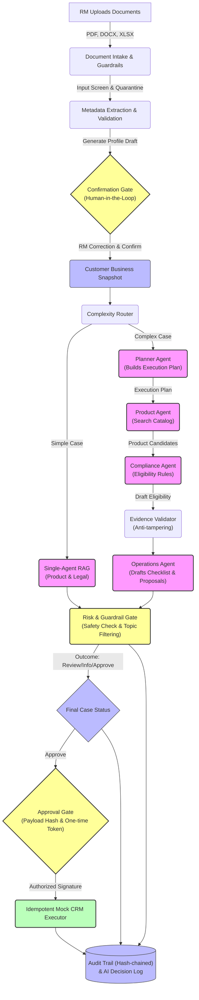

# SHB Corporate Sales Copilot — Enterprise Specialist Workspace (VAIC 2026)

> **Track:** Corporate Banking | **Team:** `<TEAM_NAME>` | **Status:** Sandbox MVP V2 Functional
>
> An AI-native assistant designed for Corporate Relationship Managers (RMs) at SHB, managing the end-to-end sales case lifecycle through a controlled multi-agent workflow, deterministic eligibility validation, and secure cryptographic execution.

---

## 1. One-Line Pitch
We help **SHB Corporate Relationship Managers (RMs)** solve **complex credit & service underwriting bottlenecks** by using a **controlled, multi-agent workflow** to produce **verifiable, policy-compliant opportunity drafts and action plans**.

---

## 2. Pain Points & Opportunities (Business Context)

### The Real-world Bottlenecks
*   **Manual Policy Overhead:** RMs spend days manually parsing complex, multi-layered B2B product regulations (Payroll, Cash Management, Bulk Payment, Working Capital) to check corporate eligibility.
*   **Compliance & Credit Risk:** High risk of human error or oversight in checking legal exclusions (such as bad debts, PEP list, AML, or complex industry restrictions), leading to potential financial loss.
*   **AI Hallucination & Lack of Trust:** Generic LLM chatbots (chatbot wrappers) hallucinate rules, fail to cite evidence, and cannot be trusted to perform banking operations.
*   **Security & Execution Vulnerabilities:** Unsecured AI outputs can be tricked via prompt injection or data leakage (PII), and lack cryptographic controls to prevent unauthorized action execution.

---

## 3. The AI-Native Solution

### Core Architectural Pillars
1.  **Controlled Multi-Agent Coordination:** Tasks are routed and sequenced through dedicated specialized agents (**Planner, Product, Compliance/Eligibility, Operations**) rather than an unrestricted single-agent chat.
2.  **Deterministic Eligibility Engine (Fail-Closed):** LLMs are restricted to information extraction and RAG grounding. The final eligibility decision (Pass/Fail) is executed by a deterministic, version-controlled rule engine.
3.  **Evidence-Backed Underwriting:** Every recommendation, product match, and action checklist is linked to a specific policy section with verification hashes, validating evidence authenticity (`is_valid`, anti-tampering).
4.  **Dual-Gate Human-in-the-Loop (HITL):**
    *   *Confirmation Gate:* RM reviews and confirms the extracted `Customer Business Snapshot` before downstream analysis begins.
    *   *Approval Gate:* Final transaction payloads are cryptographically frozen. RMs sign off with a secure, one-time use JWT approval token.
5.  **Robust Guardrails & Redaction:** Input screening blocks prompt injection and malware. The runtime log automatically redacts sensitive data (PII, credentials, tokens) before storing.

---

## 4. End-to-End Workflow Architecture

The system coordinates the relationship between document ingestion, agent reasoning, and secure execution:



### Flow Breakdown
1.  **Intake & Screening:** Documents undergo size, type, and prompt-injection checks. The text layer is parsed (or marked `NEEDS_OCR`).
2.  **Context Resolution:** Extracted attributes are compiled with existing CRM records. The RM reviews, edits, and freezes the **Customer Business Snapshot**.
3.  **Complexity Routing:** Simple inquiries go to direct RAG. Complex credit requests spawn a dependency plan via the **Planner Agent**.
4.  **Specialist Analysis:**
    *   **Product Agent** searches the catalog using Hybrid RAG.
    *   **Compliance Agent** evaluates candidates against eligibility rules.
    *   **Evidence Validator** audits the source text for anti-tampering and completeness.
    *   **Operations Agent** drafts checklists, proposals, and CRM payloads.
5.  **Risk & Guardrail Gate:** Audits the overall case (resolving to *Approve*, *Need Information*, or *Need Review* with a high-risk indicator if policy checks fail).
6.  **Secure Execution:** RMs approve the frozen transaction payload, generating a secure token for idempotent execution.

---

## 5. Key Features

| Feature | Description | AI Role | Business Value | Status |
|---|---|---|---|---|
| **Document Intake** | Multi-format parser (PDF, DOCX, XLSX, TXT) with validation. | Classifies docs & extracts core attributes. | Eliminates manual data entry. | **Working** |
| **Customer Snapshot** | Merges CRM, docs, and RM corrections. | Synthesizes conflicting data. | Single source of customer truth. | **Working** |
| **Complexity Router** | Classifies cases into simple or complex pipelines. | Evaluates query complexity. | Lowers latency & token costs. | **Working** |
| **Hybrid RAG** | Persistent Product/Legal index in SQLite or MCP. | Vector + Keyword retrieval with filters. | Zero hallucination domain grounding. | **Working** |
| **Eligibility Engine** | Deterministic rule checking for corporate loans. | Extracts rules; does NOT make decisions. | Fail-closed compliance compliance. | **Working** |
| **Risk Guardrail Gate** | Checks policy risk, validation, and injection. | Runs safety checks on inputs/outputs. | Banking-grade safety assurance. | **Working** |
| **Operations Engine** | Drafts checklist, proposals, and CRM task drafts. | Generates contextual B2B templates. | Cuts draft times by 90%. | **Working** |
| **Approval Service** | One-time token locked to frozen payload hash. | None (Deterministic cryptography). | Prevents unauthorized executions. | **Working** |
| **AI Decision Log** | Traceable case log (model, cost, latency, outcome). | Logs raw output metadata (sanitized). | Auditability and LLM observability. | **Working** |
| **OCR Service** | Scans PDFs/images without text layers. | Tesseract/GCP Vision adapter stub. | Enables scanning of physical files. | *Planned* |

---

## 6. Technology Stack

| Layer | Technology | Purpose |
|---|---|---|
| **Frontend** | Vanilla JS, HTML5, CSS3 | RM Workspace 3-column UI with interactive stepper, AI Log, and Audit panels. |
| **Backend** | Python 3.11, FastAPI, Pydantic | High-performance, async API facade with schema verification. |
| **Agent Workflow** | Custom State Machine (router, planner, specialist agents) | Controlled agent orchestration and impact-based state resumption. |
| **RAG System** | SQLite (Local), MCP SDK (Independent Service) | Hybrid keyword & vector retrieval, Bearer Auth, and branch ACL. |
| **LLM Provider** | OpenAI API (GPT-4o), Google Gemini API (fallback) | Text analysis, schema extraction, and planning. |
| **Storage / DB** | SQLite | Case persistent store, optimistic locking, and hash-chained audit events. |
| **Evaluation** | Pytest, Custom Scopes (40 golden cases, 45 security/reliability cases) | E2E assurance, regression safety, and single vs. multi-agent benchmarking. |

---

## 7. Directory Structure

```text
.
├── app/
│   ├── actions/          # Mock CRM action execution
│   ├── api/v2/           # API routes (40 endpoints)
│   ├── approval/         # Cryptographic payload-hash approval token service
│   ├── context/          # Customer profile builder & resolution logic
│   ├── data_catalog/     # Shared catalogs (Products, Rules, Exclusions)
│   ├── eligibility/      # Deterministic Eligibility check engine
│   ├── evaluation/       # Automated test & safety bench runners
│   ├── intake/           # File upload, validation, and extraction
│   ├── intent/           # Intent parser (LLM optional & Regex fallback)
│   ├── knowledge/        # Local RAG service & parsing utilities
│   ├── observability/    # JSON logger, metrics, and Audit Event hash chain
│   ├── product/          # Product recommender service
│   ├── reliability/      # Circuit breakers, Scoped TTL Cache, safe retry
│   ├── schemas/v2/       # Pydantic schema contracts matching plan_v2/contracts/
│   ├── static/           # RM UI (HTML, CSS, JS)
│   └── workflow/         # Complexity Router, Planner Agent, Risk Gate, state machine
├── services/
│   └── rag_mcp/          # Independent RAG MCP server (SDK 1.x, HTTP stateless)
├── tests/                # Unit, contract, RAG, and e2e integration tests
├── docs/                 # System guides, benchmarks, design documents, and audit logs
├── plan_v2/              # Modular implementation plans & machine-readable contracts
├── AI_LOG.md             # AI Collaboration Log (Integrity Audit)
└── README.md             # This document
```

---

## 8. RAG Provider Configuration (Local | MCP | Hybrid)

`app/knowledge/service.py` and `legal_service.py` route all queries according to the `RAG_PROVIDER` env variable:
*   `local` (default): Queries the local SQLite index. No MCP initialization occurs.
*   `mcp`: Uses the independent MCP server; fails with `RagProviderUnavailableError` if the server is down (no silent fallback).
*   `hybrid`: Queries the MCP server with a circuit breaker (`RAG_MCP_FAILURE_THRESHOLD`, `RAG_MCP_COOLDOWN_SECONDS`, `RAG_MCP_REQUEST_TIMEOUT_SECONDS`) and falls back to local indexing only for network/availability issues (not for policy/auth failures).

*For a detailed specification on circuit breakers, metrics, and logging, refer to [docs/RAG_PROVIDER_AND_FALLBACK.md](./docs/RAG_PROVIDER_AND_FALLBACK.md).*

### Independent RAG MCP Server
The service in `services/rag_mcp/` manages the corpus, chunking, and retrieval independently:
*   Official MCP Python SDK `1.x`, HTTP streamable.
*   Tools exposed: `rag_search`, `rag_get_chunk`, `rag_list_sources`, `rag_health`.
*   Bearer token auth and branch ACL checking.
*   To start the MCP server, run: `.\run_rag_mcp.cmd` (Endpoint: `http://127.0.0.1:8100/mcp`).
*   *For details, see [docs/RAG_MCP_SERVER.md](./docs/RAG_MCP_SERVER.md).*

---

## 9. Local Execution Guide

### Prerequisites
*   Python 3.11 (virtual environment configured)
*   SQLite3

### Quick Start
To start the FastAPI server and the local frontend mock:
```powershell
# In the repository root:
.\run_mock_demo.cmd
```
*If port 8000 is occupied, run with a custom port:*
```powershell
.\run_mock_demo.cmd 8010
```

### Accessing the Workspace
*   **Web UI:** `http://127.0.0.1:8000`
*   **Swagger OpenAPI Docs:** `http://127.0.0.1:8000/docs`
*   **API Health Check:** `http://127.0.0.1:8000/api/v2/health`

### Recommended UI Walkthrough
1.  Access the workspace using persona `RM-999`, session `SESS-MP`, and customer `Minh Phát · COMP-MP`.
2.  Select a mock scenario from the list and click **Tạo sales case**.
3.  Click **Tải lên & kiểm tra file** (using mock files provided) to upload the intake documents.
4.  Click **Chạy Document Intelligence** to extract the profile snapshot, verify sources, and resolve conflicts.
5.  Check the profile attributes, then click **Xác nhận context** (freezes snapshot).
6.  Click **Chạy phân tích end-to-end** and track agent processing from left to right.
7.  Check the **Nhật ký AI** (AI Decision Log) tab to see how agents resolved the credit rules.
8.  If eligible: Click **Xem payload** -> **RM phê duyệt** -> **Thực thi trên CRM mock** to complete the deal.

*Refer to [docs/MOCK_DEMO_GUIDE.md](./docs/MOCK_DEMO_GUIDE.md) for full case definitions.*

---

## 10. Verification and Automated Testing

Run the full automated test suite:
```powershell
# Run unit, contract, and RAG integration tests
.\.venv\Scripts\python.exe -m pytest -q

# Run business capability and evaluation benchmarks
.\.venv\Scripts\python.exe -m app.evaluation.runner --output data\eval\v2\latest_report.json

# Run safety, security, and reliability stress tests
.\.venv\Scripts\python.exe -m app.evaluation.safety_reliability_runner --output data\eval\v2\latest_safety_reliability_report.json

# Run Single-Agent vs. Multi-Agent benchmark (40 synthetic cases)
.\.venv\Scripts\python.exe -m benchmarks.run --cache-mode warm --output-dir benchmarks\results\latest
```

### Verified Benchmark Snapshot (2026-07-18)
*   **Tests passing:** `275 passed`, `0 failed`.
*   **Business accuracy:** `40/40` golden cases evaluated.
*   **Unsafe approval block rate:** `0%` (successfully blocked unauthorized executions).
*   **Legal RAG precision/recall:** `100% / 100%` on synthetic credit policies.
*   **Security & reliability coverage:** `25/25` security gates and `20/20` reliability cases passing.
*   **Multi-Agent Benchmarking:** Multi-Agent workflow achieved a `recall` of `0.889` for missing info and `0.833` for legal risk detection, compared to `0.0` in the single-agent pipeline (which bypasses the compliance engine entirely). *See [docs/SINGLE_VS_MULTI_AGENT_BENCHMARK.md](./docs/SINGLE_VS_MULTI_AGENT_BENCHMARK.md) for details.*

---

## 11. Production Boundaries & 3-Month Pilot Roadmap

While the sandbox MVP is fully functional, transitioning to SHB production requires addressing the following limitations:
*   **Real Data Integration:** Connecting to real SHB core banking systems, DMS, CRM, CIC, and AML PEP database.
*   **OCR Capability:** Activating a live OCR OCR API (GCP Document AI or Azure OCR) for scanned PDFs; the MVP currently requires text-layered PDFs.
*   **Enterprise Security:** Migrating from basic `X-Employee-ID` headers to OAuth2/OIDC SSO gateway and implementing AWS/GCP KMS key storage.
*   **Scalability:** Replacing SQLite backend with PostgreSQL/Redis and migrating vector embeddings to a production-grade store.

### Pilot Roadmap

| Phase | Timeline | Goal | Deliverable | Success Metric |
|---|---|---|---|---|
| **Phase 1** | Weeks 1–2 | Sandbox & Catalog Ingestion | Local workspace matching SHB corporate portfolio | 100% catalog ingestion correctness |
| **Phase 2** | Weeks 3–4 | Shadow Testing & Feedback | SME validation on 10 active RMs | RM satisfaction score > 4/5 |
| **Phase 3** | Month 2 | Controlled Pilot Run | Live CRM sync for 5 branches | Case handling time cut by 50% |
| **Phase 4** | Month 3 | Central Rollout Decision | Comprehensive pilot report and security sign-off | 0 critical security incidents |

---

## 12. AI Collaboration Statement

This project was built through AI-native collaboration. AI assisted the team with problem analysis, architecture design, implementation, debugging, evaluation, and documentation preparation. Human team members reviewed the outputs and made the final product, safety, and business decisions. See [`AI_LOG.md`](./AI_LOG.md) for the collaboration record.

---
## 13. Links & Artifacts

*   **Live Backend API:** `https://vaic-api.w9.nu` (`/health` → `{"status":"ok"}`)
*   **Live Frontend:** `https://vaic.w9.nu` (Flutter web, Cloudflare Pages project `rm-workspace`)
*   **Demo Video:** `<DEMO_VIDEO_URL>`
*   **AI Collaboration Audit Trail:** [`./AI_LOG.md`](./AI_LOG.md)
*   **Underwriting Benchmarks:** [`./docs/SINGLE_VS_MULTI_AGENT_BENCHMARK.md`](./docs/SINGLE_VS_MULTI_AGENT_BENCHMARK.md)
*   **RAG MCP Specification:** [`./docs/RAG_MCP_SERVER.md`](./docs/RAG_MCP_SERVER.md)

---

## 14. Production Deployment (VAIC2026)

### 14.1 Backend (`vaic-api.w9.nu`)
*   **Runtime:** FastAPI (`app.main:app`) on VPS `sgp1.w9.nu:2204`, served via `cloudflared` tunnel, systemd `vaic-api.service` (port `8000`).
*   **Data layer:** PostgreSQL 17 on `127.0.0.1:5432` (DB `vaic`). When `DATABASE_URL` is set, the enterprise CRM/IAM/SSO adapters (`app/integrations/pg.py`) replace the local SQLite mirrors transparently.
*   **Schema:** `deploy/postgres/schema.sql` — full KYC schema (`companies`, `financial_health`, `cic_risk_profiles`, `collaterals`, `ownership_structure`, `supply_chain_partners`, `transaction_behavior`, `customer_products`, `company_transaction_history`, `corporate_credit_requests`) plus legacy mirror tables (`customers`, `permissions`, `employees`) seeded from `tools/seed_postgres_enterprise.py`.
*   **LLM:** Google AI Studio `gemma-4-31b-it` via `GOOGLE_API_KEY` / `GOOGLE_ENDPOINT`.
*   **RAG MCP:** separate `vaic-mcp.service` (port `8100`); `RAG_PROVIDER=local` fallback enabled.

### 14.2 Frontend (`vaic.w9.nu`)
*   **Stack:** Flutter web build (`build/web`) deployed to Cloudflare Pages project **`rm-workspace`**; custom domain `vaic.w9.nu`.
*   **API target:** `lib/core/api_config.dart` → `kApiBaseUrl` defaults to `https://vaic-api.w9.nu` (override with `--dart-define=API_BASE_URL=…`).
*   **Deploy command:** `flutter build web --release && npx wrangler pages deploy build/web --project-name=rm-workspace`

### 14.3 Known limitations
*   Case/intake/employee pilot state still uses SQLite (`V2Repository`, `employee_db.py`); only the enterprise CRM/IAM/SSO source is on Postgres today.
*   Demo auth (`DEMO_AUTH_ENABLED=true`, password `demo1234`) is on for the live demo; replace with enterprise SSO before pilot.
