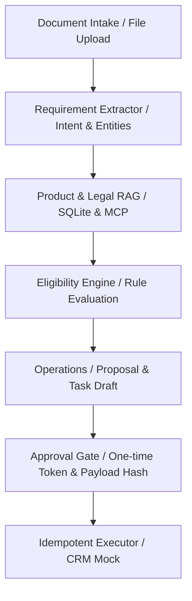
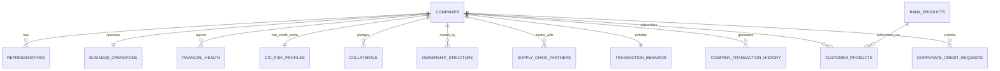

# Hướng dẫn chi tiết: Cơ sở dữ liệu (Database Schema) & Kiến trúc Backend V2

Tài liệu này cung cấp cái nhìn toàn cảnh về thiết kế cơ sở dữ liệu và cách thức vận hành của hệ thống Backend trong dự án **SHB Corporate Sales Copilot (V2)**.

---

## I. TỔNG QUAN KIẾN TRÚC BACKEND

Hệ thống Backend được xây dựng bằng **FastAPI** và quản lý luồng xử lý sales case thông qua một **Workflow Engine** được kiểm soát chặt chẽ (State Machine).



### Các thành phần chính của Backend:
1. **API Router (`app/api/v2/`)**: Expose 40 endpoint phục vụ nghiệp vụ (Tạo case, upload tài liệu, chạy phân tích, phê duyệt và thực thi).
2. **Workflow Engine (`app/workflow/engine.py`)**: Điều phối luồng xử lý vụ việc từ khi bắt đầu đến khi kết thúc.
3. **Intent Extractor (`app/intent/`)**: Trích xuất nhu cầu khách hàng từ văn bản sử dụng mô hình LLM hoặc bộ lọc deterministic fallback offline.
4. **Product & Legal RAG (`app/knowledge/`)**: Tra cứu chính sách sản phẩm và điều kiện pháp lý, hỗ trợ cả SQLite cục bộ lẫn MCP Server độc lập (`services/rag_mcp/`).
5. **Eligibility Engine (`app/eligibility/`)**: Đánh giá điều kiện cấp tín dụng/sản phẩm bằng Rule Engine cứng, đảm bảo tính nhất quán và an toàn (LLM không quyết định Pass/Fail).
6. **Approval & Executor (`app/approval/` & `app/actions/`)**: Tạo chữ ký bảo mật cho payload hành động và thực thi idempotent lên hệ thống core/CRM giả lập.

---

## II. THIẾT KẾ CƠ SỞ DỮ LIỆU (DATABASE SCHEMA)

Cơ sở dữ liệu của hệ thống sử dụng **PostgreSQL** (hoặc SQLite cho môi trường Sandbox) với khóa định danh trung tâm là Mã số thuế doanh nghiệp (`tax_id`).

### 1. Sơ đồ Quan hệ Thực thể (ERD)



### 2. Mô tả chi tiết các bảng dữ liệu

#### Nhóm 1: Định danh pháp lý & KYC
* **`companies`**: Lưu trữ thông tin định danh pháp lý cơ bản của doanh nghiệp (Mã số thuế, Tên doanh nghiệp, Hình thức pháp lý, Địa chỉ trụ sở, Trạng thái hoạt động).
* **`representatives`**: Danh sách người đại diện pháp luật, kế toán trưởng, ban giám đốc kèm theo trạng thái xác minh hồ sơ.

#### Nhóm 2: Vận hành & Tài chính doanh nghiệp
* **`business_operations`**: Mô tả ngành nghề hoạt động kinh tế (VSIC), quy mô nhân sự, số lượng nhà máy, địa điểm sản xuất và thâm niên trong ngành.
* **`financial_health`**: Dữ liệu báo cáo tài chính hàng năm (Tổng tài sản, Doanh thu, Lợi nhuận sau thuế, hàng tồn kho...) cùng các chỉ số tài chính tính toán sẵn (ROA, ROE, D/E ratio, Quick ratio).

#### Nhóm 3: Lịch sử tín dụng & Tài sản bảo đảm
* **`cic_risk_profiles`**: Điểm tín dụng CIC toàn ngành, nhóm nợ hiện tại (Nhóm 1 đến Nhóm 5), tổng dư nợ ngắn/trung/dài hạn và cờ lịch sử nợ xấu.
* **`collaterals`**: Danh sách tài sản bảo đảm (Bất động sản, máy móc thiết bị, phương tiện vận tải...) kèm theo giá trị định giá gần nhất.

#### Nhóm 4: Hệ sinh thái liên kết & Chuỗi cung ứng
* **`ownership_structure`**: Cơ cấu sở hữu của doanh nghiệp. Cột `is_major_shareholder` được tự động tính toán (True nếu tỷ lệ sở hữu >= 5%).
* **`corporate_relationships`**: Mối quan hệ sở hữu mẹ - con, liên kết hoặc cùng nhóm lợi ích để kiểm soát rủi ro tập trung hạn mức chéo.
* **`supply_chain_partners`**: Các đối tác mua/bán hàng chính trong chuỗi cung ứng doanh nghiệp để xác thực dòng tiền thương mại.

#### Nhóm 5: Dữ liệu giao dịch & Đăng ký sản phẩm
* **`transaction_behavior`**: Dữ liệu tổng hợp hành vi giao dịch nội bộ tại ngân hàng (Số dư CASA trung bình 3 tháng/12 tháng, tần suất giao dịch, uy tín trả nợ nội bộ).
* **`company_transaction_history`**: Nhật ký giao dịch chi tiết qua tài khoản (Thu/chi, đối tác giao dịch, nội dung giao dịch, số dư lũy kế).
* **`customer_products`**: Các sản phẩm và hạn mức tín dụng/bảo lãnh mà doanh nghiệp đang sử dụng.
* **`corporate_credit_requests`**: Hồ sơ đề nghị cấp tín dụng mới do khách hàng nộp (hoặc trích xuất từ biểu mẫu hồ sơ). Lưu thông tin về số tiền vay, kỳ hạn, lãi suất đề xuất, mục đích và tài sản đảm bảo tương ứng.

---

## III. CÁC TRUY VẤN ĐỐI CHIẾU NGHIỆP VỤ QUAN TRỌNG

Hệ thống backend sử dụng các câu truy vấn JOIN dưới đây để tự động hóa khâu thẩm định hồ sơ:

### 1. Kiểm tra điều kiện cấp tín dụng tự động (Eligibility Screening)
Kiểm tra xem hồ sơ đề xuất có vi phạm các quy tắc rủi ro cứng (nhóm nợ xấu CIC, đòn bẩy tài chính quá cao, hoặc tỷ lệ vay/tài sản đảm bảo LTV > 75%):

```sql
SELECT 
    request_id, company_name, tax_id,
    requested_amount_vnd / 1000000000.0 AS requested_amount_billion,
    ROUND(((requested_amount_vnd / 1000000000.0) / NULLIF(collateral_value_billion_vnd, 0)) * 100, 2) AS ltv_ratio_pct,
    cic_debt_classification, debt_to_equity_ratio,
    CASE 
        WHEN cic_debt_classification LIKE '%Nhóm 3%' OR cic_debt_classification LIKE '%Nhóm 4%' OR cic_debt_classification LIKE '%Nhóm 5%' THEN 'AUTO_REJECT (Nợ xấu CIC)'
        WHEN debt_to_equity_ratio > 3.0 THEN 'AUTO_REJECT (Đòn bẩy D/E > 3.0)'
        WHEN ((requested_amount_vnd / 1000000000.0) / NULLIF(collateral_value_billion_vnd, 0)) > 0.75 THEN 'AUTO_REJECT (LTV > 75%)'
        ELSE 'AUTO_PASS'
    END AS auto_assessment_status
FROM corporate_credit_requests
WHERE status = 'Pending';
```

### 2. Đối chiếu số dư CASA tự khai và thực tế giao dịch
Xác thực số dư CASA bình quân do khách hàng tự khai so với số dư trung bình thực tế tính từ lịch sử giao dịch 90 ngày gần nhất:

```sql
WITH last_txn_dates AS (
    SELECT tax_id, MAX(transaction_date) AS max_date FROM company_transaction_history GROUP BY tax_id
),
casa_actual_3m AS (
    SELECT 
        h.tax_id,
        ROUND(AVG(h.running_balance) / 1000000000.0, 4) AS actual_casa_avg_3m_billion
    FROM company_transaction_history h
    INNER JOIN last_txn_dates ltd ON h.tax_id = ltd.tax_id
    WHERE h.transaction_date >= (ltd.max_date - INTERVAL '90 days')
    GROUP BY h.tax_id
)
SELECT 
    r.request_id, r.company_name, r.tax_id,
    r.casa_avg_balance_billion_vnd AS casa_tu_khai_billion,
    COALESCE(c3m.actual_casa_avg_3m_billion, 0.00) AS casa_thuc_te_billion,
    ROUND((r.casa_avg_balance_billion_vnd - COALESCE(c3m.actual_casa_avg_3m_billion, 0.00)), 4) AS chenh_lech_billion,
    CASE 
        WHEN (r.casa_avg_balance_billion_vnd / NULLIF(c3m.actual_casa_avg_3m_billion, 0)) > 1.20 THEN 'CẢNH BÁO: Lệch số dư tự khai (>20%)'
        ELSE 'Hợp lệ'
    END AS danh_gia_trung_thuc
FROM corporate_credit_requests r
LEFT JOIN casa_actual_3m c3m ON r.tax_id = c3m.tax_id;
```
