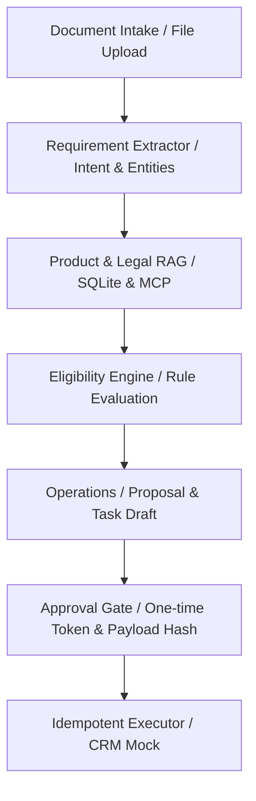
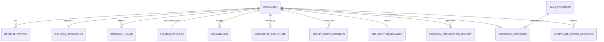

# Hướng dẫn chi tiết: Cơ sở dữ liệu (Database Schema) & Kiến trúc Backend V2

Tài liệu này cung cấp cái nhìn toàn cảnh về thiết kế cơ sở dữ liệu và cách thức vận hành của hệ thống Backend trong dự án **SHB Corporate Sales Copilot (V2)**.

---

## I. TỔNG QUAN KIẾN TRÚC BACKEND

Hệ thống Backend được xây dựng bằng **FastAPI** và quản lý luồng xử lý sales case thông qua một **Workflow Engine** được kiểm soát chặt chẽ (State Machine).



### Các thành phần chính của Backend:
1. **API Router (`app/api/v2/`)**: Expose 40 endpoint phục vụ nghiệp vụ (Tạo case, upload tài liệu, chạy phân tích, phê duyệt và thực thi).
2. **Workflow Engine (`app/workflow/engine.py`)**: Điều phối luồng xử lý vụ việc từ khi bắt đầu đến khi kết thúc.
3. **Intent Extractor (`app/intent/`)**: Trích xuất nhu cầu khách hàng từ văn bản sử dụng mô hình LLM hoặc bộ lọc deterministic fallback offline.
4. **Product & Legal RAG (`app/knowledge/`)**: Tra cứu chính sách sản phẩm và điều kiện pháp lý, hỗ trợ cả SQLite cục bộ lẫn MCP Server độc lập (`services/rag_mcp/`).
5. **Eligibility Engine (`app/eligibility/`)**: Đánh giá điều kiện cấp tín dụng/sản phẩm bằng Rule Engine cứng, đảm bảo tính nhất quán và an toàn (LLM không quyết định Pass/Fail).
6. **Approval & Executor (`app/approval/` & `app/actions/`)**: Tạo chữ ký bảo mật cho payload hành động và thực thi idempotent lên hệ thống core/CRM giả lập.

---

## II. THIẾT KẾ CƠ SỞ DỮ LIỆU (DATABASE SCHEMA)

Cơ sở dữ liệu của hệ thống sử dụng **PostgreSQL** (hoặc SQLite cho môi trường Sandbox) với khóa định danh trung tâm là Mã số thuế doanh nghiệp (`tax_id`).

### 1. Sơ đồ Quan hệ Thực thể (ERD)



### 2. Mô tả chi tiết các bảng dữ liệu

#### Nhóm 1: Định danh pháp lý & KYC
* **`companies`**: Lưu trữ thông tin định danh pháp lý cơ bản của doanh nghiệp (Mã số thuế, Tên doanh nghiệp, Hình thức pháp lý, Địa chỉ trụ sở, Trạng thái hoạt động).
* **`representatives`**: Danh sách người đại diện pháp luật, kế toán trưởng, ban giám đốc kèm theo trạng thái xác minh hồ sơ.

#### Nhóm 2: Vận hành & Tài chính doanh nghiệp
* **`business_operations`**: Mô tả ngành nghề hoạt động kinh tế (VSIC), quy mô nhân sự, số lượng nhà máy, địa điểm sản xuất và thâm niên trong ngành.
* **`financial_health`**: Dữ liệu báo cáo tài chính hàng năm (Tổng tài sản, Doanh thu, Lợi nhuận sau thuế, hàng tồn kho...) cùng các chỉ số tài chính tính toán sẵn (ROA, ROE, D/E ratio, Quick ratio).

#### Nhóm 3: Lịch sử tín dụng & Tài sản bảo đảm
* **`cic_risk_profiles`**: Điểm tín dụng CIC toàn ngành, nhóm nợ hiện tại (Nhóm 1 đến Nhóm 5), tổng dư nợ ngắn/trung/dài hạn và cờ lịch sử nợ xấu.
* **`collaterals`**: Danh sách tài sản bảo đảm (Bất động sản, máy móc thiết bị, phương tiện vận tải...) kèm theo giá trị định giá gần nhất.

#### Nhóm 4: Hệ sinh thái liên kết & Chuỗi cung ứng
* **`ownership_structure`**: Cơ cấu sở hữu của doanh nghiệp. Cột `is_major_shareholder` được tự động tính toán (True nếu tỷ lệ sở hữu >= 5%).
* **`corporate_relationships`**: Mối quan hệ sở hữu mẹ - con, liên kết hoặc cùng nhóm lợi ích để kiểm soát rủi ro tập trung hạn mức chéo.
* **`supply_chain_partners`**: Các đối tác mua/bán hàng chính trong chuỗi cung ứng doanh nghiệp để xác thực dòng tiền thương mại.

#### Nhóm 5: Dữ liệu giao dịch & Đăng ký sản phẩm
* **`transaction_behavior`**: Dữ liệu tổng hợp hành vi giao dịch nội bộ tại ngân hàng (Số dư CASA trung bình 3 tháng/12 tháng, tần suất giao dịch, uy tín trả nợ nội bộ).
* **`company_transaction_history`**: Nhật ký giao dịch chi tiết qua tài khoản (Thu/chi, đối tác giao dịch, nội dung giao dịch, số dư lũy kế).
* **`customer_products`**: Các sản phẩm và hạn mức tín dụng/bảo lãnh mà doanh nghiệp đang sử dụng.
* **`corporate_credit_requests`**: Hồ sơ đề nghị cấp tín dụng mới do khách hàng nộp (hoặc trích xuất từ biểu mẫu hồ sơ). Lưu thông tin về số tiền vay, kỳ hạn, lãi suất đề xuất, mục đích và tài sản đảm bảo tương ứng.

---

## III. CÁC TRUY VẤN ĐỐI CHIẾU NGHIỆP VỤ QUAN TRỌNG

Hệ thống backend sử dụng các câu truy vấn JOIN dưới đây để tự động hóa khâu thẩm định hồ sơ:

### 1. Kiểm tra điều kiện cấp tín dụng tự động (Eligibility Screening)
Kiểm tra xem hồ sơ đề xuất có vi phạm các quy tắc rủi ro cứng (nhóm nợ xấu CIC, đòn bẩy tài chính quá cao, hoặc tỷ lệ vay/tài sản đảm bảo LTV > 75%):

```sql
SELECT 
    request_id, company_name, tax_id,
    requested_amount_vnd / 1000000000.0 AS requested_amount_billion,
    ROUND(((requested_amount_vnd / 1000000000.0) / NULLIF(collateral_value_billion_vnd, 0)) * 100, 2) AS ltv_ratio_pct,
    cic_debt_classification, debt_to_equity_ratio,
    CASE 
        WHEN cic_debt_classification LIKE '%Nhóm 3%' OR cic_debt_classification LIKE '%Nhóm 4%' OR cic_debt_classification LIKE '%Nhóm 5%' THEN 'AUTO_REJECT (Nợ xấu CIC)'
        WHEN debt_to_equity_ratio > 3.0 THEN 'AUTO_REJECT (Đòn bẩy D/E > 3.0)'
        WHEN ((requested_amount_vnd / 1000000000.0) / NULLIF(collateral_value_billion_vnd, 0)) > 0.75 THEN 'AUTO_REJECT (LTV > 75%)'
        ELSE 'AUTO_PASS'
    END AS auto_assessment_status
FROM corporate_credit_requests
WHERE status = 'Pending';
```

### 2. Đối chiếu số dư CASA tự khai và thực tế giao dịch
Xác thực số dư CASA bình quân do khách hàng tự khai so với số dư trung bình thực tế tính từ lịch sử giao dịch 90 ngày gần nhất:

```sql
WITH last_txn_dates AS (
    SELECT tax_id, MAX(transaction_date) AS max_date FROM company_transaction_history GROUP BY tax_id
),
casa_actual_3m AS (
    SELECT 
        h.tax_id,
        ROUND(AVG(h.running_balance) / 1000000000.0, 4) AS actual_casa_avg_3m_billion
    FROM company_transaction_history h
    INNER JOIN last_txn_dates ltd ON h.tax_id = ltd.tax_id
    WHERE h.transaction_date >= (ltd.max_date - INTERVAL '90 days')
    GROUP BY h.tax_id
)
SELECT 
    r.request_id, r.company_name, r.tax_id,
    r.casa_avg_balance_billion_vnd AS casa_tu_khai_billion,
    COALESCE(c3m.actual_casa_avg_3m_billion, 0.00) AS casa_thuc_te_billion,
    ROUND((r.casa_avg_balance_billion_vnd - COALESCE(c3m.actual_casa_avg_3m_billion, 0.00)), 4) AS chenh_lech_billion,
    CASE 
        WHEN (r.casa_avg_balance_billion_vnd / NULLIF(c3m.actual_casa_avg_3m_billion, 0)) > 1.20 THEN 'CẢNH BÁO: Lệch số dư tự khai (>20%)'
        ELSE 'Hợp lệ'
    END AS danh_gia_trung_thuc
FROM corporate_credit_requests r
LEFT JOIN casa_actual_3m c3m ON r.tax_id = c3m.tax_id;
```

---

## IV. CÁC TRUY VẤN NÂNG CAO (ADVANCED USE CASES)

Các truy vấn dưới đây dùng để phân tích sâu hơn dòng tiền, quản lý rủi ro nhóm lợi ích và phòng chống rửa tiền (AML):

### 1. Rủi ro tích lũy toàn nhóm liên kết (Group-wide Exposure)
Tính tổng dư nợ hiện tại và tổng hạn mức mới đề xuất của cả nhóm công ty con/liên kết (Cùng nhóm lợi ích) để kiểm soát giới hạn an toàn tín dụng nhóm (dưới 150 tỷ VNĐ):

```sql
WITH RECURSIVE group_network AS (
    SELECT 
        parent_tax_id AS root_tax_id,
        child_tax_id AS member_tax_id,
        relationship_type,
        1 AS level
    FROM corporate_relationships
    UNION ALL
    SELECT 
        gn.root_tax_id,
        cr.child_tax_id AS member_tax_id,
        cr.relationship_type,
        gn.level + 1
    FROM group_network gn
    INNER JOIN corporate_relationships cr ON gn.member_tax_id = cr.parent_tax_id
    WHERE gn.level < 5
)
SELECT 
    c_root.company_name AS tap_doan_me,
    COUNT(DISTINCT gn.member_tax_id) AS so_luong_thanh_vien_nhom,
    ROUND(SUM(cic.outstanding_short_term + cic.outstanding_medium_term + cic.outstanding_long_term) / 1000000000.0, 2) AS tong_du_no_hien_tai_nhom_ty,
    ROUND(SUM(r.requested_amount_vnd) / 1000000000.0, 2) AS tong_han_muc_de_xuat_nhom_ty,
    CASE 
        WHEN ROUND(SUM(r.requested_amount_vnd) / 1000000000.0, 2) > 150.0 THEN 'RẤT NGUY HIỂM: Vượt giới hạn nhóm (>150 tỷ)'
        WHEN ROUND(SUM(r.requested_amount_vnd) / 1000000000.0, 2) BETWEEN 100.0 AND 150.0 THEN 'CẢNH BÁO: Cận biên giới hạn nhóm'
        ELSE 'Hạn mức nhóm an toàn'
    END AS danh_gia_han_muc_nhom
FROM companies c_root
INNER JOIN group_network gn ON c_root.tax_id = gn.root_tax_id
INNER JOIN cic_risk_profiles cic ON gn.member_tax_id = cic.tax_id
LEFT JOIN corporate_credit_requests r ON gn.member_tax_id = r.tax_id
GROUP BY c_root.company_name
ORDER BY tong_du_no_hien_tai_nhom_ty DESC;
```

### 2. Chu kỳ tiền mặt của doanh nghiệp (Working Capital Cycle)
Tính toán Số ngày phải thu (DSO), Số ngày phải trả (DPO) và Chu kỳ chuyển đổi tiền mặt (CCC) từ báo cáo tài chính để thẩm định thời hạn cho vay vốn lưu động ngắn hạn:

```sql
SELECT 
    c.company_name,
    f.fiscal_year,
    f.net_revenue / 1000000000.0 AS doanh_thu_thuan_ty,
    f.inventory / 1000000000.0 AS hang_ton_kho_ty,
    f.receivables / 1000000000.0 AS phai_thu_khach_hang_ty,
    f.payables / 1000000000.0 AS phai_tra_nha_cung_cap_ty,
    ROUND((f.receivables / NULLIF(f.net_revenue, 0)) * 365, 0) AS so_ngay_phai_thu_dso,
    ROUND((f.payables / NULLIF(f.net_revenue, 0)) * 365, 0) AS so_ngay_phai_tra_dpo,
    ROUND(((f.receivables + f.inventory - f.payables) / NULLIF(f.net_revenue, 0)) * 365, 0) AS chu_ky_tien_mat_ccc_days,
    CASE 
        WHEN ROUND(((f.receivables + f.inventory - f.payables) / NULLIF(f.net_revenue, 0)) * 365, 0) > 90 THEN 'Chu kỳ dài: Cần tài trợ vốn'
        ELSE 'Chu kỳ ngắn: Dòng tiền tự chủ tốt'
    END AS nhan_dinh_dong_von
FROM companies c
INNER JOIN financial_health f ON c.tax_id = f.tax_id
ORDER BY c.company_name, f.fiscal_year DESC;
```

### 3. Xác thực chi trả Lương và Thuế qua lịch sử giao dịch
Đánh giá mức độ minh bạch vận hành doanh nghiệp trong 6 tháng qua thông qua dữ liệu giao dịch nộp thuế nhà nước và thanh toán lương đều đặn:

```sql
SELECT 
    r.request_id,
    r.company_name,
    r.tax_id,
    bo.employee_count AS so_nhan_vien_khai_bao,
    ROUND(SUM(CASE WHEN h.category = 'Lương' OR h.description ILIKE '%luong%' OR h.description ILIKE '%payroll%' THEN h.debit_amount ELSE 0 END) / 1000000.0, 2) AS tong_chi_luong_6m_trieu_vnd,
    COUNT(CASE WHEN h.category = 'Lương' OR h.description ILIKE '%luong%' OR h.description ILIKE '%payroll%' THEN 1 END) AS so_lan_chi_luong,
    ROUND(SUM(CASE WHEN h.category = 'Thuế' OR h.description ILIKE '%thue%' OR h.description ILIKE '%nop thue%' THEN h.debit_amount ELSE 0 END) / 1000000.0, 2) AS tong_nop_thue_6m_trieu_vnd,
    CASE 
        WHEN COUNT(CASE WHEN h.category = 'Lương' OR h.description ILIKE '%luong%' THEN 1 END) >= 6 THEN 'VẬN HÀNH TỐT (Trả lương đều đặn mỗi tháng)'
        WHEN SUM(CASE WHEN h.category = 'Thuế' OR h.description ILIKE '%thue%' THEN h.debit_amount ELSE 0 END) = 0 THEN 'CẢNH BÁO: Chưa phát hiện giao dịch nộp thuế'
        ELSE 'Cần kiểm tra bổ sung bảng lương giấy'
    END AS danh_gia_van_hanh
FROM corporate_credit_requests r
INNER JOIN company_transaction_history h ON r.tax_id = h.tax_id
LEFT JOIN business_operations bo ON r.tax_id = bo.tax_id
WHERE h.transaction_date >= (SELECT MAX(transaction_date) FROM company_transaction_history) - INTERVAL '180 days'
GROUP BY r.request_id, r.company_name, r.tax_id, bo.employee_count;
```

### 4. Truy tìm người hưởng lợi cuối cùng (AML - Ultimate Beneficial Owner)
Truy vết đệ quy từ cơ cấu sở hữu cổ đông là các tổ chức để tìm ra các cá nhân nắm quyền sở hữu gián tiếp tích lũy đạt tỷ lệ `>= 25%`:

```sql
WITH RECURSIVE ubo_tracing AS (
    SELECT 
        o.tax_id AS target_tax_id,
        o.shareholder_name AS holder_name,
        o.national_id_or_tax_id AS holder_id,
        o.ownership_percentage AS direct_pct,
        o.ownership_percentage AS cumulative_pct,
        1 AS depth
    FROM ownership_structure o
    UNION ALL
    SELECT 
        ut.target_tax_id,
        o_next.shareholder_name AS holder_name,
        o_next.national_id_or_tax_id AS holder_id,
        o_next.ownership_percentage AS direct_pct,
        (ut.cumulative_pct * o_next.ownership_percentage / 100.0) AS cumulative_pct,
        ut.depth + 1
    FROM ubo_tracing ut
    INNER JOIN ownership_structure o_next ON ut.holder_id = o_next.tax_id
    WHERE ut.depth < 4
)
SELECT 
    c.company_name AS doanh_nghiep_nop_don,
    ut.holder_name AS co_dong_ca_nhan_to_chuc,
    ut.holder_id AS ma_dinh_danh,
    ROUND(SUM(ut.cumulative_pct), 2) AS tong_ty_le_so_huu_tich_luy_pct,
    CASE 
        WHEN SUM(ut.cumulative_pct) >= 25.0 THEN 'UBO (Cổ đông hưởng lợi cuối cùng - Bắt buộc KYC)'
        ELSE 'Cổ đông thành viên'
    END AS phan_loai_kyc
FROM ubo_tracing ut
INNER JOIN companies c ON ut.target_tax_id = c.tax_id
GROUP BY c.company_name, ut.holder_name, ut.holder_id
ORDER BY tong_ty_le_so_huu_tich_luy_pct DESC;
```

```
