# SHB Corporate Sales Copilot Implementation Plan

Nguồn yêu cầu: `plan.md` (repo root). Tài liệu ban đầu là repository audit + implementation plan; đến bản cập nhật `2026-07-17`, các hạng mục local MVP đã được triển khai. Các mục gap/`PROPOSED DESIGN` phía dưới được giữ làm dấu vết quyết định tại thời điểm audit; trạng thái as-built chính thức nằm ở mục 1, `plan_v2/PROGRESS.md` và `docs/BUILD_V2_LOG.md`.

---

## 1. Executive Conclusion

```text
LOCAL/SANDBOX MVP IMPLEMENTED — PRODUCTION INTEGRATION REQUIRED
```

**Trạng thái as-built:**

- Document Intake đã có ở `app/intake/`, gồm upload theo case, kiểm tra file, classify/extract, provenance/confidence/conflict, prompt-injection quarantine và persistent processing state.
- Customer Business Snapshot đã có contract tại `app/schemas/v2/intake.py`, merge CRM mock + document + RM correction, revision hash và RM confirmation gate.
- Planner/NBQ/NBA đã có tại `app/workflow/planner.py` và `app/workflow/next_best.py`; workflow replan từ Eligibility và chỉ mở Operations/Approval khi đủ điều kiện.
- Product RAG, Legal RAG, deterministic Eligibility, Evidence Validator, Operations, approval payload freeze, one-time token và idempotent mock executor đã nối end-to-end.
- Public facade có `19` route dưới `/api/v2/sales-cases`; toàn `/api/v2` có `39` route.
- RM Workspace đã thành hành trình năm bước, ba cột; có case mẫu, output kỳ vọng, profile review, approval và tab Nguồn/Nhật ký AI/Audit/JSON.
- AI Decision Log theo case ghi module, model/mode, prompt/rule/workflow version, source, latency, token/cost và output summary đã sanitize; không lưu raw PII/secret.
- Bằng chứng hiện tại: `172 passed`; business `40/40`; security `25/25`; reliability `20/20`; browser E2E và RAG MCP transport E2E đều hoàn tất.

**Ranh giới:** bản hiện tại hoàn chỉnh cho local/sandbox synthetic MVP, chưa production-ready. OCR scan, semantic embedding benchmark, dữ liệu/policy SHB thật, SSO/IAM/CRM/DMS/KYC/CIC thật, centralized telemetry, retention/KMS, load/penetration/DR test và sign-off vẫn là `DATA/INTEGRATION REQUIRED`.

---

## 2. Repository Audit Method

Phương pháp kiểm tra (tuân thủ mục 1 của `plan.md`):

1. Đọc trực tiếp: `README.md`, `docs/BUILD_V2_LOG.md`, `docs/V2_READINESS_REPORT.md`, `docs/UI_INFORMATION_ARCHITECTURE.md`, `app/main.py`, `app/config.py`, `app/static/index.html` (toàn bộ 359 dòng), `app/api/v2/router.py` (toàn bộ 709 dòng), `app/schemas/v2/shared_case_state.py`, `.env.v2.example`.
2. Chạy độc lập: `pytest -q` (không lấy số liệu từ tài liệu tự báo cáo mà không xác minh — xem mục 38 về kết quả thật). Lần xác minh gần nhất sau triển khai RAG MCP: **172 passed, 1 warning in 10.86s**.
3. Giao 4 tác vụ con (sub-agent) đọc song song, mỗi tác vụ chỉ đọc code + test thật, trả về trích dẫn `file:line`, không được suy đoán:
   - `app/knowledge/`, `app/data_catalog/`.
   - `app/intent/`, `app/product/`, `app/eligibility/`, `app/operations/`, `app/workflow/`.
   - `app/actions/`, `app/approval/`, `app/storage/`.
   - `app/reliability/`, `app/observability/`, `app/evaluation/`.
4. Đối chiếu chéo: mọi kết luận quan trọng (đặc biệt phần Document Intake) được xác nhận từ ít nhất 2 nguồn độc lập (ví dụ: UI + router + agent audit đều xác nhận `documents` là metadata, không phải file).

Giới hạn của phương pháp: browser QA đã chạy happy path end-to-end; case missing-information/cross-scope/unsafe input được kiểm tra bằng API automated tests. Không có quyền truy cập hệ thống SHB thật để đối chiếu nghiệp vụ, dữ liệu, IAM, CRM hoặc OCR provider.

---

## 3. Current Repository Architecture

> **Historical audit snapshot:** Mermaid và inventory/gap ở mục 3–5 mô tả repo trước Change set 10. Giữ lại để truy vết quyết định build; không dùng làm trạng thái hiện hành. Trạng thái as-built xem mục 1 và `docs/BUILD_V2_LOG.md`.

`HISTORICAL REPOSITORY FACT`: Mermaid dưới đây mô tả kiến trúc tại thời điểm audit ban đầu — không phải trạng thái as-built hiện hành.

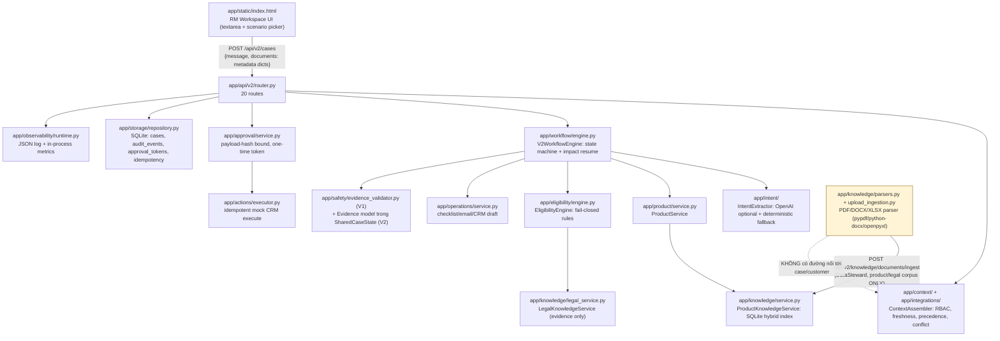

Điểm mấu chốt: `app/knowledge/parsers.py` (parser PDF/DOCX/XLSX thật) đã tồn tại nhưng chỉ nối vào nhánh ingest kho tri thức (viền vàng), **không có đường nối** tới `ContextAssembler`/`SharedCaseState` của một case cụ thể.

---

## 4. Current Repository Inventory

| Module | File chính | Vai trò hiện tại | Bằng chứng |
|---|---|---|---|
| Contracts | `app/schemas/v2/*.py` | Pydantic mirror của JSON Schema (`plan_v2/contracts/`); `SharedCaseState` có `schema_version, case_id, trace_id, status, context, request, intent_result, workflow, product_result, eligibility_result, operations_result, evidences, approval, audit_events` | `app/schemas/v2/shared_case_state.py:112-136` |
| Context | `app/context/`, `app/integrations/` | RBAC scope, freshness/staleness, precedence 6-tier, conflict detection, provenance (`ResolvedValue`) | `app/context/assembler.py` |
| Intent | `app/intent/` (11 file, 704 dòng) | Trích intent đa ý định; gọi `AsyncOpenAI` nếu `INTENT_USE_LLM=true` VÀ có `OPENAI_API_KEY`, ngược lại/khi lỗi dùng `DeterministicIntentExtractor` (regex/keyword) | `app/intent/extractor.py:10,36-39,52-65`; mặc định tắt LLM `app/config.py:15` |
| Product | `app/product/service.py` (88 dòng) | Gọi `ProductKnowledgeService.search`, gắn điểm, trả `"eligibility": "unknown"` (cố ý, không tự kết luận) | `app/product/service.py:15,51` |
| Product knowledge | `app/knowledge/{service,index,ingestion,models}.py` | Ingest catalog JSON, index hybrid (hash-embedding + sparse) SQLite, lọc ACL/effective-date | `app/knowledge/service.py:20-67` |
| Eligibility | `app/eligibility/{engine,registry,models}.py` (233 dòng) | Rule engine fail-closed, versioned, nguồn trích dẫn; LLM không được quyết định pass/fail (tự khai trong docstring) | `app/eligibility/engine.py:1,16` |
| Operations | `app/operations/service.py` (157 dòng) | Checklist hợp nhất, email/case/task draft, dedup key, content hash; `external_side_effects` luôn `[]` | `app/operations/service.py:77-99` |
| Workflow | `app/workflow/{engine,state_machine,impact}.py` (307 dòng) | State machine 12 trạng thái, resume theo impact graph, loop-guard tối đa 3 | `app/workflow/state_machine.py:12`, `engine.py:93-98` |
| Knowledge parsers | `app/knowledge/parsers.py` (162 dòng) | Parse PDF (`pypdf`)/DOCX (`python-docx`)/XLSX (`openpyxl`)/txt/md/csv/json → `List[ParsedSection]` (chunk-shaped, không phải field-shaped) | `app/knowledge/parsers.py:13-18,71-162` |
| Upload ingestion | `app/knowledge/upload_ingestion.py` | Governed: cần Data Source Card đã duyệt, chạy `screen_input` chống prompt-injection, index vào kho tri thức | `app/knowledge/upload_ingestion.py:21-83` |
| Approval | `app/approval/service.py` (86 dòng) | Token HMAC ràng buộc `payload_hash` + `case_id` + `approver_id` + `permission` + `expires_at`; one-time-use thật thi hành ở DB (`UPDATE...WHERE status='issued'`) | `app/approval/service.py:35-86`; `app/storage/repository.py:215-221` |
| Execution | `app/actions/executor.py` (60 dòng) | Kiểm tra status/eligibility/evidence/payload khớp draft đông cứng trước khi thực thi mock; idempotent theo `idempotency_key` | `app/actions/executor.py:22-60` |
| Storage | `app/storage/repository.py` (245 dòng) + `migrations.py` | SQLite 4 bảng, optimistic locking theo `version`, audit hash-chain (`prev_hash/event_hash`) có hàm verify | `app/storage/repository.py:56-91,120-144,161-206` |
| Observability | `app/observability/runtime.py` (46 dòng) | JSON log theo dòng, redact theo TÊN field cố định (`token, approval_token, secret, password, email_body, identity_number`); counter in-process | `app/observability/runtime.py:14-46` |
| Reliability | `app/reliability/patterns.py` (102 dòng) | `retry_safe` (chặn retry non-idempotent), `CircuitBreaker`, `ScopedTTLCache` (khoá theo scope+version) — đều generic, tái sử dụng được | `app/reliability/patterns.py:16-102` |
| Evaluation | `app/evaluation/{runner,safety_reliability_runner}.py` + `data/eval/v2/*.json` | 40 case nghiệp vụ (15 intent/15 retrieval/10 eligibility) + 25 case security + 20 case reliability, đều gắn `"synthetic": true` | `data/eval/v2/golden_cases.json` (theo báo cáo agent, xem mục 38 để đối chiếu số liệu test thật) |
| API | `app/api/v2/router.py` (709 dòng) | 20 route dưới `/api/v2`, xác thực bằng header `X-Employee-ID`/`X-Session-ID` (không phải SSO thật) | Danh sách đầy đủ ở mục 31 |
| UI | `app/static/index.html` (359 dòng) | 1 trang, dropdown case mẫu + textarea + checkbox tài liệu giả; hiển thị context/intent/product/eligibility/operations/evidence/audit | Toàn bộ file |
| V1 (baseline cũ) | `app/main.py:43-141`, `app/agents/*`, `app/services/orchestrator.py` | API `/api/v1` giữ để tương thích; kiến trúc đơn giản hơn V2 (ToolRegistry đã nối cho Legal/Operations, EvidenceValidator có Lớp 1+2 — xem `plan/BUILD_STATUS.md`) | `app/main.py:19,29,43-141` |
| Document Intake & Customer Profile Builder | — | `NOT FOUND IN CURRENT REPOSITORY` | Xem mục 1 |
| RM Sales Case Wizard | — | `NOT FOUND IN CURRENT REPOSITORY` (chỉ có dropdown + textarea + checkbox) | `app/static/index.html:84-117` |
| Customer Business Snapshot schema | — | `NOT FOUND IN CURRENT REPOSITORY` | Grep toàn `app/`, xem mục 1 |
| OCR | — | `NOT FOUND IN CURRENT REPOSITORY` | Grep `OCR|ocr` trong `app/` = 0 kết quả |
| OpenTelemetry/tracing thật | — | `NOT FOUND IN CURRENT REPOSITORY` (chỉ có trong `plan_v2/13_STORAGE_OBSERVABILITY_RELIABILITY.md` như đề xuất) | Grep `opentelemetry|jaeger|otel` trong `app/` = 0 kết quả |

---

## 5. Current vs Target Gap Analysis

| Component | Current implementation | Evidence path | Target requirement (plan.md) | Gap | Decision |
|---|---|---|---|---|---|
| RM input UI | Dropdown case mẫu + 1 textarea tự do + 1 checkbox | `app/static/index.html:84-117` | Wizard 5 bước, field rời (tên DN, MST, ngành, người liên hệ, ưu tiên...) | Thiếu toàn bộ wizard; textarea tự do đã đúng tinh thần "không JSON" | MODIFY |
| File upload | 1 nút upload file thật nhưng chỉ cho kho tri thức, không cho case | `app/static/index.html:113-117`, `router.py:581-626` | Multi-file upload gắn với case, nhiều loại tài liệu | Thiếu route/luồng upload theo case | ADD |
| Document processing | Parser PDF/DOCX/XLSX thật nhưng tách rời khỏi case; không OCR | `app/knowledge/parsers.py` | Parse/OCR/Classify/Extract/Cross-check theo case | Có nền tảng parser, thiếu OCR, thiếu route theo case, thiếu classify/extract field | ADD (tái dùng parser) |
| Structured extraction | Không có; `Customer.attributes` là dict tự do từ CRM giả lập | `app/integrations/crm.py`, `context_snapshot.py` | Field-level extraction có confidence/source/status | `NOT FOUND` | ADD |
| Human verification | Có PATCH sửa 5 field cố định của context (không phải review-toàn-bộ-profile sau extraction) | `app/api/v2/router.py:363-427`, UI `correctContext()` | Review grid mọi field trích xuất, Confirm/Edit | Có cơ chế correction tổng quát (field path + provenance) có thể tái dùng, thiếu UI review hàng loạt | MODIFY |
| Planner Agent | `V2WorkflowEngine` (state machine + DAG task + impact resume), không phải LLM planner tự do | `app/workflow/engine.py` | Planner nhận Customer Business Snapshot đã confirm | Cần nhận thêm input mới, logic lõi giữ nguyên | MODIFY (input contract) |
| Product Agent | `ProductService` + `ProductKnowledgeService`, deterministic, không tự kết luận eligibility | `app/product/service.py` | Giữ nguyên hành vi mô tả trong plan.md | Không có gap hành vi đáng kể | KEEP |
| Legal Agent | `EligibilityEngine` (rule) + `LegalKnowledgeService` (RAG evidence-only) | `app/eligibility/engine.py` | Giữ nguyên | Không có gap hành vi đáng kể | KEEP |
| Operations Agent | `OperationsService`, không gửi action thật | `app/operations/service.py` | Giữ nguyên | Không có gap | KEEP |
| Shared state | `SharedCaseState` đã có `intent_result/product_result/eligibility_result/operations_result` | `shared_case_state.py:127-131` | Thêm được `customer_profile`/snapshot | Thiếu field mới; `product_result`/`eligibility_result`/`operations_result` đang là `Dict[str, Any]` lỏng, không phải model riêng | MODIFY |
| Evidence Validator | V2: field `Evidence` trong state + `is_valid`; V1: `app/safety/evidence_validator.py` có Lớp 1+2 (xem `plan/PROGRESS.md`) | `shared_case_state.py:69-82` | Giữ nguyên nguyên tắc no-hallucination | Không có gap kiến trúc; cần thêm evidence cho field trích xuất mới | MODIFY (mở rộng phạm vi evidence) |
| Human approval | Payload-hash bound, one-time DB-enforced, TTL | `app/approval/service.py` | Giữ nguyên | Không có gap; ghi nhận `nonce` có sinh nhưng không được kiểm tra lại (không phải lỗ hổng vì one-time-use thật nằm ở DB, nhưng tên gọi "nonce" gây hiểu nhầm) | KEEP (note nhỏ) |
| Opportunity creation | `crm_case_draft` trong Operations, thực thi qua `ActionExecutorV2` | `app/actions/executor.py` | Giữ nguyên | Không có gap | KEEP |
| Task creation | `task_drafts` trong Operations | `app/operations/service.py:77-99` | Giữ nguyên | Không có gap | KEEP |
| Audit log | Hash-chain SQLite, verify được, redact theo tên field | `app/storage/repository.py:161-206,242-245` | Giữ nguyên | Redaction chỉ theo tên field, không quét nội dung — cần đánh giá thêm khi thêm field nhạy cảm mới từ document intake | MODIFY (mở rộng danh sách field redact) |

**Target architecture — `PROPOSED DESIGN`:**

```mermaid
flowchart TD
    RM["RM Sales Case Wizard"] --> IAM["IAM + case access check"]
    IAM --> INTAKE["Document Intake API"]
    INTAKE --> SAFE["MIME/size/hash/malware placeholder/prompt-injection screen"]
    SAFE --> PARSE["Parser + OCR fallback"]
    PARSE --> EXTRACT["Document classification + schema-guided extraction"]
    EXTRACT --> VALIDATE["Deterministic validation + normalization"]
    VALIDATE --> MERGE["Cross-document merge + conflict + confidence"]
    MERGE --> REVIEW["RM review/edit/confirm"]
    REVIEW --> SNAPSHOT["Confirmed Customer Business Snapshot"]
    SNAPSHOT --> PLANNER["Planner: initial plan"]
    PLANNER --> PRODUCT["Product Agent + Product RAG"]
    PRODUCT --> LEGAL["Eligibility rules + Legal RAG evidence"]
    LEGAL --> REPLAN["Planner: re-plan from legal result"]
    REPLAN --> NB["Next Best Questions + Next Best Actions"]
    NB --> OPS["Operations: checklist + email/proposal/CRM/task drafts"]
    OPS --> EVIDENCE["Evidence Validator + guardrails"]
    EVIDENCE --> APPROVAL["RM approval bound to frozen payload"]
    APPROVAL --> EXECUTOR["Idempotent mock CRM/task executor"]
    EXECUTOR --> AUDIT["Case state + immutable audit + metrics"]
```

---

## 6. Components to Keep

- Context assembly + provenance/precedence (`app/context/`, `app/integrations/`) — 45 test (19+13+... xem mục 38), RBAC fail-closed đã kiểm chứng.
- Contracts kép Pydantic + JSON Schema (`app/schemas/v2/`) — tránh model tự chế lệch schema.
- Intent extractor có fallback an toàn khi không có API key (`app/intent/`).
- Product/Eligibility/Operations service — đúng nguyên tắc "không tự kết luận" (`"eligibility": "unknown"` ở Product; Eligibility fail-closed; Operations không side-effect thật).
- Workflow state machine + impact-based resume (`app/workflow/`).
- Approval payload-hash-bound one-time token, Storage optimistic locking + audit hash-chain.
- Reliability primitives (`retry_safe`, `CircuitBreaker`, `ScopedTTLCache`) — generic, dùng lại được cho adapter OCR/LLM extraction mới.
- Evaluation harness (golden/security/reliability runner) — mở rộng thêm case cho extraction thay vì viết lại.
- Parser PDF/DOCX/XLSX (`app/knowledge/parsers.py`) — tái dùng cho document intake thay vì viết parser mới.

## 7. Components to Modify

- `SharedCaseState`: thêm field mới (xem mục 20), giữ nguyên field cũ (additive, không phá schema_version hiện tại — cần bump version, xem mục 34/47).
- `CaseStatus` state machine: chèn thêm trạng thái intake TRƯỚC `new` (xem mục 33).
- UI `app/static/index.html`: thêm các bước wizard/upload/review, giữ nguyên toàn bộ khối "Kết luận xử lý/Hành động ưu tiên" hiện có làm màn hình sau khi confirm profile.
- `merge_documents`/`WorkspaceDocument`: mở rộng để nhận kết quả extraction thay vì chỉ metadata do caller tự khai.
- `app/observability/runtime.py`: mở rộng danh sách field bị redact khi có thêm field nhạy cảm từ hồ sơ người đại diện (số CCCD/CMND, ngày sinh...).

## 8. Components to Add

- `app/intake/` (đặt tên theo `plan.md` mục 12, ánh xạ vào cấu trúc hiện có — xem mục 30): `upload_service`, `document_classifier`, `structured_extractor`, `field_validator`, `document_merger`, `conflict_detector`, `confidence_service`, `customer_profile_builder`.
- OCR adapter (interface thay thế được, ban đầu có thể `NOT IMPLEMENTED`/stub trả lỗi rõ ràng thay vì giả vờ hoạt động — xem mục 16).
- Schema `CustomerBusinessSnapshot` mới trong `app/schemas/v2/` (không tạo ở nơi khác, theo đúng luật "models nằm ở app/schemas/" đã áp dụng nhất quán trong repo — xem `plan_v2/PROGRESS.md` mục 5).
- API case-scoped: `POST /api/v2/cases/{id}/documents/upload` (multipart, khác với `POST /api/v2/cases/{id}/documents` hiện tại là JSON metadata).
- RM Sales Case Wizard (5 bước) trong UI.
- Bảng SQLite mới cho case documents/extraction (xem mục 32).
- Golden eval set cho structured extraction (precision/recall theo field).

## 9. Components to Remove

Không có thành phần nào cần xoá. Không tìm thấy code chết liên quan trực tiếp tới luồng intake cần dọn (dọn dẹp code chết ở tầng V1 `app/tools/` đã thực hiện trong đợt audit trước, xem `plan/BUILD_STATUS.md` mục 9).

---

## 10. Product Context

`CURRENT REPOSITORY FACT` + `PROPOSED CHANGE` (giữ nguyên theo `plan.md`, đã khớp với README hiện tại):

- SHB là khách hàng mua/triển khai. RM là người dùng trực tiếp. Khách hàng doanh nghiệp là đối tượng được phục vụ, không truy cập hệ thống.
- Tên sản phẩm trong `plan.md`: **SHB Corporate Sales Copilot**. Tên hiện tại trong code/README: **Corporate Expert Workspace V2** (`README.md:1`, `app/static/index.html:6`). `ASSUMPTION`: đây là cùng một sản phẩm ở giai đoạn đặt tên khác nhau — cần xác nhận với RM/PM có đổi tên trong code/UI hay giữ tên hiện tại.
- Use case chính: Corporate Banking Sales Opportunity Resolution — khớp với luồng `intent → product → eligibility → operations → approval → execute` đã có.

## 11. User and Stakeholder Definition

| Vai trò | Đã có trong code? | Bằng chứng |
|---|---|---|
| RM (người dùng) | Có, qua header `X-Employee-ID` (`MockSSOAdapter`/`MockIAMAdapter`) | `app/integrations/sso.py`, `app/integrations/iam.py` |
| SHB (chủ hệ thống) | Ngụ ý qua RBAC/scope, chưa có vai trò "SHB admin" tường minh | `app/context/employee_service.py` |
| Khách hàng doanh nghiệp | Chỉ là dữ liệu (`Customer`), không có tài khoản/đăng nhập | `app/schemas/v2/context_snapshot.py` |
| Data Steward (quản trị kho tri thức) | Có, quyền `knowledge:write` | `app/api/v2/router.py:628-683` (theo báo cáo audit) |

## 12. Revised User Journey

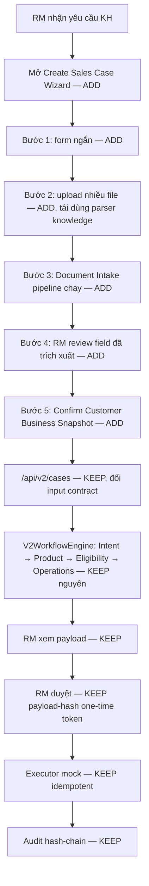

---

## 13. RM Sales Case Wizard

`PROPOSED DESIGN` — chưa có trong code (mục 1). Theo đúng mục 4.1 của `plan.md`, ánh xạ vào hạ tầng hiện có:

| Bước | Field | Ghi chú kỹ thuật |
|---|---|---|
| 1 — Thông tin cơ bản | Tên DN, MST, ngành, người liên hệ, nội dung nhu cầu, ghi chú RM, ưu tiên, sản phẩm đang dùng | Map vào `Request.text` (nhu cầu, giữ nguyên tự do) + field mới trong `CustomerBusinessSnapshot.company_identity` (mục 20) |
| 2 — Tải tài liệu | Multi-file, các loại ở mục 7 | Cần route mới `POST /cases/{id}/documents/upload` (multipart, khác route JSON hiện tại) |
| 3 — Trạng thái xử lý | `Uploaded/Validating/Parsing/OCR/Classifying/Extracting/Cross-checking/Ready for Review/Failed` | Cần bảng `document_processing_jobs` (mục 32); UI có thể tái dùng khối "Thanh tiến trình" đã có (`app/static/index.html:64`, hàm `renderJourney`) nhưng thêm nhánh trạng thái mới |
| 4 — RM kiểm tra | Value/source/page/confidence/status/edit/confirm theo field | Tái dùng cơ chế provenance đã có (`ResolvedValue` — `app/schemas/v2/common.py`) thay vì phát minh field mới |
| 5 — Xác nhận | `Confirm Customer Profile & Start Analysis` | Chỉ sau bước này mới gọi `POST /cases` (V2WorkflowEngine) — đúng yêu cầu "chỉ chuyển Planner sau khi confirm" |

`DATA REQUIRED`: danh sách ngành nghề chuẩn hoá (enum) chưa có trong repo — cần SHB cung cấp hoặc dùng danh sách tự do có gợi ý.

## 14. Document Intake Architecture

`PROPOSED DESIGN`, tái dùng tối đa hạ tầng hiện có thay vì viết mới:

```mermaid
flowchart LR
    Upload[Upload Gateway — ADD] --> Validate["File Security Validator — ADD<br/>(tái dùng screen_input từ app/safety/input_guardrails_v2.py)"]
    Validate --> Parse["Document Parser — KEEP<br/>app/knowledge/parsers.py (đổi caller, không đổi logic)"]
    Parse --> OCR["OCR — ADD (chưa có, xem mục 16)"]
    Parse --> Classify[Document Classifier — ADD]
    Classify --> Extract["Structured Extractor — ADD<br/>tái dùng pattern của app/intent/extractor.py (LLM + fallback + timeout)"]
    Extract --> Validate2["Deterministic Validation — ADD<br/>tái dùng app/schemas/v2 Pydantic validators"]
    Validate2 --> Merge["Cross-document Merge — ADD<br/>tái dùng logic precedence 6-tier của app/context/assembler.py"]
    Merge --> Conflict["Conflict Detection — ADD<br/>tái dùng app/context/conflicts.py (build_conflict)"]
    Conflict --> Confidence[Confidence Assessment — ADD]
    Confidence --> Review[Human Review — ADD UI, BE đã có cơ chế PATCH context]
    Review --> Snapshot["Confirmed Customer Business Snapshot — ADD schema"]
    Snapshot --> Planner["V2WorkflowEngine.run — KEEP nguyên"]
```

**Vì sao không giao toàn bộ cho một LLM duy nhất** (yêu cầu bắt buộc của `plan.md` mục 5): repo hiện tại đã tự chứng minh nguyên tắc này ở `app/eligibility/engine.py:1` ("Fail-closed deterministic rule execution; no LLM is allowed to decide pass/fail") và ở `app/intent/extractor.py` (LLM chỉ gợi ý, có fallback + validator riêng ở `app/intent/validator.py` kiểm evidence span khớp đúng message gốc). Document Intake nên theo đúng khuôn mẫu đã kiểm chứng này: LLM chỉ đề xuất giá trị field, một lớp deterministic độc lập xác nhận (regex MST, JSON Schema, ngày tháng), không có field nào được ghi thành fact nếu thiếu evidence — đúng tinh thần `EvidenceValidator` đã có ở cả V1 (`app/safety/evidence_validator.py`) và field `Evidence` trong `SharedCaseState` V2.

## 15. File Processing Pipeline

| Giai đoạn | Deterministic hay LLM | Thành phần tái dùng | Thành phần cần thêm |
|---|---|---|---|
| MIME/size validation, hashing | Deterministic | `hashlib` đã dùng ở `app/storage/repository.py` (`_sha256` pattern ở `app/knowledge/ingestion.py:15`) | Giới hạn kích thước — đã có `MAX_UPLOAD_BYTES` trong config (`app/config.py:17`) nhưng cần xác nhận có được dùng ở route case-document mới |
| PDF/DOCX/XLSX text extraction | Deterministic | `app/knowledge/parsers.py` (đã test: `tests/unit/test_v2_document_parsers.py`) | Không cần viết lại, chỉ cần caller mới |
| Duplicate detection | Deterministic | Có SHA-256 lineage ở `app/knowledge/ingestion.py` cho product data | Cần áp dụng pattern tương tự cho case document |
| Date parsing, Tax ID format | Deterministic | `app/intent/normalizer.py` đã có `extract_amount`/`extract_tenor_months` — pattern tương tự cần cho MST/ngày | Viết hàm mới theo cùng style |
| Enum normalization, JSON Schema validation | Deterministic | `app/schemas/v2/json_schema_loader.py` (dual Pydantic+JSON Schema) | Áp dụng cho `CustomerBusinessSnapshot` |
| Merge rules, conflict detection | Deterministic | `app/context/assembler.py` (`resolve_precedence`), `app/context/conflicts.py` | Mở rộng field áp dụng (hiện chỉ có `customer_id`) |

## 16. OCR and Parsing Strategy

`NOT FOUND IN CURRENT REPOSITORY` — không có OCR. `app/knowledge/parsers.py` dùng `pypdf.PdfReader.extract_text()`, chỉ đọc được PDF có text layer; PDF scan sẽ ra text rỗng và bị chặn bởi `extraction_quality()` (`publishable = non_empty_ratio >= 0.8`, `app/knowledge/parsers.py:60-68`) — tức là hệ thống **tự phát hiện và từ chối** file scan thay vì âm thầm trả kết quả rỗng, đây là hành vi an toàn đúng hướng cần giữ.

`PROPOSED DESIGN`: thêm OCR adapter theo interface thay thế được (khớp yêu cầu `plan.md` mục 16), ví dụ `OCRPort` (Protocol) cùng mẫu với `SSOPort`/`IAMPort`/`CRMPort` đã có ở `app/integrations/`. Route qua OCR **chỉ khi** `extraction_quality().publishable == False` — không OCR file đã có text layer tốt (đúng yêu cầu "Không dùng OCR nếu parser lấy được text tốt").

`DATA REQUIRED FROM SHB`: chọn nhà cung cấp OCR (self-host Tesseract/PaddleOCR hay dịch vụ cloud) — ảnh hưởng trực tiếp tới bảo mật (mục 18) vì tài liệu KYC là dữ liệu nhạy cảm.

## 17. Structured Extraction

`PROPOSED DESIGN`, theo đúng khuôn `Schema-guided extraction + JSON Schema/Pydantic validation + evidence span + retry khi invalid schema + abstain khi không tìm thấy` mà `plan.md` yêu cầu — đây chính xác là pattern đã chứng minh hoạt động ở `app/intent/`:

- `app/intent/extractor.py:79` (`_extract_llm`) → mẫu cho lời gọi LLM có timeout (`MODEL_TIMEOUT_SECONDS`, `app/config.py:16`) và try/except fallback.
- `app/intent/validator.py:13` (`validate_intent_result`) → mẫu cho việc bắt buộc evidence span phải khớp đúng văn bản gốc, và chặn LLM tự đánh dấu `confirmed=True`.
- `app/schemas/v2/json_schema_loader.py` → mẫu validate kép Pydantic + JSON Schema thật (không phải chỉ tin cấu trúc Python).

Field extraction mới nên implement `ExtractedField` theo đúng shape `plan.md` mục 6 (`field_name, value, normalized_value, source_document_id, source_page, source_section, source_text_span, extraction_method, confidence, validation_status, confirmed_by_rm`) — đây LÀ nội dung của `ResolvedValue` đã có (`app/schemas/v2/common.py`: `value, source_type, source_id, confidence, confirmed, observed_at, expires_at`) cộng thêm `source_page`/`source_text_span`/`normalized_value`/`validation_status`. `ASSUMPTION`: nên MỞ RỘNG `ResolvedValue` (thêm field optional) thay vì tạo type song song, để giữ đúng nguyên tắc "một chỗ định nghĩa provenance" đã áp dụng nhất quán trong repo — cần xác nhận với người duy trì `plan_v2/contracts/` trước khi sửa JSON Schema gốc.

**Contract field bắt buộc — `PROPOSED DESIGN`:**

```json
{
  "field_name": "business_profile.annual_revenue",
  "value": 125000000000,
  "normalized_value": {"amount": 125000000000, "currency": "VND", "period": "FY2025"},
  "source_document_id": "doc_01",
  "source_page": 12,
  "source_section": "Báo cáo kết quả kinh doanh",
  "source_text_span": "Doanh thu thuần ... 125.000.000.000",
  "extraction_method": "table_parser",
  "confidence": 0.96,
  "validation_status": "valid",
  "confirmed_by_rm": false
}
```

Quy tắc: `source_text_span` phải khớp nội dung parser/OCR đã lưu; không tìm thấy thì `value=null`, `validation_status=missing`; candidate do LLM suy luận phải mang `source_type=llm_inference`, không được chuyển thành fact trước khi RM xác nhận; `confidence` không thay thế validation.

**Form dữ liệu theo loại tài liệu:**

| Document type | Field cần trích xuất | Kiểu/chuẩn hóa | Validation deterministic | Khi thiếu hoặc mâu thuẫn |
|---|---|---|---|---|
| `meeting_note` — biên bản/ghi chú gặp KH | `company_name`, `explicit_needs[]`, `pain_points[]`, `priority`, `decision_makers[]`, `expected_timeline`, `current_bank_products[]`, `financing_need`, `erp_integration_need`, `rm_commitments[]` | Text/list; timeline ISO date nếu có; amount + currency | Evidence span bắt buộc; không coi nhận định của RM là pháp lý/KYC fact | Sinh NBQ cho nhu cầu/timeline thiếu; không ghi đè dữ liệu đăng ký DN |
| `business_registration` — đăng ký doanh nghiệp | `legal_name`, `tax_code`, `registration_number`, `legal_type`, `registered_address`, `industry`, `established_date`, `legal_representative_name`, `charter_capital` | MST/registration string; ISO date; amount VND | Regex/checksum MST nếu áp dụng; ngày hợp lệ; tên/địa chỉ không rỗng | Conflict với CRM → `requires_confirmation=true`; không tự chọn nguồn |
| `representative_document` — người đại diện/ủy quyền | `full_name`, `role`, `identity_type`, `identity_number_masked`, `date_of_birth`, `issue_date`, `issue_place`, `authorization_scope`, `authorization_expiry` | PII được mask; ISO date; enum role/type | Không log số định danh thô; expiry >= issue date; evidence page bắt buộc | Không tự kết luận KYC pass; chuyển Legal/Operations thành missing document/verification task |
| `payment_process` — quy trình thu/chi/thanh toán | `inbound_flows[]`, `outbound_flows[]`, `monthly_transaction_count`, `monthly_transaction_value`, `customer_count`, `supplier_count`, `payroll_employee_count`, `channels[]`, `manual_steps[]`, `reconciliation_pain_points[]`, `erp_system`, `integration_need` | Count integer; amount+currency+period; controlled vocabulary cho channel | Giá trị không âm; period/currency bắt buộc khi có amount; source span cho từng flow | Giá trị khác nhau giữa tài liệu → lưu candidates và decision impact |
| `financial_statement` — báo cáo tài chính | `reporting_period`, `currency`, `annual_revenue`, `net_profit`, `total_assets`, `total_liabilities`, `short_term_debt`, `accounts_receivable`, `accounts_payable`, `cash_balance`, `operating_cash_flow`, `audit_status` | Decimal; currency; FY/quarter period | Bảo toàn header bảng/đơn vị; kiểm tra phương trình tài sản ở mức tolerance; không tự đổi đơn vị | Field tài chính thiếu/sai đơn vị → blocking cho sản phẩm tín dụng; sinh NBQ/NBA |
| `other` | Chỉ giữ text/section/metadata và candidate field chưa chuẩn hóa | Không đưa thẳng vào snapshot | Phải được classifier/RM gán loại trước khi dùng làm fact | Hiển thị review; không chạy eligibility từ candidate chưa xác nhận |

**Structured extraction sequence — `PROPOSED DESIGN`:**

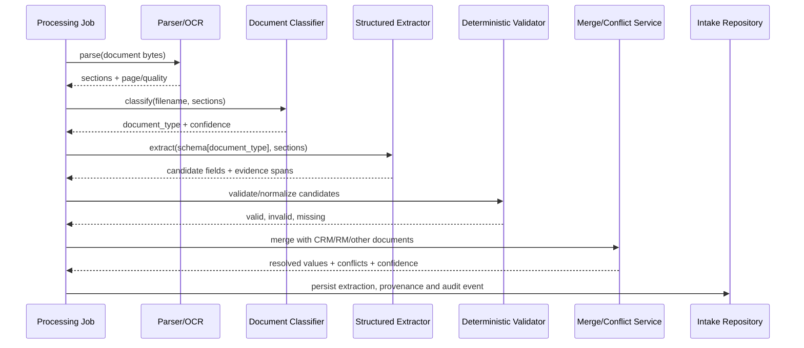

## 18. Customer Profile Builder

`PROPOSED DESIGN`. Bảng phân loại 5 loại dữ liệu của `plan.md` mục 8 (`Explicit fact / Extracted fact / Candidate inference / Missing information / Conflict`) ánh xạ trực tiếp vào khái niệm đã có trong `app/schemas/v2/common.py` (`SourceType` enum: `user_explicit, workspace, crm, document, workflow, conversation_confirmed, cache, llm_inference`) và `DecisionImpact` — **không cần phát minh khái niệm mới**, chỉ cần dùng đúng `source_type=DOCUMENT`/`llm_inference` đã định nghĩa nhưng hiện chưa có ai tạo ra giá trị thật cho (theo audit: `SourceType.DOCUMENT` là "unused, forward-declared hook", `app/context/assembler.py:8-13`).

Quy tắc bắt buộc của `plan.md` mục 6 (không tìm thấy → `null`, không có evidence → không ghi fact, RM sửa → lưu `original_value` và `edited_value`) khớp với nguyên tắc fail-closed đã áp dụng xuyên suốt repo (Eligibility, Approval, Storage optimistic lock) — đây là điểm nhất quán tốt, không phải điểm cần tranh luận thiết kế.

## 19. Human Review and Confirmation

Cơ chế correction đã có (`PATCH /api/v2/cases/{id}/context`, `app/api/v2/router.py:363-427`) chỉ hỗ trợ **5 field cố định** (`employees_count, annual_revenue, account_or_unit_count, operating_years, ubo_status` — theo dropdown UI `app/static/index.html:108`) và yêu cầu case đã tồn tại. `plan.md` cần review TRƯỚC khi case được tạo (Bước 4, trước Bước 5 "Confirm & Start Analysis"). Đây là khác biệt thật, không thể tái dùng nguyên route hiện tại — cần route review riêng cho giai đoạn intake (case chưa `status=new`), dùng lại LOGIC (field path + provenance + impact) nhưng không dùng chung state machine `CaseStatus` hiện tại (case chưa được tạo ở bước này).

**Human review flow — `PROPOSED DESIGN`:**

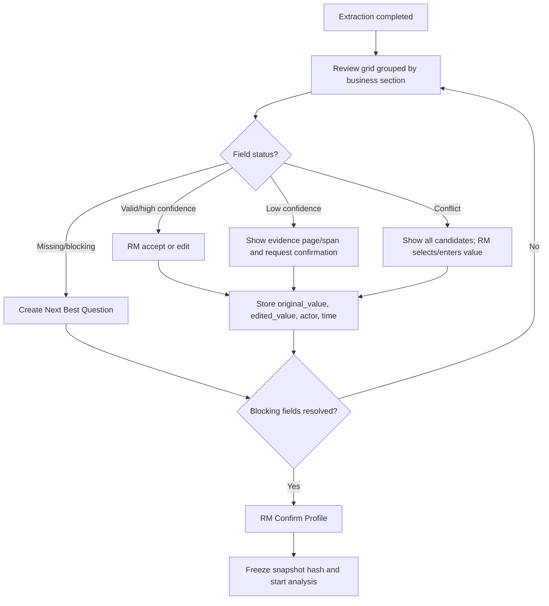

Acceptance của bước review: không có nút `Start Analysis` khi còn conflict/blocking field chưa xử lý; mọi edit lưu cả giá trị gốc và mới; RM có thể mở đúng trang/section nguồn; confirm tạo `snapshot_hash` để audit và để phát hiện chỉnh sửa sau confirm.

## 20. Confirmed Customer Business Snapshot

`PROPOSED DESIGN` — schema mới, đặt tại `app/schemas/v2/customer_business_snapshot.py` (theo đúng vị trí models đã thống nhất trong repo):

```text
CustomerBusinessSnapshot (KHÔNG thay thế Customer hiện có trong ContextSnapshot;
là nguồn ĐẦU VÀO xây dựng case, Customer.attributes vẫn là nguồn CRM runtime)
  snapshot_id, schema_version, snapshot_hash, created_at, confirmed_at, confirmed_by
  company_identity: {name, tax_code, legal_type, address, industry, established_date}
  business_profile: {employees_count, annual_revenue, operating_years}
  operating_model, transaction_profile, collection_profile, payment_profile,
  payroll_profile, cash_flow_profile, technology_profile, financing_profile,
  legal_profile: Dict[str, ResolvedValue]   # tái dùng ResolvedValue đã có
  existing_bank_products: List[str]
  explicit_needs: List[str]
  inferred_candidate_needs: List[str]        # PHẢI tách riêng, không lẫn vào fact
  pain_points: List[str]
  missing_information: List[str]
  source_map: Dict[str, str]                 # field -> document_id
  confidence_summary: Dict[str, float]
  rm_confirmed: bool
```

Mỗi leaf field nghiệp vụ phải là `ResolvedValue` mở rộng hoặc `ExtractedField`, không phải primitive trần. `source_map` là index tiện tra cứu, không thay thế provenance ở field. Sau confirm, snapshot là immutable; chỉnh sửa tiếp theo tạo revision mới và buộc Planner chạy lại các node bị ảnh hưởng.

`DATA REQUIRED`: xác nhận với PM liệu `CustomerBusinessSnapshot` có cần lưu vĩnh viễn tách khỏi `SharedCaseState` (để tái dùng cho case sau của cùng khách hàng) hay chỉ tồn tại trong quá trình intake rồi đổ vào `Customer.attributes` — quyết định này ảnh hưởng trực tiếp bảng SQLite ở mục 32.

---

## 21. Multi-Agent Workflow

Giữ các specialist service hiện có nhưng bổ sung contract Planner và vòng phản hồi Legal. Không gọi đây là “re-plan đã có”: `app/workflow/impact.py` hiện chỉ chọn node cần chạy lại khi input thay đổi, chưa tạo execution plan mới từ kết quả Legal.

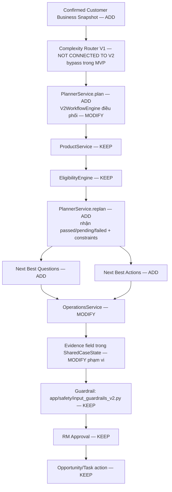

`CURRENT REPOSITORY FACT`: `app/services/complexity_router.py` thuộc V1; `app/workflow/engine.py` không import/gọi module này. MVP đi thẳng `Snapshot → PlannerService`. Nếu sau này thêm router cho V2, đó là feature mới cần contract và test routing, không phải `KEEP` ngầm.

## 22. Planner Agent

Hiện tại: `V2WorkflowEngine` (`app/workflow/engine.py`) là state machine + task DAG deterministic. `app/workflow/impact.py` chỉ hỗ trợ partial resume. `MODIFY/ADD`: tạo `app/workflow/planner.py` với hai hàm thuần, có schema tại `app/schemas/v2/planning.py`:

- `plan(snapshot, intent) -> ExecutionPlan`: tạo `plan_version`, goals, ordered steps, dependencies, required inputs, stop conditions và `reason`.
- `replan(previous_plan, eligibility_result, legal_constraints, answered_questions) -> ExecutionPlan`: giữ step không bị ảnh hưởng, đánh dấu `blocked/skipped/replaced`, thêm câu hỏi/hành động, tăng `plan_version` và ghi `changed_because`.
- Planner không tự gọi CRM/email; không tự đổi eligibility; không dùng LLM cho transition. LLM nếu có chỉ diễn giải rationale, output vẫn phải qua Pydantic/JSON Schema.
- `V2WorkflowEngine._analysis` phải gọi `plan` trước Product và gọi `replan` ngay sau Eligibility/Legal khi có `pending_information`, `failed` hoặc constraint làm thay đổi bundle. Đây là thay đổi thật, không gắn nhãn `KEEP`.

**Next Best Question contract:** `question_id`, `question`, `reason`, `target_field`, `source_gap`, `decision_impact`, `priority`, `answer_type`, `options`, `blocking_steps`, `status`, `answered_value`, `answered_by`, `answered_at`.

**Next Best Action contract:** `action_id`, `action_type`, `title`, `rationale`, `owner_role`, `sla_hours`, `due_at`, `dependencies`, `risk_level`, `requires_approval`, `payload_preview`, `status`.

**Missing-information loop — `PROPOSED DESIGN`:**

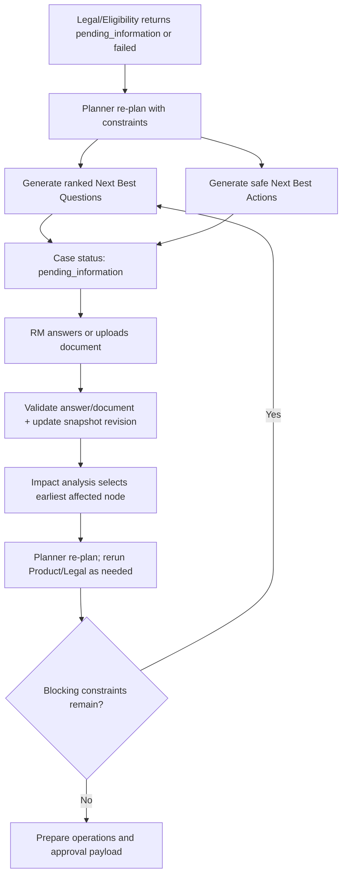

## 23. Product Agent

`KEEP` retrieval/ranking hiện có, `MODIFY` input/output contract. Input phải gồm snapshot đã confirm, intent và metadata filter; output mỗi đề xuất gồm `product_id`, `score`, `fit_reasons`, `unmet_information`, `source_document_id/version/effective_date` và `eligibility=unknown`. Không đề xuất product ID ngoài catalog; không ghi phí/hạn mức nếu evidence không có. Bundle nhiều sản phẩm phải chỉ rõ dependency và lý do từng thành phần.

## 24. Legal Agent

`KEEP` `EligibilityEngine` + `LegalKnowledgeService`; `MODIFY` output thành contract rõ cho Planner: `overall_status`, `product_results[]`, `hard_rule_results[]`, `legal_constraints[]`, `missing_fields[]`, `required_documents[]`, `blocking_reasons[]`, `evidences[]`, `rule_version`, `policy_version`. Rule cứng quyết định pass/fail; Legal RAG chỉ cung cấp evidence/giải thích. Kết quả phải kích hoạt `PlannerService.replan`, không đi thẳng Operations khi còn blocking constraint.

## 25. Operations Agent

`KEEP` checklist/email/CRM/task draft hiện có; `MODIFY` để nhận execution plan sau re-plan, NBQ/NBA và chỉ tạo artifact phù hợp trạng thái:

- `pending_information`: discovery checklist, câu hỏi cho RM/khách hàng, task thu thập tài liệu; không tạo opportunity-ready payload.
- `passed`: CRM opportunity draft, follow-up task, email draft và `ProposalDraft` có `product_ids`, benefits, conditions, required_documents, disclaimers, evidence_ids, template_version.
- `failed`: giải thích nội bộ + phương án thay thế có evidence; không soạn câu khẳng định khách hàng chắc chắn không đủ điều kiện nếu policy còn mâu thuẫn.
- Proposal chỉ là draft; PDF export và gửi ra ngoài nằm sau RM approval. Thêm `app/operations/proposal_service.py`; không gộp logic render proposal vào Product Agent.

## 26. Evidence Validator

V2 dùng field `Evidence` trực tiếp trong `SharedCaseState` (`shared_case_state.py:69-82`, có `is_valid`, `validation_score`). V1 có `app/safety/evidence_validator.py` với Lớp 1 exact-match + Lớp 2 semantic similarity. `MODIFY`: một validator thống nhất phải kiểm bốn nhóm claim: extracted field, product recommendation, legal/eligibility explanation và operations/proposal draft. Mỗi claim cần `claim_id`, `claim_text`, `source_id/version`, `source_span`, `validation_method`, `score`, `is_valid`. Claim không được hỗ trợ làm case dừng ở `pending_review`; không dùng LLM-as-judge làm cổng duy nhất.

## 27. Guardrails

Đã có `app/safety/input_guardrails_v2.py` (`screen_input`, dùng cho cả case message lẫn upload knowledge) và `app/reliability/patterns.py`. `MODIFY`: áp dụng `screen_input` cho toàn bộ text trích xuất trước khi đưa vào prompt; kiểm MIME/magic bytes/size/hash; malware-scan adapter fail-closed hoặc trạng thái quarantine; permission trước đọc file và trước retrieval; PII masking ở log/prompt; tool allowlist; output schema validation; action gate bắt buộc. Tài liệu upload luôn là dữ liệu, không bao giờ là instruction.

---

## 28. Opportunity and Task Actions

`KEEP` `app/actions/executor.py` và draft hiện có; `MODIFY` payload để hỗ trợ `opportunity_draft`, `task_drafts`, `email_draft`, `proposal_draft`. Approval preview phải đóng băng toàn bộ payload và hash; token gắn `case_id`, `rm_id`, permission, expiry, payload hash; execute bắt buộc idempotency key. Reject không thực hiện side effect và lưu lý do.

**Opportunity approval sequence — `PROPOSED DESIGN`:**

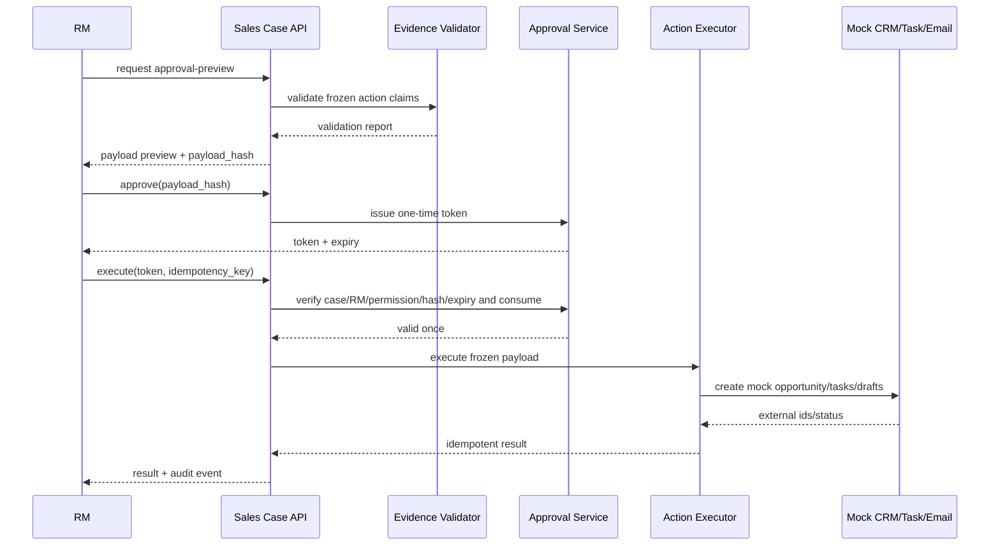

## 29. Frontend Plan

`KEEP` khối kết luận/checklist/evidence/audit hiện có; `MODIFY` navigation và nguồn dữ liệu; `ADD` đủ 14 màn hình của `plan.md`. Không thêm framework trong MVP, nhưng tách JavaScript/CSS khỏi `index.html` để 14 màn hình không dồn vào một file: `app/static/{app.css,api.js,state.js,wizard.js,case_workspace.js,components.js}`. `index.html` chỉ còn shell và semantic regions.

| # / màn hình | Mục tiêu và components | Input / auto-fill | Validation + loading/empty/error | Permission + API | Acceptance criteria |
|---|---|---|---|---|---|
| 1. Sales Case List | Tìm case, nhìn trạng thái, owner, SLA, blocking reason; filter/search/table | Input: query/status/owner; auto: case ID, customer, updated time, pending count | Skeleton; empty có CTA tạo case; lỗi có retry; filter phải giữ khi reload | RM chỉ thấy scope của mình; `GET /sales-cases` | Không lộ case ngoài scope; mở đúng workspace trong 1 click |
| 2. Create Sales Case Wizard | Stepper 5 bước, save draft, back/continue | Input bước 1: tên DN, MST, ngành, contact, nhu cầu tự do, ghi chú, ưu tiên, sản phẩm đang dùng | Field bắt buộc + MST format; autosave; lỗi không mất dữ liệu | `case:create`; `POST /sales-cases` | RM tạo draft không nhập JSON; refresh vẫn tiếp tục được |
| 3. Multi-file Upload | Dropzone, file list, progress, remove/retry | Input: PDF/DOCX/TXT/XLSX; auto: MIME, size, hash, guessed type | Chặn extension/magic bytes/size; duplicate warning; upload progress; quarantine/error rõ | `case:write`; `POST/GET /sales-cases/{id}/documents` | Nhiều file/upload lại an toàn; duplicate không tạo bản ghi mới |
| 4. Document Processing Status | Timeline từng file: validate/parse/OCR/classify/extract/merge | Không nhập; auto job stage, percent, quality, error code | Polling; empty khi chưa process; partial failure không che file khác; retry chỉ job idempotent | `case:read`; `POST process-documents`, `GET processing-status` | RM biết file nào xong/lỗi/cần OCR và hành động tiếp theo |
| 5. Extracted Data Review | Grid theo nhóm, source preview, confidence badge, conflict selector, edit | Input edit/select candidate/mark unknown; auto extracted values/evidence | Chặn confirm nếu blocking/conflict; loading source; empty “chưa trích xuất”; 409 khi ETag cũ | `case:write`; `GET/PATCH extracted-profile` | Mọi edit lưu original/new/actor; click field mở đúng evidence |
| 6. Customer Business Snapshot | Bản tóm tắt cuối trước phân tích, revision/hash | Input confirm; auto toàn bộ profile, missing/conflict summary | Không cho sửa trực tiếp ngoài review; confirm spinner; lỗi hash/version phải reload | `case:confirm`; `POST confirm-profile` | Chỉ snapshot đã confirm mới chạy agent; hiển thị người/thời điểm xác nhận |
| 7. Agent Execution Plan | Timeline plan version, step, dependency, status, re-plan diff | Không nhập ngoài “run/resume”; auto plan + agent run | Streaming/polling; empty trước confirm; lỗi từng agent; stop condition rõ | `case:run`; `POST run-analysis`, `GET trace` | Hiển thị vì sao step bị block/skip/replaced và plan version mới |
| 8. Product Opportunity Panel | Bundle sản phẩm, fit score, reason, conditions, citations | Input chọn/bỏ bundle để draft; auto recommendation | Không catalog hit → empty có hướng dẫn; citation lỗi → warning/block | `case:read`; `GET recommendations` | Không hiển thị sản phẩm ngoài catalog; mỗi claim có nguồn/version |
| 9. Legal Constraints Panel | Pass/pending/fail theo sản phẩm, hard rules, policy evidence | Không nhập; auto constraint/missing docs/rule version | Mâu thuẫn policy → escalation; nguồn hết hiệu lực → block; loading độc lập | `case:read`; `GET recommendations` hoặc analysis state | RM phân biệt rule quyết định và RAG giải thích; không có “phê duyệt an toàn” sai |
| 10. Next Best Questions | Câu hỏi ưu tiên, lý do, field đích, tác động | Input answer/attach document/mark unavailable; auto priority/type/options | Validate answer type; empty khi không thiếu; stale answer → 409/re-plan | `case:write`; `GET missing-information`, `PATCH profile`, upload docs | Trả lời câu hỏi cập nhật snapshot revision và chỉ rerun node bị ảnh hưởng |
| 11. Next Best Actions | Action card owner/SLA/dependency/risk, create draft task | Input owner/due date/select action; auto rationale/payload preview | Action rủi ro cao yêu cầu approval; empty khi chưa có plan; tool error giữ draft | `case:write`; analysis state + approval routes | Không action bên ngoài nào chạy trước approval; action có owner và trạng thái |
| 12. RM Approval | Frozen payload diff, evidence report, approve/reject | Input reason/confirm; auto payload hash, expiry, side effects | Disable khi evidence invalid; expiry/error/replay rõ; reject reason bắt buộc | `case:approve`; `POST approve/reject` | RM thấy chính xác dữ liệu sẽ ghi/gửi; token dùng một lần |
| 13. Opportunity and Task Result | External/mock IDs, task list, email/proposal draft, retry-safe result | Không nhập ngoài copy/download/retry safe | Loading execute; idempotent replay trả cùng kết quả; partial failure phân tách | `case:execute`; `POST execute-actions` | Không tạo trùng; mọi kết quả liên kết payload hash/idempotency key |
| 14. Audit Timeline | Filter event theo agent/action, mở sanitized payload, verify chain | Input filter; auto trace ID, actor, versions, latency, status | Empty chỉ khi case draft chưa có event; verify failure báo đỏ/escalate | `case:audit`; `GET audit/trace` | Timeline đủ từ upload đến execute; không lộ PII/token; chain verify được |

Quy tắc bố cục: thanh trên cùng chỉ hiển thị customer/case/status/owner; cột trái là 5 bước hoặc case timeline; vùng giữa là “việc RM cần quyết định”; cột phải là evidence/context. Màu đỏ chỉ dùng cho blocking/risk, vàng cho cần xác nhận, xanh cho đã xác minh. Mỗi màn hình phải có một câu “Bạn cần làm gì tiếp theo?” và không hiển thị JSON thô mặc định.

## 30. Backend Plan

Ánh xạ cấu trúc mục tiêu của `plan.md` (mục 12) vào cấu trúc THẬT đang có — không tạo folder trùng chức năng:

| Target (`plan.md`) | Ánh xạ vào hiện có | Quyết định |
|---|---|---|
| `intake/upload_service` | Mới, đặt `app/intake/upload_service.py` | ADD |
| `intake/file_validator` | Tái dùng `app/safety/input_guardrails_v2.screen_input` + `MAX_UPLOAD_BYTES` | MODIFY (bổ sung MIME/size check nếu chưa có ở route mới) |
| `intake/document_parser` | **Không tạo mới** — dùng thẳng `app/knowledge/parsers.py` | KEEP + tái dùng |
| `intake/ocr_adapter` | Mới, `app/intake/ocr_adapter.py`, theo mẫu `Protocol` của `app/integrations/` | ADD |
| `intake/document_classifier`, `structured_extractor`, `field_validator`, `document_merger`, `conflict_detector`, `confidence_service` | Mới trong `app/intake/`, tái dùng `app/context/assembler.py` (precedence/conflict) và `app/intent/` (LLM+fallback pattern) làm khuôn mẫu | ADD |
| `intake/customer_profile_builder` | Mới, `app/intake/profile_builder.py`, ghi ra `CustomerBusinessSnapshot` (mục 20) | ADD |
| `sales/case_service` | Đã có rải rác trong `app/api/v2/router.py` (`create_case`, `get_case`...) — chưa tách thành service riêng | MODIFY (cân nhắc tách, không bắt buộc cho MVP) |
| `sales/opportunity_service`, `task_service` | `app/operations/service.py` + `app/actions/executor.py` | KEEP |
| `sales/proposal_service`, `email_draft_service` | `app/operations/service.py._message` (email draft có sẵn); proposal draft **chưa có** | MODIFY (email) / ADD `app/operations/proposal_service.py` |
| `agents/router` | `app/services/complexity_router.py` thuộc V1; không được import trong `app/workflow/engine.py` V2 | KEEP V1 / không nối vào V2 MVP |
| `agents/planner` | `app/workflow/engine.py` hiện chỉ orchestration/partial resume | MODIFY engine + ADD `app/workflow/planner.py` và `app/schemas/v2/planning.py` |
| `agents/product_agent`, `legal_agent`, `operations_agent` | `app/product/`, `app/eligibility/`, `app/operations/` | KEEP |
| `agents/next_best` | `missing_information`/checklist hiện có chưa đủ contract | ADD `app/workflow/next_best.py`, `app/schemas/v2/next_best.py` |
| `agents/evidence_validator` | `Evidence` model + `app/safety/evidence_validator.py` (V1) | KEEP |
| `agents/guardrail` | `app/safety/input_guardrails_v2.py` | KEEP |
| `shared/schemas`, `state` | `app/schemas/v2/` | KEEP |
| `shared/tool_registry` | V1 có runtime `app/tools/registry.py`; V2 có contract/load registry ở `app/schemas/v2/tool_contracts.py` nhưng V2 workflow/services không import `load_tool_registry` | MODIFY/ADD runtime allowlist enforcement trước mọi adapter V2; MVP mock action vẫn qua approval |
| `shared/audit` | `app/storage/repository.py` (audit hash-chain) + `app/observability/runtime.py` | KEEP |
| `shared/permissions` | `app/integrations/iam.py` | KEEP |

Backend dependency order bắt buộc: contracts → migrations/repository → intake services → API → Planner/re-plan/NBQ/NBA → Operations proposal → UI → eval. Không cho frontend tự suy diễn status từ text; mọi trạng thái và action permission phải đến từ API contract.

## 31. API Plan

Route hiện có (20, từ `app/api/v2/router.py`, xác nhận bằng grep `@router.(get|post|patch)`):

| Method | Path | Vai trò hiện tại |
|---|---|---|
| GET | `/context/current` | Lấy context hiện tại |
| POST | `/context/resolve` | Resolve context + sanitize message, không tạo case |
| POST | `/cases` | Tạo case + chạy phân tích (nhận `message` + `documents: metadata`) |
| GET | `/cases` | List case theo employee |
| GET | `/cases/{id}` | Lấy state + ETag |
| GET | `/cases/{id}/trace` | Timeline + audit |
| POST | `/cases/{id}/messages` | Cập nhật nhu cầu, rerun |
| POST | `/cases/{id}/documents` | Đăng ký METADATA tài liệu (không parse) |
| PATCH | `/cases/{id}/context` | RM sửa 1 field context |
| POST | `/cases/{id}/resume` | Resume có kiểm soát theo impact |
| POST | `/cases/{id}/approval-preview` | Xem payload sẽ ghi CRM |
| POST | `/cases/{id}/approve` | Phát hành token 1 lần |
| POST | `/cases/{id}/execute` | Thực thi mock, idempotent |
| POST | `/cases/{id}/reject` | Từ chối |
| GET | `/knowledge/products/search` | RAG sản phẩm |
| GET | `/knowledge/legal/search` | RAG pháp lý |
| POST | `/knowledge/documents/inspect` | Kiểm tra file trước khi ingest kho tri thức |
| POST | `/knowledge/documents/ingest` | Ingest kho tri thức (DataSteward) |
| GET | `/metrics` | Metrics in-process |
| GET | `/health` | Health SQLite + index |

**Quyết định public contract — `PROPOSED DESIGN`:** dùng đúng facade `/api/v2/sales-cases` của `plan.md`; giữ 20 route `/api/v2/cases` hiện có để tương thích. `POST /sales-cases` tạo `intake_session` và giữ trước một `case_id`, nhưng chưa tạo/chạy `SharedCaseState`; `confirm-profile` mới materialize case runtime với cùng `case_id`. Như vậy URL thống nhất với người dùng nhưng state machine intake vẫn tách an toàn khỏi `CaseStatus`.

Common contract: authentication MVP dùng `X-Employee-ID` + `X-Session-ID` như repo hiện tại, production thay bằng SSO/JWT; mọi route kiểm branch/portfolio scope; response có `X-Trace-ID`; resource mutable có `ETag`; lỗi theo `detail={code,message,field?,retryable}`; không trả stack trace/PII; audit payload được sanitize.

| Endpoint | Purpose; request → response schema | Permission | Validation / sync-async / error codes | Idempotency; audit event; repository module |
|---|---|---|---|---|
| `POST /sales-cases` | Tạo draft; `CreateSalesCaseRequest{company_name,tax_code?,industry?,contact?,need_text,rm_note?,priority,current_products[]}` → `SalesCaseDraft{case_id,intake_status,version,next_step}` | `case:create` | Validate text/MST/schema; sync; `400 VALIDATION_ERROR`, `403 SCOPE_DENIED`, `409 DUPLICATE_DRAFT` | `Idempotency-Key` bắt buộc; `sales_case_draft_created`; ADD `app/intake/case_service.py`, router |
| `POST /sales-cases/{id}/documents` | Multi-part upload → `DocumentReceipt[]{document_id,name,mime,size,sha256,status}` | `case:write` + owner/scope | Magic bytes, MIME, size, hash, filename, malware placeholder; sync upload, không parse; `400 UNSUPPORTED_FILE`, `413 FILE_TOO_LARGE`, `422 MALWARE_SUSPECTED`, `409 DUPLICATE_DOCUMENT` | Key theo `case_id+sha256`; `case_document_uploaded/rejected`; `app/intake/upload_service.py` |
| `GET /sales-cases/{id}/documents` | Liệt kê metadata và stage → `DocumentSummary[]` | `case:read` | Sync; `403`, `404 CASE_NOT_FOUND` | GET idempotent; `case_documents_viewed` chỉ metrics, không cần immutable audit; repository query |
| `POST /sales-cases/{id}/process-documents` | Bắt đầu jobs cho document IDs → `ProcessAccepted{job_batch_id,document_jobs[]}` | `case:write` | Case chưa confirm; file đã validated; async; `409 INVALID_INTAKE_STATE/PROCESS_ALREADY_RUNNING`, `422 NO_VALID_DOCUMENT` | Key theo case+document hashes+pipeline version; `document_processing_started`; `app/intake/pipeline.py` |
| `GET /sales-cases/{id}/processing-status` | Poll stage/progress/error → `ProcessingStatus{overall_status,jobs[],retry_after_ms}` | `case:read` | Sync read; `404`; không biến lỗi một file thành 500 toàn batch | GET idempotent; metrics `processing_status_viewed`; job repository |
| `GET /sales-cases/{id}/extracted-profile` | Lấy draft snapshot, field evidence/conflicts → `ExtractedProfileResponse{profile,fields,conflicts,missing,version}` | `case:read` | Chỉ sau extraction; sync; `409 EXTRACTION_NOT_READY`, `404` | GET idempotent; `extracted_profile_viewed`; profile repository |
| `PATCH /sales-cases/{id}/extracted-profile` | RM sửa/chọn candidate/trả lời NBQ; `ProfilePatch{expected_version,changes[]}` → profile revision mới | `case:write` | Field allowlist, type/schema, evidence cho candidate, optimistic lock; sync; `400`, `409 VERSION_CONFLICT/PROFILE_CONFIRMED` | `Idempotency-Key` + expected version; `profile_field_corrected`; `app/intake/review_service.py` |
| `POST /sales-cases/{id}/confirm-profile` | Freeze snapshot; `ConfirmProfileRequest{expected_version,attestation}` → `{snapshot_id,snapshot_hash,confirmed_at}` | `case:confirm` | Blocking/conflict phải hết; sync; `409 UNRESOLVED_BLOCKERS/ALREADY_CONFIRMED` | Cùng version trả cùng snapshot; `customer_profile_confirmed`; profile builder + repository |
| `POST /sales-cases/{id}/run-analysis` | Materialize `SharedCaseState`, chạy Planner/Product/Legal/Operations → `AnalysisAccepted{trace_id,plan_version,status}` | `case:run` | Snapshot hash confirmed; async logical job/poll trace; `409 PROFILE_NOT_CONFIRMED/ANALYSIS_RUNNING` | Key theo snapshot hash+workflow version; `analysis_started`; `app/workflow/engine.py` + planner |
| `GET /sales-cases/{id}/trace` | Timeline agent/task/plan diff → `TraceResponse` | `case:read` | Sync; redact payload; `404` | GET idempotent; metrics only; map route `/cases/{id}/trace` |
| `GET /sales-cases/{id}/recommendations` | Product bundle + legal constraints + evidence → `RecommendationResponse` | `case:read` | Chỉ trả catalog item/source được phép; `409 ANALYSIS_NOT_READY`, `424 EVIDENCE_INVALID` | GET idempotent; `recommendations_viewed`; aggregate current state |
| `GET /sales-cases/{id}/missing-information` | NBQ/NBA và blocking impact → `MissingInformationResponse{questions,actions,blocked_steps}` | `case:read` | Sync; empty list là hợp lệ; `404` | GET idempotent; metrics only; `app/workflow/next_best.py` |
| `POST /sales-cases/{id}/approve` | Phê duyệt frozen payload; `ApproveRequest{payload_hash,expected_version}` → `{approval_token,expires_at}` | `case:approve` | Evidence valid, status pending approval, hash khớp; sync; `409 PAYLOAD_CHANGED`, `422 EVIDENCE_INVALID` | Không phát hai token active cho cùng hash/RM; `approval_issued`; map `ApprovalServiceV2` |
| `POST /sales-cases/{id}/reject` | Từ chối; `RejectRequest{reason,expected_version}` → status | `case:approve` | Reason bắt buộc; sync; `409 INVALID_STATE` | Retry cùng reason/version trả cùng result; `approval_rejected`; map current reject |
| `POST /sales-cases/{id}/execute-actions` | Thực thi opportunity/task/email action đã duyệt; `ExecuteRequest{approval_token,idempotency_key}` → `ExecutionResult{opportunity_id?,task_ids[],draft_ids[],status}` | `case:execute` | Token one-time/case/RM/hash/expiry; sync cho mock, adapter thật có thể async; `401 TOKEN_INVALID`, `409 TOKEN_USED/PAYLOAD_CHANGED`, `502 TOOL_FAILED` | Idempotency key bắt buộc; `actions_execution_started/completed/failed`; `app/actions/executor.py` |
| `GET /sales-cases/{id}/audit` | Audit hash-chain đã sanitize → `AuditResponse{events,chain_valid}` | `case:audit` | Permission riêng; sync; `403`, `409 AUDIT_CHAIN_INVALID` | GET idempotent; truy cập audit cũng ghi security access log; `app/storage/repository.py` |

Polling là phương án MVP vì stack hiện tại chưa có queue/WebSocket. Background job ban đầu dùng in-process executor có persistent `document_processing_jobs`; restart phải chuyển job `running` quá TTL thành `retryable_failed`. Production mới đánh giá worker/queue riêng. Retry chỉ stage idempotent; job vượt retry limit vào trạng thái `dead_letter` và cần Data Steward/RM xử lý, không tự lặp vô hạn.

## 32. Database Plan

SQLite hiện có được giữ cho MVP; không đổi database engine trong 48 giờ. Retention hiện **NOT FOUND IN CURRENT REPOSITORY**, vì vậy các giá trị dưới đây là `PROPOSED/ASSUMPTION` và phải được SHB phê duyệt trước dữ liệu thật.

**Bảng hiện có:**

| Bảng / chức năng | PK, field quan trọng, relationship | Nhạy cảm / index | Retention | Model + migration |
|---|---|---|---|---|
| `cases` — runtime state | `case_id PK`; `employee_id, customer_id, version, state_json, updated_at`; parent logic của audit/approval | `state_json` nhạy cảm; index `(employee_id,updated_at)`, `(customer_id,updated_at)` cần xác minh/ADD nếu thiếu | Theo vòng đời case; `DATA REQUIRED FROM SHB` | `SharedCaseState`, `app/storage/repository.py`; KEEP schema, thêm field optional qua contract version |
| `audit_events` — immutable event chain | `sequence PK`, `event_id UNIQUE`, `case_id` logic FK, `trace_id,actor,action,payload_json,prev_hash,event_hash` | payload sanitized; index `(case_id,sequence)`, `trace_id` | Dài hơn case theo audit policy; `DATA REQUIRED` | `AuditEvent`; KEEP, thêm event types không đổi bảng |
| `approval_tokens` — one-time approval | `token_id PK`, `case_id`, `approver_id,payload_hash,expires_at,status` | token/security-sensitive; index `(case_id,status)`, `expires_at` | Xóa/ẩn token material sau expiry, giữ metadata audit | `ApprovalServiceV2`; KEEP |
| `idempotency_records` — chống action trùng | `idempotency_key PK`, `action,payload_hash,result_json,created_at` | result có thể nhạy cảm; index `created_at` để cleanup | TTL theo retry window nhưng không ngắn hơn thời gian CRM eventual consistency; `DATA REQUIRED` | repository; KEEP |
| `schema_migrations` — version DB | `version PK`, `name` | Không nhạy cảm | Vĩnh viễn | `app/storage/migrations.py`; KEEP |

**Bảng cần thêm cho intake (`migration v2`, repository model mới trong `app/intake/models.py` và query trong `app/storage/intake_repository.py`):**

| Bảng / chức năng | PK, field quan trọng, relationship | Nhạy cảm / index | Retention đề xuất | Migration/acceptance |
|---|---|---|---|---|
| `intake_sessions` — draft trước runtime case | `intake_id PK`, `case_id UNIQUE reserved`, `employee_id,customer_id?,manual_input_json,status,version,created_at,updated_at`; 1-N documents/fields/conflicts | PII/need text; index `(employee_id,status,updated_at)`, `customer_id` | Draft bỏ dở 30 ngày; confirmed theo case policy | Create table + optimistic version; không thể truy cập khác scope |
| `case_documents` — metadata file | `document_id PK`, `intake_id FK`, `filename,mime,sha256,size_bytes,document_type,status,storage_ref?,created_at`; 1-N jobs/extractions | Filename/KYC metadata; unique `(intake_id,sha256)`, index `(intake_id,status)` | Raw file: mặc định xóa sau parse/confirm; metadata theo case; SHB xác nhận | FK cascade khi draft bị xóa; duplicate deterministic |
| `document_processing_jobs` — async state | `job_id PK`, `document_id FK`, `pipeline_version,stage,status,attempt,error_code,error_sanitized,started_at,updated_at` | Không lưu raw text/error secret; index `(status,updated_at)`, `(document_id,stage)` | 90 ngày hoặc theo ops policy | Có `retryable_failed/dead_letter`; restart recovery test |
| `document_extractions` — section/page text | `extraction_id PK`, `document_id FK`, `page,section,text_encrypted,quality_score,parser_version,created_at` | Rất nhạy cảm; index `(document_id,page)`; encryption at rest production | Ngắn nhất có thể: tới khi snapshot/audit evidence được chốt, sau đó purge hoặc archive theo policy | Không log text; evidence lookup vẫn hoạt động sau retention bằng redacted span/hash |
| `extracted_fields` — candidate/resolved field | `field_id PK`, `intake_id FK`, `field_name,value_json,normalized_json,source_document_id FK,source_page,source_span,method,confidence,validation_status,confirmed_by_rm,revision` | PII/tài chính; index `(intake_id,field_name,revision)`, `source_document_id` | Theo profile/case policy | Schema validate; mọi fact có source; sửa tạo revision, không overwrite lịch sử |
| `field_conflicts` — candidates xung đột | `conflict_id PK`, `intake_id FK`, `field_name,candidates_json,decision_impact,requires_confirmation,resolution_json,resolved_by,resolved_at` | Có thể chứa PII; index `(intake_id,requires_confirmation)` | Theo case/audit policy | Không confirm profile khi conflict blocking chưa resolve |
| `customer_profile_drafts` — snapshot revisions | `snapshot_id PK`, `intake_id FK`, `revision,snapshot_json,snapshot_hash,rm_confirmed,confirmed_by,confirmed_at`; unique `(intake_id,revision)` | Hồ sơ tổng hợp nhạy cảm; index `(intake_id,rm_confirmed)` | Draft 30 ngày; confirmed theo case policy | Hash/revision immutable; một confirmed revision active |

**Ánh xạ các entity database bắt buộc khác của `plan.md`:**

| Entity yêu cầu | Lưu MVP | Khi nào tách bảng riêng |
|---|---|---|
| `customer_profiles`, `customer_profile_sources` | `customer_profile_drafts.snapshot_json` + `extracted_fields` | Khi SHB quyết định profile tái sử dụng giữa nhiều case và có retention/consent riêng |
| `agent_plans`, `agent_runs` | `cases.state_json.workflow` + `audit_events` | Khi cần query/dashboard plan version ở quy mô lớn |
| `product_recommendations`, `legal_constraints` | `cases.state_json.product_result/eligibility_result` | Khi reporting/BI cần query field trực tiếp |
| `next_best_questions`, `next_best_actions` | Field typed mới trong `SharedCaseState` + audit | Khi cần assignment/SLA cross-case hoặc analytics riêng |
| `sales_opportunities`, `follow_up_tasks` | Frozen `operations_result` + `idempotency_records` | Khi nối CRM thật hoặc cần reconciliation nội bộ |
| `approvals`, `audit_events` | Đã có `approval_tokens`, `audit_events` | Không tạo bảng trùng |

Quyết định mở: có tách `customer_profiles` lưu lâu dài khỏi draft hay không. Cho tới khi SHB xác nhận, MVP không tái sử dụng snapshot giữa case khác và không coi dữ liệu case cũ là current truth.

## 33. State Machine

`CaseStatus` hiện có (12 giá trị, `app/schemas/v2/shared_case_state.py:18-32`, ràng buộc transition ở `app/workflow/state_machine.py:12`):

```text
new → understanding → clarification_required → planned → in_analysis
→ pending_information → pending_review → pending_approval → executing
→ completed / rejected / failed
```

`plan.md` mục 14 đề xuất trạng thái intake TRƯỚC các trạng thái này. `PROPOSED CHANGE`: đây là state machine cho `intake_sessions` (bảng riêng, mục 32), **không chèn vào `CaseStatus` hiện có** — vì `CaseStatus` đã được 20 route + workflow engine + audit + evaluation dùng ổn định (158 test đang pass), sửa trực tiếp enum này là rủi ro không cần thiết. Đề xuất `IntakeStatus` riêng:

```text
draft → files_uploaded → document_processing → extraction_completed
→ profile_review_required → profile_confirmed → [chuyển sang CaseStatus.new]

Lỗi: upload_failed, processing_failed, extraction_failed, cancelled
```

Điểm nối: `profile_confirmed` → `POST /sales-cases/{id}/run-analysis` materialize state theo logic `POST /cases` hiện có → `CaseStatus.new`. Không route nào được chạy Product/Legal trước `profile_confirmed`.

**Case state machine — `PROPOSED DESIGN`:**

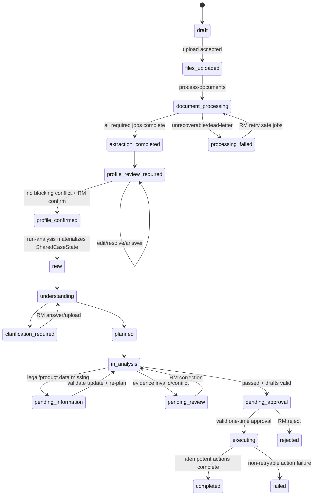

## 34. Data Requirements

Không trộn ba lớp dữ liệu: **customer/case data** (theo scope RM), **internal knowledge** (catalog/policy/SOP có version/quyền) và **external reference data** (chỉ bổ trợ, không thay nguồn nội bộ). Mỗi dataset trước khi dùng phải có Data Source Card: owner, legal basis, schema, freshness SLA, access scope, sensitive classification, quality checks, version, retention và rollback.

| Nhóm dữ liệu phù hợp/khả dụng | Vai trò trong solution | Khả dụng MVP | Chuẩn bị và xử lý bắt buộc |
|---|---|---|---|
| CRM customer/account/contact/case history | Context hiện hành, tránh RM nhập lại | Mock CRM đã có; dữ liệu thật `DATA REQUIRED FROM SHB` | Mapping customer ID, dedup, freshness timestamp, field-level permission, provenance; không coi field stale là fact hiện hành |
| Product catalog, pricing/fee policy, eligibility rules, legal policy, SOP, templates | Product RAG, Legal evidence, deterministic rules, Operations | Synthetic đã có trong `data/synthetic/v2`; bản thật chưa có | Owner approval, effective/expiry date, product/policy/rule version, ACL, chunk theo section/table, hybrid retrieval, stale/conflict behavior |
| Tài liệu doanh nghiệp do RM upload | Xây snapshot: đăng ký DN, người đại diện, meeting note, payment process, BCTC | Parser text-layer có; OCR/intake chưa có | MIME/magic/hash/scan, parse/OCR, classify, extract theo schema mục 17, validate, merge/conflict, RM confirm, retention tối thiểu |
| Dữ liệu giao dịch/cash-flow/payroll/supplier/customer nội bộ | Hiểu quy mô và flow thực, tăng độ chính xác bundle | `NOT FOUND IN CURRENT REPOSITORY`; không dùng trong MVP | Chỉ dùng aggregate cần thiết; window/period/currency; consent/purpose limitation; không đưa raw transaction vào prompt nếu không cần |
| Email/meeting/CRM activity của RM | Nắm context nhân viên, tránh hỏi lặp | Meeting note upload có thể mô phỏng; connector thật chưa có | Thread/case linking, dedup, recency, extract explicit commitment/need; không tự suy diễn từ ngôn ngữ mơ hồ |
| Dữ liệu đăng ký DN/thuế công khai hoặc được cấp quyền | Cross-check identity/industry/status | External integration chưa chọn; `DATA REQUIRED` | Legal basis/licence, API freshness, rate limit, source priority; chỉ cross-check, conflict phải RM xử lý |
| Báo cáo công khai của doanh nghiệp niêm yết/thống kê ngành | Bối cảnh ngành và benchmark tham khảo | Không cần cho MVP | Gắn ngày/nguồn/độ phủ; không dùng benchmark công khai để kết luận eligibility cá thể |
| Sanctions/PEP/adverse-media/KYC provider được phê duyệt | Tín hiệu compliance cho Legal | Chưa có provider; ngoài MVP | Provider governance, false-positive workflow, human compliance review; AI không tự kết luận pháp lý |
| Danh mục ngành/địa bàn/đơn vị/role chuẩn hóa | Metadata filter và validation | `DATA REQUIRED FROM SHB` | Controlled vocabulary + alias map + version; unknown không ép map sai |
| OCR provider/model | Xử lý PDF scan | `DATA REQUIRED FROM SHB` | Ưu tiên on-prem nếu policy yêu cầu; kiểm retention/residency; benchmark theo loại tài liệu; lưu model/version/confidence |

**Ngưỡng dữ liệu:** không tái dùng cứng ngưỡng semantic evidence `0.85` cho extraction. `PROPOSED`: hiệu chuẩn riêng theo field trên golden set; field identity/legal/financial blocking luôn cần deterministic validation hoặc RM confirm bất kể confidence. Trước khi có số liệu, auto-fill chỉ là candidate; không auto-confirm.

**Data flow — `PROPOSED DESIGN`:**

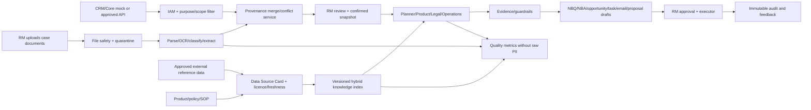

## 35. Security and Privacy

Phát hiện thật từ audit (không suy đoán):

| Rủi ro | Hiện trạng | Đánh giá |
|---|---|---|
| Prompt injection qua tài liệu tải lên | `screen_input` đã chạy cho upload vào kho tri thức (`app/knowledge/upload_ingestion.py`) | Cần áp dụng THÊM cho toàn bộ text trích xuất trong pipeline intake mới (chưa tồn tại nên chưa thể có gap, nhưng phải thiết kế đúng từ đầu) |
| PII trong log | Redact theo TÊN field cố định, không quét nội dung (`app/observability/runtime.py:38`) | Field mới (số CCCD người đại diện, ngày sinh) PHẢI được thêm vào danh sách `forbidden` set trước khi triển khai, nếu không sẽ lọt log |
| Approval token "nonce" | Sinh ra (`app/approval/service.py:45`) nhưng KHÔNG được kiểm tra lại ở `verify_and_consume` — one-time-use thật nằm ở DB status flip (`app/storage/repository.py:215-221`), không phải ở nonce | Không phải lỗ hổng (DB-backed one-time-use vẫn đúng), nhưng tên gọi gây hiểu nhầm — nên sửa comment/docstring khi có dịp, không phải ưu tiên bảo mật |
| OCR provider retention | Chưa chọn nhà cung cấp | `DATA REQUIRED` — nếu dùng OCR cloud, tài liệu KYC (CCCD, đăng ký kinh doanh) sẽ rời khỏi hạ tầng nội bộ — cần đánh giá pháp lý trước khi chọn |
| Malware trong file upload | Chưa thấy cơ chế quét malware trong `app/knowledge/parsers.py`/`upload_ingestion.py` (chỉ có `screen_input` chống prompt injection, không phải antivirus) | `NOT FOUND` — cần thêm placeholder quét malware trước khi nhận file thật từ RM (khác với file nội bộ ingest kho tri thức) |
| Production guard cho secret demo | Có thật, chạy ở import-time: `ApprovalServiceV2.__init__` raise nếu `APP_ENV != "development"` và secret vẫn là mặc định (`app/approval/service.py:32-33`), và `router = create_router()` chạy ở module scope (`app/api/v2/router.py:709`) nên guard này chạy ngay khi app khởi động qua `app/main.py:19` | Xác nhận: guard hoạt động đúng như thiết kế |

**Security trust boundaries — `PROPOSED DESIGN`:**

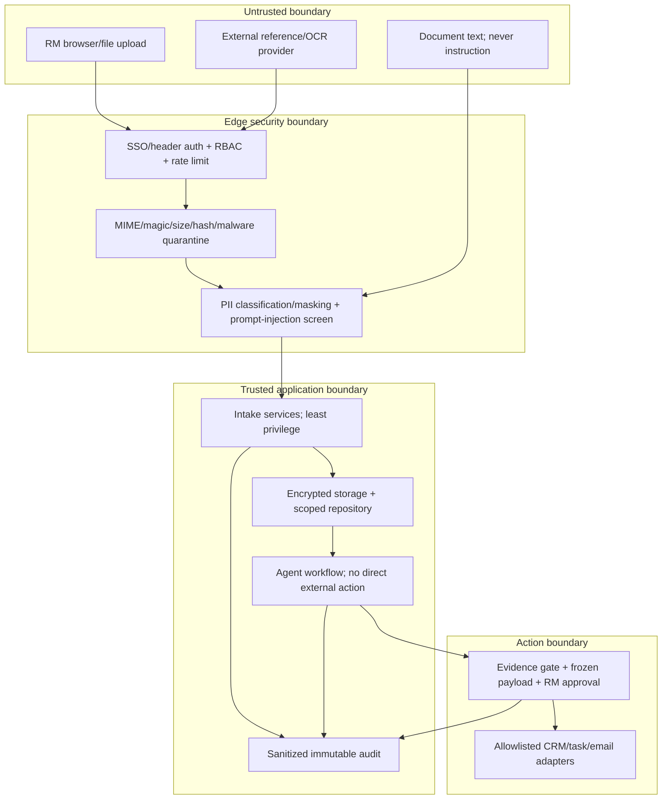

Control bắt buộc trước dữ liệu thật: TLS; encryption at rest cho document/extraction; object key không chứa PII; signed URL TTL ngắn nếu lưu raw; tenant/branch filter ở repository, không chỉ UI; file parser chạy process/container hạn quyền với timeout/memory limit; egress allowlist cho OCR/model; secret từ secret manager; raw prompt/document không vào log; export/download có audit; xóa theo retention có deletion event; backup cũng tuân retention; incident path khi audit chain hỏng hoặc file bị quarantine.

## 36. Error Handling

Đã có convention nhất quán: `HTTPException(status_code, detail={"code": ..., "message": ...})`, ví dụ `CONTEXT_ACCESS_DENIED` (403), `CASE_ACCESS_DENIED` (403), `STATE_VERSION_CONFLICT` (409), `UNSAFE_INPUT` (400), `CASE_NOT_FOUND` (404). Route intake mới nên theo đúng convention này (`INTAKE_SESSION_NOT_FOUND`, `EXTRACTION_FAILED`, `UNSUPPORTED_FILE_TYPE`...) thay vì phát minh format lỗi mới.

| Failure | Trạng thái/fallback | Retry | Thông báo cho RM |
|---|---|---|---|
| Upload/file invalid/malware suspect | Reject/quarantine trước parser; không tạo extraction | Không retry tự động | File nào lỗi, lý do, loại file/size hỗ trợ; không lộ rule bảo mật chi tiết |
| Parser text rỗng | Chuyển OCR nếu adapter khả dụng; nếu không `processing_failed` | Retry khi đổi parser/OCR version | “Tài liệu scan cần OCR, MVP chưa hỗ trợ” |
| OCR/model timeout/5xx | Circuit breaker + job `retryable_failed`; giữ file/job | Exponential backoff chỉ stage idempotent, tối đa cấu hình | Hiển thị đang chờ/thử lại và cho RM xử lý thủ công |
| LLM output sai schema | Một lần repair/retry với cùng evidence; sau đó deterministic fallback/abstain | Tối đa 1 model retry | Field thành missing, không hiển thị giá trị bịa |
| Conflict/low confidence | `profile_review_required` | Không tự retry/chọn nguồn | Mở candidates/evidence cho RM xác nhận |
| Product/Legal retrieval rỗng hoặc policy conflict | `pending_review`/manual lookup | Không loop model; cache invalidation nếu index version đổi | Không có đủ nguồn đáng tin; chỉ hiển thị tài liệu tìm được |
| Optimistic lock 409 | Không ghi đè revision mới | Client reload rồi RM quyết định áp dụng lại | Có thay đổi mới từ phiên khác |
| CRM/task/email tool lỗi | Giữ frozen payload; ghi partial result; không tạo trùng | Chỉ retry adapter có idempotency | Hành động nào thành công/thất bại, nút retry an toàn |
| Audit chain invalid | Dừng approval/execute, security escalation | Không tự sửa chain | Tạm dừng hành động do lỗi toàn vẹn nhật ký |

## 37. Observability

`KEEP` JSON log + counter; `MODIFY` event taxonomy và redaction. Mỗi event có `trace_id, case_id, intake_id?, actor_id_hash, workflow_version, schema_version, stage, status, latency_ms, error_code?, safety_flags`; model event thêm model/prompt version/token/cost; retrieval event thêm index/document/version/filter/score; tool event chỉ lưu arguments đã sanitize. Không log raw document text, source span đầy đủ, approval token, email/proposal body hoặc identity number.

Event tối thiểu: `sales_case_draft_created`, `case_document_uploaded/rejected`, `document_processing_started/stage_completed/failed/dead_letter`, `field_extracted/validation_failed/conflict_detected`, `profile_field_corrected/profile_confirmed`, `planner_plan_created/replanned`, `next_best_questions_created/answered`, `agent_run_started/completed/failed`, `evidence_validation_failed`, `approval_issued/rejected/expired`, `action_execution_started/completed/failed`, `audit_chain_verification_failed`.

Metrics/dashboard: upload/parser/OCR success rate; extraction completeness/precision/field confidence distribution; conflict and RM correction rate; time từ draft tới confirmed; Product Hit@K/context precision; eligibility accuracy/unsafe approval; NBQ answer rate; plan re-plan count/loop limit; tool success/idempotent replay; P50/P95 latency; token/cost per case; escalation rate. Alert P0: unsafe action, cross-scope access, audit chain invalid, PII leak detection; P1: dead-letter spike, retrieval empty spike, CRM circuit open. OpenTelemetry **NOT FOUND**; pilot có thể dùng trace ID hiện tại, production thêm OTel sau khi chốt backend.

## 38. Test Plan

**Baseline hiện hành, chạy độc lập khi cập nhật tài liệu** (không lấy số từ tài liệu tự báo cáo):

```powershell
.\.venv\Scripts\python.exe -m pytest -q
```

```text
172 passed, 1 warning in 10.86s
```

Warning là `PendingDeprecationWarning` của `starlette.formparsers`/`python_multipart`, không phải assertion failure. Kết quả này đã bao gồm intake, profile confirmation, planner/NBQ/NBA, AI log và public sales-case facade.

Ma trận test Document Intake được dùng để triển khai; các luồng lõi hiện có ở `tests/test_sales_cases_e2e.py`, unit/contract/API tests và browser QA. Các case OCR/enterprise provider vẫn để dành cho pilot:

| Nhóm | Case cần có |
|---|---|
| UI | RM tạo case qua wizard không cần JSON; upload nhiều file; hiển thị tiến trình; sửa field; xác nhận profile; chặn chạy agent khi chưa confirm |
| File processing | PDF có text/PDF scan (cần OCR)/DOCX/XLSX/file không hợp lệ/quá lớn/trùng/hỏng/OCR confidence thấp/2 file mâu thuẫn/tài liệu có prompt injection |
| Extraction | Field tồn tại/không tồn tại/mơ hồ/nhiều giá trị/sai schema/retry/evidence mapping/human correction |
| Contract/API | Đủ 16 public routes; auth/scope; request/response JSON Schema; ETag 409; idempotency; error shape; audit event |
| Planner | Initial plan; Legal pass/pending/fail; re-plan diff; NBQ/NBA ranking; tối đa 3 vòng; chỉ rerun node bị ảnh hưởng |
| Approval/action | Payload đổi sau preview; token hết hạn/replay/sai RM; duplicate execute; partial tool failure; audit chain invalid |
| Security | Cross-branch access, raw PII trong log, prompt injection trong file, magic-bytes mismatch, malware quarantine, malicious filename |
| Recovery | Restart khi job running, retryable failure, dead-letter, circuit open, polling sau restart |

Test pyramid: unit cho parser/validator/merge/planner/rules; contract cho schema/API; integration cho repository/state/approval/executor; browser E2E cho 3 case; security/adversarial; eval regression. CI gate bắt buộc chạy baseline + test mới, verify audit chain và kiểm log không chứa fixture PII.

## 39. Evaluation Plan

Đã có 40 case nghiệp vụ (15 intent/15 retrieval/10 eligibility), 25 security và 20 reliability trong `data/eval/v2/`, đều `synthetic=true`. `ADD` tối thiểu 40 golden sales cases có file fixture: 10 happy path, 10 missing-information, 8 blocking/ineligible, 5 conflict/low-confidence, 4 permission/security, 3 tool/recovery; ít nhất 5 loại tài liệu ở mục 17.

| Layer | Metric | Gate MVP/pilot |
|---|---|---|
| Extraction | Field precision/recall, source attribution accuracy, schema-valid rate | Threshold phải được đo/duyệt theo field; identity/legal blocking không có unsupported fact |
| Conflict/profile | Conflict recall, RM correction rate, profile completeness | 100% seeded blocking conflicts được đưa ra review |
| Intent/context | Field extraction accuracy, repeated-question rate | Không hỏi lại field đã confirmed/current; stale/conflict phải hỏi đúng |
| Product RAG | Hit@K, context precision/recall, citation correctness | Không recommendation ngoài catalog/ACL/effective date |
| Legal | Eligibility accuracy, false-pass/unsafe approval rate | **Unsafe approval rate = 0%** trên golden set |
| Planner/NBQ/NBA | Routing accuracy, re-plan correctness, question usefulness, task success | Legal block phải thay đổi plan; không tạo opportunity-ready payload khi pending |
| Evidence | Unsupported claim rate, faithfulness | Blocking claim không evidence = 0 |
| Reliability/ops | Tool-call correctness, duplicate action, P95 latency, cost/case | Duplicate external action = 0; budget/SLO do pilot chốt |

Runner phải xuất JSON gồm dataset version, code/workflow/prompt/model/index/rule versions và per-case failure. Không dùng LLM-as-judge đơn lẻ: kết hợp exact/schema/rule metrics, retrieval metrics và human RM review. Giá trị chưa đo ghi `<RESULT_TO_BE_MEASURED>`, không tự đặt số đẹp.

## 40. Repository Change Matrix

Tổng hợp mục 6–9 dạng bảng (yêu cầu `plan.md` mục 25 mục 40):

| Nhóm | KEEP | MODIFY | ADD | REMOVE |
|---|---|---|---|---|
| Context/Contracts | `app/context/`, `app/integrations/`, `app/schemas/v2/*` (trừ state mới) | `SharedCaseState` (+field), `WorkspaceDocument` (mở rộng) | `CustomerBusinessSnapshot` | — |
| Intent/Product/Eligibility/Operations/Workflow | Intent/Product/Eligibility core | `V2WorkflowEngine` input/re-plan hook, Operations nhận plan/NBQ/NBA/proposal | `workflow/planner.py`, `workflow/next_best.py`, planning/NBQ/NBA schemas, proposal service | — |
| Knowledge | `app/knowledge/parsers.py` (logic), `service.py`, `legal_service.py`, `index.py` | `upload_ingestion.py` (thêm nhánh case-scoped nếu tái dùng) | `app/intake/*` (8 module theo mục 8) | — |
| Approval/Actions/Storage | Approval/executor/audit core | Repository thêm migration/query, frozen payload mở rộng, redact list | `intake_sessions`, `case_documents`, `document_processing_jobs`, `document_extractions`, `extracted_fields`, `field_conflicts`, `customer_profile_drafts` | — |
| API | 20 route `/cases` hiện có | Thêm compatibility mapping | Public facade 16 route `/sales-cases` (mục 31) | — |
| UI | Khối kết luận/hành động/evidence/audit | Điều hướng và case result workspace | 14 màn hình, 5-step wizard, upload/status/review/NBQ/NBA/approval | — |
| Observability/Reliability/Evaluation | Toàn bộ cơ chế | Redact set, event code mới | Eval set cho extraction | — |
| V1 (`app/main.py` `/api/v1`, `app/agents/`) | Giữ để tương thích (theo README) | — | — | — |

---

## 41. Detailed Backlog

| ID | Epic | Module | Task | Existing path | Change type | Dependency | Priority | Owner role | Acceptance criteria |
|---|---|---|---|---|---|---|---|---|---|
| BL-01 | Repository assessment | — | Hoàn thành tài liệu này | `docs/SHB_CORPORATE_SALES_COPILOT_IMPLEMENTATION_PLAN.md` | ADD | — | High | AI/Architect | Tài liệu tồn tại, có bằng chứng file:line, không bịa chức năng |
| BL-02 | RM Sales Case Wizard | UI | Dựng 5 bước wizard | `app/static/index.html` | MODIFY | BL-05 | High | FE | RM tạo case không cần biết JSON |
| BL-03 | Multi-file upload | API+UI | Route multipart theo sales-case draft/intake session | `app/api/v2/router.py` (tái dùng UploadFile pattern) | ADD | BL-04, BL-18 | High | BE | Upload nhiều file, trả `case_id` reserved + document receipts |
| BL-04 | File validation | BE | MIME/size/hash/duplicate, chặn trước khi parse | Tái dùng `MAX_UPLOAD_BYTES`, `screen_input` | ADD | — | High | BE | File hỏng/quá lớn bị từ chối có lý do rõ |
| BL-05 | Document parser wiring | BE | Gọi `parse_document_bytes` cho case document | `app/knowledge/parsers.py` | MODIFY (caller mới) | BL-04 | High | BE | PDF/DOCX/TXT/XLSX case document parse được, quality gate hoạt động |
| BL-06 | OCR adapter | BE | Interface + 1 implementation | Mới `app/intake/ocr_adapter.py` | ADD | BL-05 | Medium | BE | PDF scan không còn bị từ chối thẳng, có kết quả OCR + confidence |
| BL-07 | Document classification | BE | Hybrid filename+keyword+LLM fallback | Mới, mẫu từ `app/intent/fallback.py` | ADD | BL-05 | Medium | BE | Phân loại đúng ≥ ngưỡng đo bằng eval mới |
| BL-08 | Structured extraction | BE | LLM + deterministic validate, evidence span | Mẫu `app/intent/extractor.py`/`validator.py` | ADD | BL-06, BL-07 | High | BE/AI | Field có confidence/source, không field nào thiếu evidence mà thành fact |
| BL-09 | Data normalization | BE | MST/ngày/enum | Mẫu `app/intent/normalizer.py` | ADD | BL-08 | Medium | BE | Test round-trip cho từng loại field |
| BL-10 | Conflict detection | BE | Áp dụng cho field mới | `app/context/conflicts.py` | MODIFY (mở rộng field áp dụng) | BL-09 | High | BE | Xung đột 2 nguồn được phát hiện, không tự chọn ngẫu nhiên |
| BL-11 | RM review UI | UI | Grid value/source/confidence/status/edit | Mới | ADD | BL-08 | High | FE | RM sửa/xác nhận từng field trước khi phân tích |
| BL-12 | Customer Profile Builder | BE | Tổng hợp `CustomerBusinessSnapshot` | Mới `app/intake/profile_builder.py` | ADD | BL-09, BL-10 | High | BE | Output đúng schema mục 20, `rm_confirmed` chỉ true sau Bước 5 |
| BL-13 | State machine intake | BE | `IntakeStatus` riêng | Mới, không đụng `CaseStatus` | ADD | — | High | BE | Transition hợp lệ có test, không phá `CaseStatus` hiện có |
| BL-14 | Nối vào workflow | BE | `profile_confirmed` → `run-analysis` → materialize `SharedCaseState` | `app/api/v2/router.py`, `app/workflow/engine.py` | MODIFY | BL-12, BL-13, BL-18 | High | BE | Case có snapshot hash/revision; không agent nào chạy trước confirm |
| BL-15 | Evaluation mở rộng | Eval | Field extraction precision/recall | `app/evaluation/runner.py` | MODIFY | BL-08 | Medium | QA | Có số liệu thật, không bịa |
| BL-16 | Security review intake/actions | Sec | Malware placeholder, redact field mới, V2 tool allowlist runtime | `app/observability/runtime.py`, `app/schemas/v2/tool_contracts.py` | MODIFY/ADD | BL-03, BL-18 | High | Security | PII fixture không lọt log; adapter bị chặn nếu caller/permission không nằm trong registry |
| BL-17 | Complexity Router boundary | BE | Giữ router V1 ngoài critical path V2; ghi ADR | `app/services/complexity_router.py`, `app/workflow/engine.py` | KEEP V1 / NO-USE V2 MVP | — | Low | Architect | Không diagram/code V2 nào giả định router đã được nối |
| BL-18 | Public API + contracts | API | 16 route `/api/v2/sales-cases`, request/response/error/ETag/idempotency | `app/api/v2/router.py`, `app/schemas/v2/` | ADD | BL-13, BL-22 | High | BE | Contract tests đủ 16 route, route `/cases` cũ không regression |
| BL-19 | Planner + re-plan | Workflow | `ExecutionPlan`, `plan`, `replan`, plan diff sau Legal | `app/workflow/engine.py`; mới `planner.py`, planning schema | MODIFY/ADD | BL-12, BL-14 | High | BE/AI | Legal pending/fail thay đổi plan; impact graph chỉ dùng để chọn node rerun |
| BL-20 | NBQ/NBA | Workflow+UI | Schema, ranking deterministic, answer/resume flow, panels | Mới `app/workflow/next_best.py`, schema/UI | ADD | BL-19 | High | BE/FE | Câu hỏi có field/impact/priority; action có owner/SLA/dependency/risk |
| BL-21 | Proposal draft | Operations | Evidence-grounded proposal + template; không send/export tự động | `app/operations/service.py`; mới `proposal_service.py` | MODIFY/ADD | BL-19, Product/Legal output | Medium | BE | Proposal chỉ dùng product/policy hợp lệ, có disclaimer/evidence IDs |
| BL-22 | Intake persistence | Storage | Migration v2 + 7 bảng/query/index/retention hooks | `app/storage/migrations.py`; mới intake repository | ADD | Contracts | High | BE | FK/index/optimistic lock/restart recovery có test |
| BL-23 | 14-screen UI | UI | Tách static modules, wizard/workspace/NBQ/NBA/approval/audit states | `app/static/` | MODIFY/ADD | BL-18, BL-20 | High | FE | Mỗi màn hình đạt contract mục 29, không render JSON thô |
| BL-24 | Intake observability | Ops | Event taxonomy, metrics, PII scan, alert hooks | `app/observability/runtime.py` | MODIFY | BL-03, BL-19 | High | BE/Sec | Trace từ upload tới action; fixture PII không xuất hiện trong log |
| BL-25 | Golden data + demo fixtures | Data/Eval | 40 sales cases + 5 document types + Minh Phát runbook | `data/eval/v2/`, `data/synthetic/v2/` | ADD | BL-08, BL-19 | High | QA/Data | Expected fields/evidence/plan/NBQ/NBA/status có ground truth và `synthetic=true` |
| BL-26 | E2E/security/recovery | QA | 3 paths browser + restart/dead-letter + approval replay/cross-scope | `tests/` | ADD | BL-18–BL-25 | High | QA/Sec | Full pytest pass; browser console 0 error; unsafe/duplicate action = 0 |

Mỗi task có Definition of Done ở mục 49.

## 42. 48-Hour MVP Plan

| Khung giờ | Task | Owner | Dependency | Output | Test | Cut criteria | File dự kiến ảnh hưởng |
|---|---|---|---|---|---|---|---|
| 0–6h | Khoá Pydantic+JSON contracts, public API, `IntakeStatus`, migration v2 (BL-13/18/22) | Architect+BE | — | Contract/migration chạy được; không dùng `Dict[str,Any]` làm chuẩn lâu dài | Schema/contract/migration tests | Cắt field không thiết yếu, không cắt provenance/version | `app/schemas/v2/`, migrations/repository |
| 6–12h | Draft case + multi-file upload + validation/hash + parser wiring (BL-03/04/05) | BE | Contracts | 6 API intake đầu chạy; PDF/DOCX/TXT/XLSX text-layer | Unit/API tests | OCR thật chuyển fallback rõ; không cắt size/MIME/scope | `app/intake/`, router |
| 12–18h | Rule classifier + deterministic-first extraction cho form mục 17 (BL-07/08/09) | BE/AI | Parser | Candidate field có evidence/confidence/validation | Fixtures 5 doc types, missing/invalid/evidence tests | LLM optional; không cắt evidence/abstain | extractor/classifier/validator |
| 18–24h | Merge/conflict + review + snapshot hash/confirm (BL-10/11/12) | BE+FE | Extraction | Review grid tối thiểu và confirmed snapshot | Conflict/edit/version/hash tests | Cắt UI polish, không cắt conflict blocking | profile builder/review/UI |
| 24–30h | Planner plan/re-plan + NBQ/NBA tối thiểu (BL-14/19/20) | BE | Snapshot + workflow | Legal pending/fail đổi plan; câu hỏi/action typed | 3 workflow branch tests | Complexity Router không vào critical path; không cắt re-plan | workflow/planner/next_best |
| 30–36h | Wizard 5 bước + case workspace ưu tiên 14 màn hình (BL-02/23) | FE | APIs | Luồng RM từ draft tới result không JSON | Browser happy path + responsive/manual states | Màn ít ưu tiên có thể là tab/panel, không bỏ chức năng | `app/static/` |
| 36–42h | Operations proposal/email/task/opportunity draft + evidence + approval/execute (BL-21) | BE+FE | Re-plan | Frozen payload; mock action idempotent; proposal draft text | Missing/blocking/happy E2E; approval replay | Không PDF export/send thật; giữ RM approval | operations/approval/actions/UI |
| 42–48h | Security/observability/recovery/eval/demo pass (BL-16/24/25/26) | QA+Sec+team | Tất cả | Build log, metrics/events, 3 demo paths, regression xanh | Full pytest, browser console, PII log scan, audit verify | Không cắt cross-scope/idempotency/audit tests | tests/data/docs/runtime |

**Must-have:** form ngắn; upload nhiều file; parser; extraction tối thiểu các field identity + employee/revenue + needs/pain points; review/conflict/confirm; snapshot; Planner/Product/Legal/Operations; re-plan; NBQ/NBA; proposal/email/opportunity/task drafts; evidence; RM approval; mock action; audit timeline; happy/missing/blocking paths.

**Out of scope 48h:** OCR provider thật (MVP phát hiện scan và báo fallback), LLM classifier bắt buộc, proposal PDF export, CRM/email/KYC/core integration thật, SSO thật, persistent queue phân tán, production vector embedding. Không được mô phỏng các mục này như đã tích hợp.

**Demo runbook bắt buộc — `SYNTHETIC DEMO DATA`: Công ty Cổ phần Thiết bị Minh Phát**

| Bước | Thao tác/demo input | Expected output bắt buộc |
|---|---|---|
| 1 | RM nhập tên DN, nhu cầu ngắn và ghi chú; không JSON | Draft có `case_id`, step 2, audit `sales_case_draft_created` |
| 2 | Upload meeting note, đăng ký DN, payment process, BCTC text-layer | Receipt/hash/type/status từng file; duplicate bị nhận diện |
| 3 | Process documents | Timeline parse→classify→extract→merge; không agent nghiệp vụ chạy |
| 4 | Xem auto-fill | Có tên/MST/500 nhân viên/40 đại lý/80 nhà cung cấp, nhu cầu payroll/supplier payment/collection/working capital/ERP, mỗi field có nguồn |
| 5 | Cố ý seed một field confidence thấp | Badge vàng + evidence; không auto-confirm |
| 6 | Cố ý seed conflict/missing về doanh thu hoặc financial period | Conflict card + blocking impact; không tự chọn nguồn |
| 7 | RM sửa/chọn và confirm | Lưu original/new/actor, snapshot hash/revision/confirmed_by |
| 8 | Product Agent chạy | Bundle grounded theo catalog synthetic, citation/version, eligibility vẫn unknown trước Legal |
| 9 | Legal chặn phần vốn lưu động vì thiếu dữ liệu/tài liệu | `pending_information`, blocking reason, required document/evidence |
| 10 | Planner re-plan | Plan version tăng; financing step blocked/replaced; payroll/payment/collection discovery vẫn tiếp tục an toàn |
| 11 | NBQ/NBA + Operations | Câu hỏi tài chính ưu tiên; discovery task/checklist; email/proposal draft không khẳng định sai điều kiện |
| 12 | RM xem preview và approve | Frozen payload hash + one-time token; reject path không side effect |
| 13 | Execute mock | Opportunity/task IDs hoặc draft result, idempotent replay không tạo trùng, audit timeline/chain valid |

## 43. Pilot Plan

`PROPOSED`: sau MVP 48h, cần (a) OCR thật có nhà cung cấp đã chọn, (b) `CustomerBusinessSnapshot` được ít nhất 5 RM thật dùng thử và cho phản hồi độ chính xác trích xuất, (c) eval set field-extraction có case thật (de-identified) thay vì chỉ synthetic, (d) security review riêng cho luồng nhận file KYC từ RM (khác với luồng ingest kho tri thức đã có governance). Không đủ thông tin để lập lịch pilot cụ thể — `DATA REQUIRED FROM SHB` (thời gian RM thật sẵn sàng test).

## 44. Production Considerations

Kế thừa nguyên trạng thái đã ghi trong `README.md` ("Ranh giới production") và bổ sung phần intake:

- Cần OCR provider đã qua đánh giá bảo mật/pháp lý (mục 16, 35).
- Cần chính sách retention cho file KYC gốc — hiện repo có tiền lệ "không lưu raw upload" cho kho tri thức, nên áp dụng nguyên tắc tương tự hoặc quyết định khác có ghi lý do.
- Cần mở rộng redact set trước khi bất kỳ field CCCD/ngày sinh nào chảy qua `app/observability/runtime.py`.
- Các gap production đã ghi nhận trước đó (SSO/IAM thật, PostgreSQL, OpenTelemetry, semantic embedding thật, penetration test) không đổi, áp dụng cho cả phần intake mới.

## 45. Risks and Mitigations

| Rủi ro | Khả năng | Tác động | Giảm thiểu |
|---|---|---|---|
| LLM trích xuất bịa field không có trong tài liệu | Trung bình | Cao (sai lệch hồ sơ KH) | Bắt buộc evidence span khớp text gốc, theo đúng mẫu `app/intent/validator.py` đã chứng minh |
| PDF scan bị từ chối hàng loạt vì chưa có OCR | Cao (nếu SHB dùng nhiều file scan) | Cao (RM không dùng được) | Ưu tiên BL-06 sớm sau MVP; MVP báo lỗi rõ ràng thay vì im lặng |
| Field nhạy cảm mới lọt vào log | Trung bình | Cao (privacy) | BL-16 bắt buộc trước khi nhận file KYC thật |
| Đụng độ với `CaseStatus` đang ổn định | Thấp (nếu theo đúng mục 33) | Cao nếu xảy ra | Dùng `IntakeStatus` riêng, không sửa `CaseStatus` |
| Baseline xanh nhưng tính năng intake mới chưa có test | Chắc chắn cho tới khi build | Cao nếu nhầm baseline thành readiness | Mục 38 ghi rõ 158 test chỉ là baseline; BL-26 bắt buộc regression + test mới |
| Hai hàm `impacted_nodes` trùng tên khác nghĩa (`app/workflow/impact.py` vs `app/intent/corrections.py`) | Đã xảy ra | Trung bình (dễ nhầm khi bảo trì) | BL-17 làm rõ vai trò từng hàm, cân nhắc đổi tên |
| Gọi partial resume là Planner re-plan | Đã phát hiện trong bản plan cũ | Cao (build thiếu vòng Legal feedback) | BL-19 thêm `ExecutionPlan/PlannerService.replan`; acceptance kiểm plan version/diff |
| RM vẫn phải hỏi lại dữ liệu đã có | Trung bình | Cao về adoption/năng suất | Snapshot field freshness/provenance + NBQ dedup; đo repeated-question rate |

## 46. Assumption Register

| # | Giả định | Ảnh hưởng nếu sai |
|---|---|---|
| A1 | "SHB Corporate Sales Copilot" và "Corporate Expert Workspace V2" là cùng một sản phẩm | Có thể cần đổi tên hiển thị, không ảnh hưởng kiến trúc |
| A2 | `CustomerBusinessSnapshot` mở rộng `ResolvedValue` hiện có thay vì tạo type song song | Nếu team muốn tách riêng, cần thiết kế lại mục 17, 20 |
| A3 | Confidence extraction phải hiệu chuẩn theo field; chưa có một ngưỡng chung được phê duyệt | Trước khi đo, mọi output chỉ là candidate và field blocking cần RM confirm |
| A4 | Giữ vanilla JS nhưng tách thành static modules, không thêm framework trong MVP | Nếu chuyển framework, API/UI contract giữ nguyên nhưng backlog FE/estimate phải cập nhật |
| A5 | Không lưu raw file upload cho case document (theo tiền lệ kho tri thức) | Nếu SHB yêu cầu lưu raw để tra soát, cần thêm storage + mã hoá |
| A6 | Public facade `/sales-cases` có thể cùng tồn tại với `/cases` cũ | Nếu bắt buộc một namespace duy nhất, cần migration/deprecation plan cho client cũ |

## 47. Open Questions

1. `CustomerBusinessSnapshot` có cần lưu lâu dài và tái dùng giữa các case cùng khách hàng không? (mục 20, 32)
2. Schema mới là additive minor version hay breaking major version của `SharedCaseState`/JSON contracts? (`shared_case_state.py`, `plan_v2/contracts/`)
3. SHB chọn OCR provider nào, có yêu cầu on-prem/data residency không? (mục 16, 35)
4. Chính sách retention/xóa raw file, parsed text, field evidence, profile và backup là gì? (mục 32, 34, 44)
5. Public external data/KYC provider nào được cấp phép và source priority so với CRM/tài liệu RM là gì? (mục 34)
6. Role nào có `case:confirm`, `case:approve`, `case:execute`, `case:audit`; có cần four-eyes approval cho sản phẩm/rủi ro nào? (mục 29, 31, 35)
7. Proposal draft cần template/brand/legal disclaimer nào; PDF export có thuộc pilot không? (mục 25, 42)

## 48. Acceptance Criteria

Trạng thái dưới đây là **độ đầy đủ của kế hoạch**, không phải tuyên bố code đã implement:

| # | Acceptance criterion từ `plan.md` | Trạng thái trong tài liệu | Bằng chứng |
|---|---|---|---|
| 1 | Audit repo có đường dẫn | Đạt | Mục 2–4 |
| 2 | Kết luận mức sửa | Đạt | Mục 1: Moderate |
| 3 | RM không nhập JSON | Đạt | Mục 1, 13, 29 |
| 4 | Thiết kế form/UI | Đạt | Mục 13, 29 đủ 14 màn |
| 5 | Multi-file upload | Đạt trong thiết kế | Mục 14, 29, 31 |
| 6 | Document processing trước Planner | Đạt | Mục 12, 14, 33 |
| 7 | Parser + OCR strategy | Đạt | Mục 15–16 |
| 8 | LLM structured extraction | Đạt trong thiết kế; optional MVP | Mục 17 |
| 9 | Deterministic validation | Đạt | Mục 15, 17 |
| 10 | Field-level evidence | Đạt | Mục 17, 20, 26 |
| 11 | Confidence | Đạt, không dùng thay validation | Mục 17, 34 |
| 12 | Conflict detection | Đạt | Mục 14, 17–19, 32 |
| 13 | RM review | Đạt | Mục 19, 29 |
| 14 | Customer Business Snapshot | Đạt | Mục 20 |
| 15 | Agent chỉ chạy sau confirm | Đạt | Mục 19, 31, 33 |
| 16 | Planner/Product/Legal/Operations | Đạt | Mục 21–25 |
| 17 | Re-plan sau Legal | Đạt trong thiết kế, **ADD/MODIFY** chứ không giả là hiện có | Mục 21–22, BL-19 |
| 18 | Next Best Questions | Đạt trong thiết kế, **ADD** | Mục 22, 29, BL-20 |
| 19 | Next Best Actions | Đạt trong thiết kế, **ADD** | Mục 22, 29, BL-20 |
| 20 | Human approval | Đạt | Mục 28, 31 |
| 21 | Opportunity/task action | Đạt | Mục 25, 28, 31 |
| 22 | Audit log | Đạt | Mục 4, 35, 37 |
| 23 | Uploaded document security | Đạt trong thiết kế | Mục 27, 35 |
| 24 | Repository change matrix | Đạt | Mục 40 |
| 25 | Detailed backlog | Đạt | Mục 41 |
| 26 | Plan 48 giờ | Đạt | Mục 42 |
| 27 | Không bịa chức năng repo | Đạt | Nhãn CURRENT/NOT FOUND/PROPOSED xuyên suốt |
| 28 | Không bịa dữ liệu SHB | Đạt | Dữ liệu demo gắn `SYNTHETIC DEMO DATA`; dữ liệu thật gắn `DATA REQUIRED` |
| 29 | Không bịa API | Đạt | Mục 31 tách 20 route hiện có và 16 public route đề xuất |
| 30 | Không bịa benchmark | Đạt | Mục 38 ghi lệnh và kết quả 161 pass; metric chưa đo vẫn ghi rõ |

Điều kiện trước coding: PM/RM/Data/Security xác nhận các open questions làm thay đổi schema, retention, quyền hoặc provider. Các mục khác có thể build theo assumption register và phải lưu assumption trong ADR/build log.

## 49. Definition of Done

Cho MỖI task ở mục 41, "Done" nghĩa là: (1) code và Pydantic+JSON contract đồng bộ, (2) unit/contract/integration hoặc browser test tương ứng chạy thật, (3) toàn bộ regression `pytest -q` pass, (4) field trích xuất có provenance/evidence và negative test abstain, (5) scope/PII/idempotency/audit được test nếu task chạm dữ liệu/action, (6) docs/runbook/migration/rollback cập nhật, (7) `docs/BUILD_V2_LOG.md` ghi file đổi, lệnh, kết quả thật và hạn chế. Task `PROPOSED` chưa có code/test không được đánh dấu Done.

## 50. No-Hallucination Verification

Tự kiểm tra theo đúng danh sách mục 27 của `plan.md`:

- Có nói module tồn tại mà không có file chứng minh? Không — mọi claim "hiện có" đều kèm `file:line`; phần chưa có đều ghi `NOT FOUND IN CURRENT REPOSITORY` hoặc `PROPOSED DESIGN`.
- Có bịa đường dẫn? Không — đường dẫn hiện có được kiểm tra trong workspace; đường dẫn mới luôn gắn `ADD/PROPOSED`.
- Có nhầm đề xuất thành hiện có? Không — dùng nhãn `PROPOSED DESIGN`/`ADD`/`ASSUMPTION` nhất quán cho phần chưa tồn tại (mục 13–20, 30–32).
- Có bắt RM nhập JSON? Không — thiết kế mới giữ nguyên textarea tự do đã có, chỉ thêm field rời cho phần định danh công ty.
- Có bỏ qua bước xử lý tài liệu? Không — mục 14 đặt Document Intake trước Planner đúng yêu cầu.
- Có dùng LLM để đoán dữ liệu thiếu? Không — mọi thiết kế đều copy nguyên tắc fail-closed đã có (`app/eligibility/engine.py`, `app/intent/validator.py`): field không có evidence không được ghi thành fact.
- Có field nào không có source? Schema mục 20 bắt buộc `source_map`/`ResolvedValue` cho mọi field.
- Có tự xác nhận KYC/eligibility? Không — giữ nguyên nguyên tắc `"eligibility": "unknown"` ở Product, fail-closed ở Eligibility.
- Có bịa sản phẩm/phí/hạn mức SHB? Không — không đề cập số liệu sản phẩm thật nào ngoài dữ liệu `SYNTHETIC DEMO DATA` đã có sẵn trong repo.
- Có bịa kết quả benchmark? Không — mục 38 ghi regression tự chạy `172 passed, 1 warning`; business/security/reliability reports được lưu dưới `data/eval/v2/`.
- Có nhầm impact resume với Planner re-plan? Không — mục 21–22 phân biệt rõ và tạo BL-19 `ADD/MODIFY`.
- Có action nào không qua approval? Không — mọi external/mock action vẫn qua `ApprovalServiceV2`/`ActionExecutorV2`, không tạo đường tắt.
- Có dữ liệu synthetic nào không gắn nhãn? Không — mọi bảng/dataset mới đề xuất đều kế thừa quy ước `"synthetic": true` đã có trong `data/eval/v2/*.json`.
