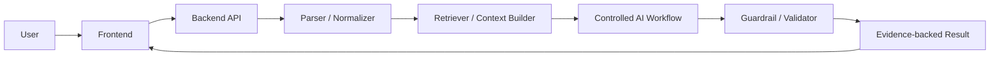

# Prompt tạo `README.md` và `AI_LOG.md` cho repo VAIC 2026

Sao chép toàn bộ prompt bên dưới vào Codex, Claude Code, Cursor, ChatGPT hoặc một AI coding assistant khác tại thư mục gốc của repo.

---

## Prompt dành cho AI coding assistant

Bạn là AI coding assistant đang hỗ trợ tôi xây dựng và hoàn thiện repository cho **Vietnam AI Innovation Challenge 2026 (VAIC 2026)**.

Nhiệm vụ của bạn là tạo hai tài liệu Markdown chuyên nghiệp tại thư mục gốc của repository:

1. `README.md`
2. `AI_LOG.md`

### Bối cảnh cuộc thi

- VAIC 2026 là hackathon AI-native diễn ra trong 48 giờ.
- Sản phẩm phải chứng minh AI nằm ở lõi kiến trúc và workflow, không chỉ là một chatbot wrapper hoặc một lớp giao diện gọi API LLM.
- Repository, live URL, slide/demo và AI collaboration log là các thành phần quan trọng của bài nộp.
- Judge có thể đánh giá sản phẩm theo các nhóm tiêu chí:
  - Problem relevance
  - AI-native architecture
  - Technical execution
  - Deployment và live URL
  - Feasibility và khả năng pilot trong khoảng 3 tháng
  - Startup/business potential
- `AI_LOG.md` phải chứng minh team đã dùng AI để nghiên cứu, lên ý tưởng, thiết kế, viết code, debug, kiểm thử, đánh giá và chuẩn bị pitch, đồng thời thể hiện rõ con người vẫn kiểm soát các quyết định cuối cùng.

### Nguyên tắc bắt buộc

- Trước khi tạo file, hãy khảo sát repository để hiểu:
  - Tên và mục tiêu sản phẩm
  - Cấu trúc thư mục
  - Tech stack thực tế
  - Các lệnh cài đặt, chạy và kiểm thử
  - Các biến môi trường
  - Kiến trúc AI và luồng dữ liệu
  - Tình trạng deployment, evaluation và guardrail
- Chỉ ghi thông tin đã được xác minh từ repository hoặc do người dùng cung cấp.
- Tuyệt đối không bịa:
  - Tên team
  - Tên thành viên
  - Track
  - Live URL
  - Demo video URL
  - Repository URL
  - Commit hash
  - Kết quả evaluation
  - Chỉ số business
  - Công nghệ hoặc tính năng chưa tồn tại
- Khi chưa có thông tin, dùng placeholder rõ ràng theo dạng `<PLACEHOLDER>`.
- Viết bằng tiếng Anh là chính để phù hợp với judge và mentor quốc tế. Có thể thêm ghi chú tiếng Việt ngắn nếu thật sự hữu ích.
- Nội dung phải rõ ràng, cụ thể, dễ quét nhanh và render đẹp trên GitHub.
- Không dùng những tuyên bố quảng cáo không có bằng chứng.
- Phân biệt rõ:
  - Tính năng đã hoạt động
  - Tính năng đang phát triển
  - Kế hoạch sau hackathon
- Không đưa secret, API key, token, mật khẩu hoặc dữ liệu nhạy cảm vào tài liệu.

### Quy tắc an toàn khi file đã tồn tại

- Nếu `README.md` hoặc `AI_LOG.md` đã tồn tại, **không được tự động ghi đè**.
- Trước tiên hãy đọc và đánh giá nội dung hiện có.
- Nếu có thể cập nhật an toàn, hãy trình bày kế hoạch thay đổi và chờ tôi xác nhận trước khi overwrite.
- Nếu chưa có xác nhận, hãy tạo:
  - `README_DRAFT.md`
  - `AI_LOG_DRAFT.md`
- Bảo toàn mọi nội dung đúng và hữu ích đang có trong file hiện tại.

---

# File 1 — `README.md`

Tạo `README.md` theo cấu trúc dưới đây. Điều chỉnh các phần cho phù hợp với repository thực tế, nhưng không được bỏ qua những mục quan trọng nếu chúng áp dụng cho dự án.

## 1. Project title

```markdown
# <PRODUCT_NAME> — VAIC 2026
```

Thêm:

- Tên track: `<TRACK_NAME>`
- Team: `<TEAM_NAME>`
- Trạng thái ngắn của prototype

## 2. One-line pitch

Viết một câu ngắn theo công thức:

```text
We help [target user] solve [specific pain point] by using [AI-native workflow] to produce [measurable or actionable outcome].
```

Nếu chưa đủ dữ liệu, dùng:

```text
<ONE_LINE_PITCH>
```

## 3. Problem

Mô tả rõ:

- Người dùng mục tiêu là ai
- Buyer hoặc enterprise stakeholder là ai
- Pain point cụ thể
- Quy trình hiện tại đang thủ công, chậm, tốn kém hoặc rủi ro như thế nào
- Vì sao vấn đề đáng giải quyết
- Vì sao doanh nghiệp có thể muốn pilot hoặc trả tiền cho giải pháp
- KPI dự kiến, nhưng chỉ ghi số cụ thể khi có bằng chứng

Ưu tiên bullet ngắn và có cấu trúc.

## 4. Solution

Mô tả:

- Sản phẩm làm gì
- Dữ liệu/input là gì
- AI xử lý input bằng workflow nào
- Output là gì
- Người dùng kiểm tra, phê duyệt hoặc hành động dựa trên output như thế nào
- Điểm khác biệt so với cách làm hiện tại hoặc chatbot thông thường

## 5. Demo

Tạo demo flow end-to-end, ví dụ:

1. User opens the application.
2. User uploads, selects, or enters enterprise data.
3. The system parses and normalizes the input.
4. The AI retrieves relevant context and executes the controlled workflow.
5. The system validates claims, evidence, safety, and missing information.
6. The user reviews an evidence-backed result.
7. The user exports or acts on the final output.

Thêm các trường:

```markdown
- Live demo: `<LIVE_URL>`
- Demo video: `<DEMO_VIDEO_URL>`
- Test account: `<TEST_ACCOUNT_OR_NOT_REQUIRED>`
```

Không đưa mật khẩu thật vào public README. Nếu cần test account, ghi cách nhận thông tin đăng nhập an toàn.

## 6. Why this is AI-native

Giải thích cụ thể vì sao AI nằm ở lõi sản phẩm.

Không chỉ nói “we use LLM/RAG/agents”. Phải chỉ ra:

- Công việc nào không thể hoàn thành theo cùng cách nếu bỏ AI
- AI tham gia vào reasoning, routing, retrieval, decision support hoặc action generation như thế nào
- Business rules và deterministic code kiểm soát AI ở đâu
- Human-in-the-loop xuất hiện ở đâu
- Hệ thống xử lý dữ liệu thiếu hoặc uncertainty như thế nào

Thêm sơ đồ text phù hợp với implementation thực tế:

```text
User Input / Enterprise Data
        ↓
Parsing and Normalization
        ↓
Retrieval / Context Builder
        ↓
Task Router / Controlled AI Workflow
        ↓
Business Tools and Deterministic Logic
        ↓
Guardrail and Validation Layer
        ↓
Evidence-backed Output
        ↓
Human Review / Export / Action
```

Nếu repository không có một layer nào, không được tuyên bố rằng layer đó đã được triển khai. Hãy đánh dấu rõ là planned nếu phù hợp.

## 7. Key features

Tạo bảng:

| Feature | Description | AI role | Business value | Status |
|---|---|---|---|---|

Các feature có thể gồm, nếu thực tế tồn tại:

- Document or structured-data ingestion
- Parsing and normalization
- Context retrieval
- Controlled reasoning workflow
- Next Best Action
- Next Best Question
- Evidence citation
- Guardrail checker
- Evaluation pipeline
- Report or email export
- User feedback
- Live dashboard

Giá trị `Status` nên thuộc một trong:

- Working
- Partial
- Planned

## 8. Architecture

Mô tả:

- Các component chính
- Quan hệ giữa frontend, backend, AI service, storage và external services
- Data flow
- Điểm kiểm soát lỗi
- Logging và observability nếu có
- Deployment topology nếu đã xác minh

Dùng Mermaid chỉ khi sơ đồ phản ánh đúng code thực tế. Ví dụ:



## 9. Tech stack

Tạo bảng:

| Layer | Technology | Purpose |
|---|---|---|

Chỉ điền công nghệ tìm thấy trong repository. Nếu chưa xác định, dùng placeholder:

- Frontend: `<FRONTEND_STACK>`
- Backend: `<BACKEND_STACK>`
- AI/LLM: `<MODEL_OR_PROVIDER>`
- Embedding: `<EMBEDDING_MODEL>`
- Vector store: `<VECTOR_STORE>`
- Database: `<DATABASE>`
- Authentication: `<AUTH_SOLUTION>`
- Deployment: `<DEPLOYMENT_PLATFORM>`
- Monitoring: `<MONITORING_SOLUTION>`

## 10. Repository structure

Sinh cây thư mục từ cấu trúc repository thực tế, không sao chép một cấu trúc giả.

Nếu repo còn trống, có thể dùng skeleton sau và đánh dấu là proposed:

```text
.
├── README.md
├── AI_LOG.md
├── EVALUATION.md
├── docs/
│   ├── architecture.md
│   ├── pilot_plan.md
│   └── demo_script.md
├── frontend/
├── backend/
├── ai/
│   ├── prompts/
│   ├── rag/
│   ├── guardrails/
│   └── evaluation/
└── data/
    ├── samples/
    └── processed/
```

## 11. Setup and run locally

Đọc source code, package files và scripts để tạo hướng dẫn chính xác.

Hướng dẫn cần gồm:

1. Prerequisites
2. Clone repository
3. Install dependencies
4. Configure environment variables
5. Start backend
6. Start frontend
7. Run tests hoặc evaluation
8. Mở URL local

Ví dụ placeholder:

```bash
git clone <REPO_URL>
cd <REPO_NAME>
cp .env.example .env
```

Không dùng các lệnh dưới đây nếu repository không thực sự sử dụng chúng:

```bash
pip install -r requirements.txt
uvicorn main:app --reload
npm install
npm run dev
```

Hãy thay bằng lệnh đúng được tìm thấy trong repo.

## 12. Environment variables

Tạo bảng:

| Variable | Description | Required | Secret |
|---|---|---:|---:|

Chỉ liệt kê tên biến, không ghi giá trị secret.

Ví dụ, nếu có:

- `OPENAI_API_KEY`
- `MODEL_NAME`
- `DATABASE_URL`
- `VECTOR_DB_PATH`
- `NEXT_PUBLIC_API_URL`

Nhắc người dùng tạo `.env` từ `.env.example`.

## 13. Evaluation

Mô tả evaluation thực tế hoặc kế hoạch evaluation:

- Retrieval relevance
- Faithfulness hoặc groundedness
- Citation correctness
- Completeness
- Safety hoặc guardrail pass rate
- Usefulness đối với target user
- Latency và cost nếu có

Thêm:

```markdown
- Evaluation cases: `<NUMBER_OF_TEST_CASES>`
- Evaluation document: `<EVALUATION_FILE_OR_PATH>`
- Latest verified result: `<RESULT_SUMMARY>`
```

Nếu chưa chạy evaluation, ghi rõ:

```text
Evaluation framework prepared; verified results are pending.
```

Không bịa score.

## 14. Guardrails, privacy, and safety

Mô tả các biện pháp thực tế:

- Không tạo kết luận không có evidence
- Phân biệt facts, assumptions và recommendations
- Hỏi thêm dữ liệu khi context chưa đủ
- Confidence hoặc uncertainty handling
- Human review đối với output rủi ro cao
- Domain-specific rules
- Sensitive-data masking
- Role-based access nếu có
- Retention hoặc deletion policy nếu có

Phân biệt rõ implemented và planned.

## 15. Known limitations

Ghi trung thực:

- Những gì prototype chưa làm được
- Giới hạn dữ liệu
- Giới hạn model
- Rủi ro hallucination
- Khả năng scale
- Security hoặc compliance còn thiếu
- Những gì cần làm trước enterprise pilot

## 16. Three-month pilot roadmap

Tạo roadmap thực tế:

| Phase | Timeline | Goal | Deliverable | Success metric |
|---|---|---|---|---|
| Phase 1 | Week 1–2 | Sandbox setup and data alignment | Pilot dataset and agreed metrics | `<METRIC>` |
| Phase 2 | Week 3–4 | Internal prototype testing | Feedback from 5–10 users | `<METRIC>` |
| Phase 3 | Month 2 | Controlled pilot | KPI dashboard and issue log | `<METRIC>` |
| Phase 4 | Month 3 | Scale decision | Pilot report and rollout recommendation | `<METRIC>` |

Không dùng KPI số cụ thể khi chưa được team xác nhận.

## 17. Business and startup potential

Mô tả:

- Target customer
- End user
- Economic buyer
- Value proposition
- Pricing hypothesis
- Expected business impact
- Why now
- Go-to-market hypothesis
- Expansion potential
- Competitive differentiation

Đánh dấu rõ mọi giả thuyết chưa được validation.

## 18. Team

Tạo bảng:

| Name | Role | Responsibility | GitHub / LinkedIn |
|---|---|---|---|

Nếu chưa có dữ liệu, dùng placeholder. Không tự đoán tên hoặc vai trò.

## 19. AI collaboration

Thêm đoạn:

```markdown
This project was built through AI-native collaboration. AI assisted the team with problem analysis, architecture, implementation, debugging, evaluation, and pitch preparation. Human team members reviewed the outputs and made the final product, safety, and business decisions. See [`AI_LOG.md`](./AI_LOG.md) for the collaboration record.
```

## 20. Links

Tạo danh sách:

- Live application: `<LIVE_URL>`
- Demo video: `<DEMO_VIDEO_URL>`
- Pitch deck: `<PITCH_DECK_URL>`
- AI collaboration log: `./AI_LOG.md`
- Evaluation: `<EVALUATION_FILE_OR_URL>`

---

# File 2 — `AI_LOG.md`

Tạo `AI_LOG.md` theo cấu trúc dưới đây.

## 1. Title

```markdown
# AI Collaboration Log — VAIC 2026
```

## 2. Purpose

Viết đoạn giải thích:

- File ghi lại những hoạt động cộng tác AI có ý nghĩa trong hackathon.
- AI được dùng như copilot cho problem analysis, product design, architecture, coding, debugging, evaluation, documentation và pitching.
- Team con người kiểm tra output và đưa ra quyết định cuối cùng.
- Log không cần chứa mọi prompt nhỏ, nhưng phải ghi các quyết định và implementation step quan trọng.
- Log giúp judge hiểu integrity của quá trình build AI-native.

## 3. Team and project information

Tạo bảng:

| Field | Value |
|---|---|
| Team name | `<TEAM_NAME>` |
| Product name | `<PRODUCT_NAME>` |
| Track | `<TRACK_NAME>` |
| Event | Vietnam AI Innovation Challenge 2026 |
| Event window | 17/07/2026–19/07/2026 |
| Repository | `<REPO_URL>` |
| Live URL | `<LIVE_URL>` |

Không tự điền những dữ liệu chưa được xác minh.

## 4. Logging policy

Giải thích:

- Một entry được tạo cho mỗi quyết định lớn, feature lớn, lần debug quan trọng, vòng evaluation, mentor feedback hoặc thay đổi pitch quan trọng.
- Không lưu secret, dữ liệu cá nhân hoặc toàn bộ nội dung nhạy cảm của prompt.
- `Prompt / Request Summary` là bản tóm tắt đủ để audit, không nhất thiết là transcript đầy đủ.
- Mỗi entry cần gắn với commit, file, issue, screenshot hoặc output khi có thể.
- Mọi AI output phải được human review trước khi đưa vào sản phẩm.

## 5. AI tools used

Tạo bảng:

| Tool | Used for | Human review method | Notes |
|---|---|---|---|

Có thể liệt kê khi thực tế được dùng:

- ChatGPT
- Claude
- Gemini
- Codex
- Cursor
- Claude Code
- GitHub Copilot
- Web search hoặc research tools
- Canva AI hoặc Figma AI

Không tự tuyên bố team dùng một tool nếu chưa có bằng chứng hoặc xác nhận.

## 6. AI usage summary

Tạo bảng:

| Area | How AI helped | Human control | Evidence |
|---|---|---|---|
| Problem analysis | Suggested pain points and possible workflows | Team selected the final scope | `<FILE_OR_LOG_ENTRY>` |
| Product design | Proposed user journeys and MVP options | Team selected the demo flow | `<FILE_OR_LOG_ENTRY>` |
| Architecture | Proposed AI-native workflows | Team selected trade-offs for 48-hour delivery | `<FILE_OR_LOG_ENTRY>` |
| Coding | Generated or modified code | Team reviewed, tested, and corrected it | `<COMMIT_OR_FILE>` |
| Prompting | Drafted prompts and schemas | Team added domain rules and constraints | `<COMMIT_OR_FILE>` |
| Evaluation | Suggested cases and metrics | Team verified data and reviewed results | `<EVALUATION_FILE>` |
| Pitch | Drafted narrative and Q&A | Team aligned it with the working product | `<PITCH_FILE>` |

## 7. Timeline log

Mỗi entry phải dùng template:

```markdown
### <DATE TIME> — <ACTIVITY TITLE>

- **Member:** `<NAME>`
- **Task:** `<TASK>`
- **AI tool:** `<TOOL>`
- **Prompt / request summary:** `<SHORT, AUDITABLE SUMMARY>`
- **AI output summary:** `<WHAT THE AI PRODUCED OR RECOMMENDED>`
- **Human review:** `<HOW THE OUTPUT WAS CHECKED>`
- **Human decision:** `<WHAT WAS ACCEPTED, REJECTED, OR CHANGED AND WHY>`
- **Result:** `<IMPLEMENTED RESULT OR DECISION>`
- **Commit / file / evidence:** `<COMMIT_HASH, FILE_PATH, ISSUE, OR SCREENSHOT>`
```

Tạo sẵn các entry placeholder sau.

### 17/07 10:30 — Track brief analysis

- **Member:** `<NAME>`
- **Task:** Understand the enterprise brief and identify possible MVP scopes.
- **AI tool:** `<TOOL>`
- **Prompt / request summary:** `<SUMMARY>`
- **AI output summary:** `<OUTPUT>`
- **Human review:** `<REVIEW>`
- **Human decision:** `<DECISION>`
- **Result:** `<RESULT>`
- **Commit / file / evidence:** `<REFERENCE>`

### 17/07 12:00 — Product scope and user journey

- **Member:** `<NAME>`
- **Task:** Define the target user, pain point, input, output, KPI hypothesis, and demo journey.
- **AI tool:** `<TOOL>`
- **Prompt / request summary:** `<SUMMARY>`
- **AI output summary:** `<OUTPUT>`
- **Human review:** `<REVIEW>`
- **Human decision:** `<DECISION>`
- **Result:** `<RESULT>`
- **Commit / file / evidence:** `<REFERENCE>`

### 17/07 14:00 — AI-native architecture

- **Member:** `<NAME>`
- **Task:** Design the controlled AI-native system architecture.
- **AI tool:** `<TOOL>`
- **Prompt / request summary:** `<SUMMARY>`
- **AI output summary:** `<OUTPUT>`
- **Human review:** `<REVIEW>`
- **Human decision:** `<DECISION>`
- **Result:** `<RESULT>`
- **Commit / file / evidence:** `<REFERENCE>`

### 17/07 16:00 — Backend and API implementation

- **Member:** `<NAME>`
- **Task:** Build or modify the backend/API foundation.
- **AI tool:** `<TOOL>`
- **Prompt / request summary:** `<SUMMARY>`
- **AI output summary:** `<OUTPUT>`
- **Human review:** `<REVIEW_AND_TESTS>`
- **Human decision:** `<DECISION>`
- **Result:** `<RESULT>`
- **Commit / file / evidence:** `<REFERENCE>`

### 17/07 20:00 — Core AI workflow implementation

- **Member:** `<NAME>`
- **Task:** Implement retrieval, routing, reasoning, tools, or another core AI workflow.
- **AI tool:** `<TOOL>`
- **Prompt / request summary:** `<SUMMARY>`
- **AI output summary:** `<OUTPUT>`
- **Human review:** `<REVIEW_AND_TESTS>`
- **Human decision:** `<DECISION>`
- **Result:** `<RESULT>`
- **Commit / file / evidence:** `<REFERENCE>`

### 18/07 09:00 — Mentor feedback

- **Member:** `Team`
- **Task:** Convert mentor feedback into prioritized product actions.
- **AI tool:** `<TOOL_OR_NONE>`
- **Prompt / request summary:** `<SUMMARY>`
- **AI output summary:** `<OUTPUT>`
- **Human review:** `<REVIEW>`
- **Human decision:** `<WHICH FEEDBACK WAS ACCEPTED OR REJECTED AND WHY>`
- **Result:** `<PRODUCT_CHANGES>`
- **Commit / file / evidence:** `<REFERENCE>`

### 18/07 13:00 — Guardrail and evidence citation

- **Member:** `<NAME>`
- **Task:** Implement or improve guardrails, validation, uncertainty handling, and evidence citation.
- **AI tool:** `<TOOL>`
- **Prompt / request summary:** `<SUMMARY>`
- **AI output summary:** `<OUTPUT>`
- **Human review:** `<REVIEW_AND_TESTS>`
- **Human decision:** `<DECISION>`
- **Result:** `<RESULT>`
- **Commit / file / evidence:** `<REFERENCE>`

### 18/07 18:00 — Evaluation

- **Member:** `<NAME>`
- **Task:** Create and run evaluation cases and scoring.
- **AI tool:** `<TOOL>`
- **Prompt / request summary:** `<SUMMARY>`
- **AI output summary:** `<OUTPUT>`
- **Human review:** `<HOW CASES, LABELS, OR JUDGMENTS WERE VERIFIED>`
- **Human decision:** `<DECISION>`
- **Result:** `<VERIFIED_RESULTS_OR_PENDING_STATUS>`
- **Commit / file / evidence:** `<REFERENCE>`

### 19/07 07:30 — Final demo and pitch

- **Member:** `Team`
- **Task:** Prepare and rehearse the final demo and pitch.
- **AI tool:** `<TOOL>`
- **Prompt / request summary:** `<SUMMARY>`
- **AI output summary:** `<OUTPUT>`
- **Human review:** `<REVIEW>`
- **Human decision:** `<FINAL STORY, CLAIMS, AND DEMO ORDER>`
- **Result:** `<RESULT>`
- **Commit / file / evidence:** `<REFERENCE>`

Sau các entry mẫu, thêm heading:

```markdown
## Additional timeline entries
```

Và nhắc team sao chép template cho mọi hoạt động quan trọng khác.

## 8. Key architecture and product decisions

Tạo bảng:

| Decision | Options considered | AI contribution | Final human decision | Reason | Evidence |
|---|---|---|---|---|---|

Mục này phải làm rõ trade-off, chẳng hạn:

- Multi-agent so với controlled workflow
- Hosted model so với local model
- Vector database choice
- Feature giữ lại hoặc cắt bỏ
- Guardrail approach
- Deployment platform

Không tự tạo quyết định giả.

## 9. AI-generated code review

Tạo checklist:

```text
[ ] AI-generated code was reviewed by a team member.
[ ] Dependencies and licenses were checked.
[ ] Error handling was reviewed.
[ ] Security-sensitive paths were reviewed.
[ ] Secrets were not committed.
[ ] Core API endpoints were tested.
[ ] Frontend critical paths were tested.
[ ] Live deployment was tested from another device.
[ ] Evidence citations were manually checked.
[ ] Guardrail behavior was tested.
[ ] Evaluation results were reviewed by humans.
```

Cho phép team thêm người review, ngày review và reference.

## 10. What AI did not decide

Tạo danh sách:

- Final enterprise problem scope
- Final target user and buyer
- Final MVP feature set
- Final architecture trade-offs
- Final business and pricing hypothesis
- Final safety policy
- Final demo flow
- Final pitch claims and narrative

Thêm tuyên bố:

```text
AI supported the team with options, analysis, drafts, and implementation assistance. The team made the final product, technical, safety, and business decisions.
```

## 11. Human validation

Tạo bảng:

| Item | Validation method | Owner | Status | Evidence |
|---|---|---|---|---|

Các item gợi ý:

- Backend local run
- Frontend local run
- API tests
- Live URL
- Cross-device demo
- Evidence correctness
- Guardrail tests
- Evaluation cases
- README accuracy
- Demo rehearsal
- AI log completeness

## 12. Known limitations and unresolved risks

Tạo bảng:

| Limitation or risk | Current impact | Temporary mitigation | Next step before pilot |
|---|---|---|---|

Yêu cầu team ghi trung thực:

- Những gì không kịp làm trong 48 giờ
- Data limitations
- Hallucination or grounding risk
- Privacy/security gaps
- Performance or scaling limitations
- Manual steps
- Domain validation còn thiếu

## 13. AI usage statistics

Chỉ tạo section tùy chọn. Không bịa số liệu.

Có thể gồm:

- Number of meaningful log entries
- Number of AI-assisted commits
- Number of evaluation cases
- Number of human-reviewed high-risk outputs
- Tools used

Nếu không đo được, ghi:

```text
Not systematically measured during the hackathon.
```

## 14. Integrity statement

Thêm đoạn:

```markdown
This log documents meaningful AI collaboration during the hackathon. It does not reproduce every minor prompt or autocomplete interaction. It records major AI-assisted decisions, implementation steps, validations, and human reviews. Placeholders indicate information that has not yet been verified; they must not be presented as completed facts.
```

## 15. Maintainer instructions

Thêm hướng dẫn ngắn:

- Cập nhật log sau mỗi feature hoặc quyết định lớn.
- Cập nhật tối thiểu mỗi 2–3 giờ trong sprint.
- Gắn commit hoặc file path ngay khi có.
- Không đợi đến cuối hackathon mới viết lại toàn bộ log.
- Không chỉnh sửa lịch sử theo cách làm sai lệch quá trình thực tế.
- Trước khi nộp, tìm mọi placeholder còn sót và thay bằng dữ liệu đã xác minh hoặc ghi rõ `Not available`.

---

# Yêu cầu đầu ra và quy trình thực hiện

Sau khi nhận prompt này, hãy thực hiện theo thứ tự:

1. Khảo sát repository và tóm tắt ngắn những gì đã xác minh.
2. Kiểm tra `README.md` và `AI_LOG.md` có tồn tại hay không.
3. Nếu file chưa tồn tại, tạo:
   - `README.md`
   - `AI_LOG.md`
4. Nếu một hoặc cả hai file đã tồn tại:
   - Không overwrite.
   - Tạo `README_DRAFT.md` và/hoặc `AI_LOG_DRAFT.md`, hoặc trình bày diff dự kiến và chờ xác nhận.
5. Dùng placeholder cho mọi thông tin chưa được xác minh.
6. Bảo đảm Markdown render đúng trên GitHub.
7. Kiểm tra toàn bộ tài liệu để loại bỏ:
   - URL bịa
   - Commit bịa
   - Team member bịa
   - Tech stack bịa
   - Evaluation score bịa
   - Feature chưa tồn tại nhưng bị mô tả là đã hoàn thành
8. Kiểm tra rằng `README.md` liên kết đúng tới `AI_LOG.md`.
9. Báo cáo:
   - File nào đã được tạo
   - File nào được giữ nguyên
   - Placeholder nào vẫn cần team điền
   - Thông tin nào chưa thể xác minh

Không tự động commit hoặc push nếu tôi chưa yêu cầu.

