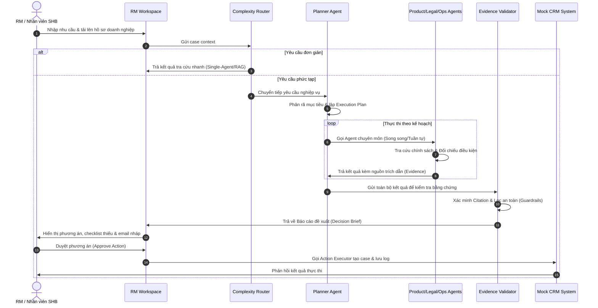
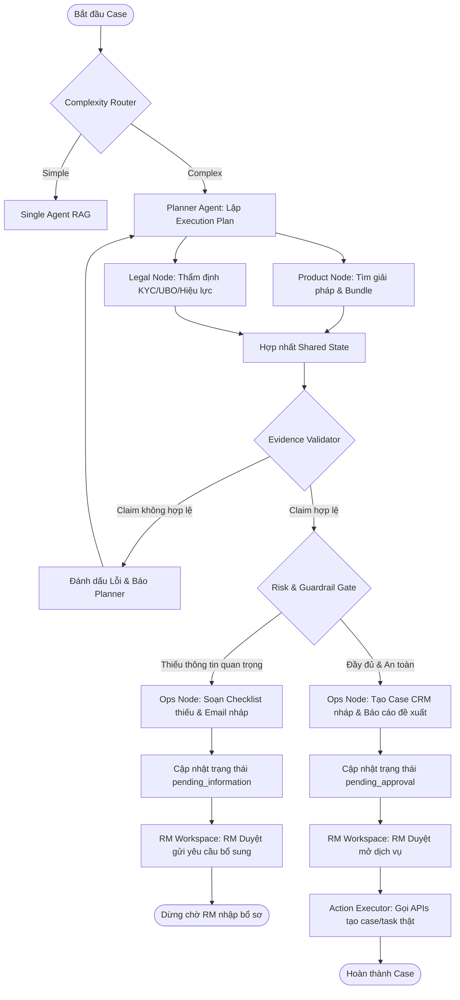
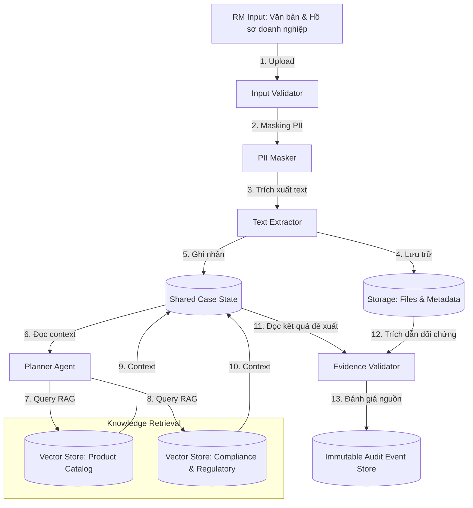
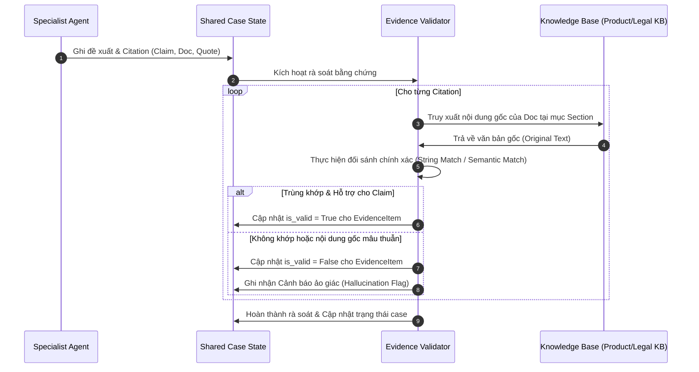
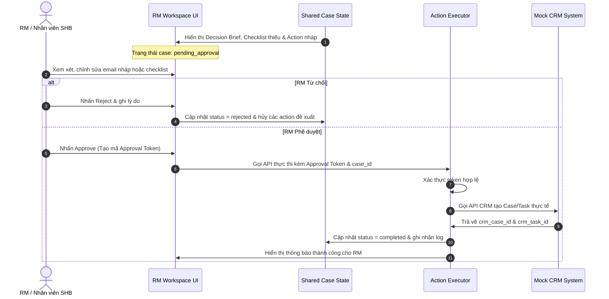
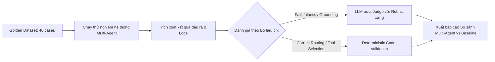
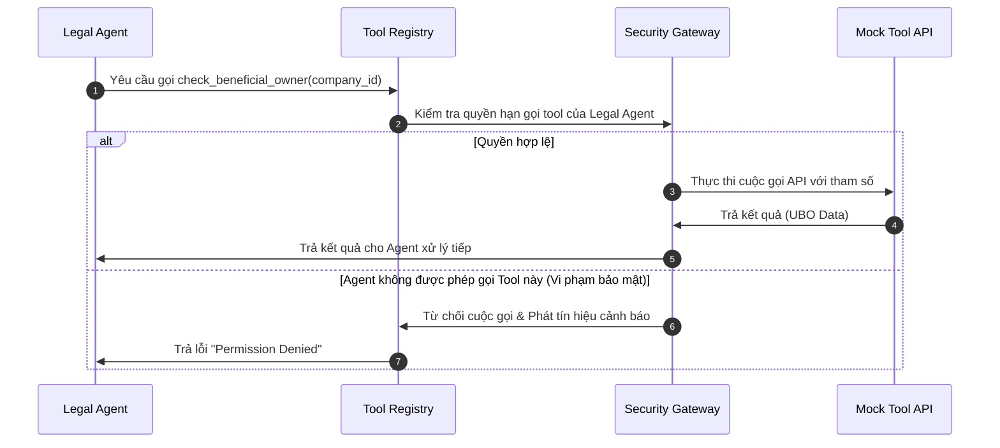
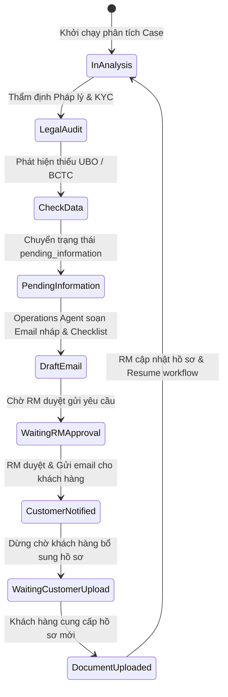
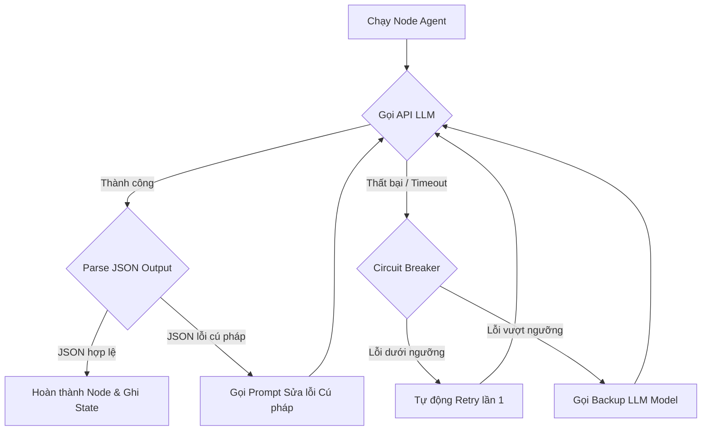

# KẾ HOẠCH TRIỂN KHAI CHI TIẾT: SHB CORPORATE EXPERT WORKSPACE

---

## 1. Executive Summary
`[PROPOSED DESIGN]`
**SHB Corporate Expert Workspace** là hệ thống Multi-Agent nội bộ được thiết kế đặc biệt nhằm hỗ trợ đội ngũ RM (Relationship Manager) và nhân viên nghiệp vụ của SHB trong việc xử lý, phân tích các yêu cầu phức tạp từ khách hàng doanh nghiệp. Bằng cách số hóa tri thức đa phòng ban bao gồm Sản phẩm, Pháp lý & Tuân thủ, và Vận hành, hệ thống hoạt động như một "đội chuyên gia số" đứng sau mỗi RM, giúp nâng cao năng suất xử lý hồ sơ, rút ngắn thời gian phản hồi doanh nghiệp, và đảm bảo mọi đề xuất hành động đều được kiểm duyệt chặt chẽ dựa trên bằng chứng xác thực (`Evidence`) và có sự phê duyệt trực tiếp của con người (`Human-in-the-Loop`).

---

## 2. Scope and Non-Scope
`[PROPOSED DESIGN]`

### 2.1 Scope (Phạm vi)
*   Xây dựng hệ thống Multi-Agent nội bộ sử dụng khung LangGraph để điều phối: Planner Agent, Product Agent, Legal & Compliance Agent, và Operations Agent.
*   Cơ chế xác thực bằng chứng `Evidence Validator` đối chiếu các claim của LLM với văn bản chính sách gốc.
*   Lớp kiểm soát an toàn `Risk & Guardrail Gate` ngăn chặn các hành vi vượt quyền hoặc ảo giác.
*   Quy trình phê duyệt nội bộ của RM (`Human Approval Node`) kiểm soát trước khi gọi API nghiệp vụ.
*   Môi trường lưu trữ trạng thái phiên làm việc chung (`Shared Case State`).
*   Mock APIs và cơ sở dữ liệu giả lập chất lượng cao (`SYNTHETIC DEMO DATA`) cho MVP.

### 2.2 Non-Scope (Ngoài phạm vi)
*   `[OUT OF SCOPE]` Tích hợp trực tiếp với hệ thống Core Banking và CRM thật của SHB ở giai đoạn MVP (Cần SHB cung cấp đặc tả API thật).
*   `[OUT OF SCOPE]` Tự động ra quyết định phê duyệt tín dụng hoặc tự động chấp thuận khách hàng mà không có sự kiểm duyệt của con người.
*   `[OUT OF SCOPE]` Phát triển chatbot công khai trực tiếp cho khách hàng doanh nghiệp tự giao dịch.
*   `[OUT OF SCOPE]` Fine-tuning các mô hình ngôn ngữ lớn (chỉ ưu tiên Prompt Engineering, Few-shot và RAG).

---

## 3. Stakeholders and Users
`[CONFIRMED INPUT]`

| Vai trò | Mô tả | Vai trò trong hệ thống | Quyền hạn |
| :--- | :--- | :--- | :--- |
| **SHB** | Tổ chức sở hữu, vận hành và mua giải pháp. | Đơn vị chủ quản hệ thống. | Thiết lập quy định bảo mật & phân quyền toàn hệ thống. |
| **RM / Nhân viên SHB** | Người trực tiếp sử dụng hệ thống phục vụ khách hàng doanh nghiệp. | Người dùng cuối trực tiếp (Direct User). | Nhập hồ sơ, xem trace, phê duyệt hoặc từ chối đề xuất hành động. |
| **Khách hàng doanh nghiệp** | Đối tượng được phục vụ bởi nhân viên SHB. | Đối tượng thụ hưởng gián tiếp (Indirect Stakeholder). | Không tương tác trực tiếp với hệ thống. Nhận email/checklist yêu cầu bổ sung thông tin từ RM. |

---

## 4. Business Problem
`[CONFIRMED INPUT]`
Trong quy trình hiện tại tại SHB, khi một khách hàng doanh nghiệp đưa ra các yêu cầu tài chính tích hợp (ví dụ: mở tài khoản thanh toán, dịch vụ chi lương Payroll, thu chi hộ Virtual Account, và vay vốn lưu động ngắn hạn), RM phải tự mình thực hiện chuỗi công việc liên phòng ban phức tạp:
1.  **Tra cứu phân tán:** Tra cứu hàng chục cuốn sổ tay sản phẩm khác nhau.
2.  **Rủi ro tuân thủ:** Xác minh thủ công các điều kiện pháp lý phức tạp (KYC/AML, cơ cấu UBO).
3.  **Vận hành chậm trễ:** Tra cứu quy trình SOP vận hành và chuẩn bị checklist hồ sơ cần có.
4.  **Tương tác lặp đi lặp lại:** Gửi email qua lại nhiều lần với khách hàng do phát hiện thiếu giấy tờ ở giai đoạn muộn.

---

## 5. Pain Points
`[CONFIRMED INPUT]`
Sự thiếu nhất quán và phân tán thông tin dẫn đến các hệ quả kinh doanh:
*   **Thời gian phản hồi (SLA) kéo dài:** RM mất từ 3 - 5 ngày để tổng hợp phương án tư vấn doanh nghiệp.
*   **Chất lượng không đồng đều:** Kết quả tư vấn phụ thuộc lớn vào kinh nghiệm của từng cá nhân RM.
*   **Hậu kiểm phức tạp:** Khó khăn trong việc hậu kiểm, đối chiếu các căn cứ pháp lý và sản phẩm của hồ sơ.
*   **Trải nghiệm khách hàng kém:** Khách hàng phải bổ sung hồ sơ nhiều lần do checklist ban đầu thiếu chính xác.

---

## 6. Proposed Solution
`[PROPOSED DESIGN]`
Xây dựng một hệ thống **Controlled Multi-Agent Workspace** đóng vai trò trợ lý chuyên gia số đứng sau RM. Hệ thống tự động phân rã các yêu cầu phức tạp của khách hàng doanh nghiệp thành các nhiệm vụ nhỏ, giao cho các Agent chuyên môn (Product, Legal, Operations) xử lý song song hoặc tuần tự dựa trên đồ thị trạng thái LangGraph. 
Mọi kết luận của Agent bắt buộc phải đi kèm trích dẫn văn bản chính sách (`Evidence`) và được kiểm duyệt qua bộ lọc an toàn (`Guardrails`) trước khi hiển thị để RM phê duyệt thực thi.

---

## 7. Use Case
`[CONFIRMED INPUT]`

### 7.1 Use Case trung tâm: Corporate Client Request Resolution
*   **Mô tả:** Hỗ trợ RM giải quyết trọn vẹn yêu cầu dịch vụ tài chính phức tạp của khách hàng doanh nghiệp từ khâu nhập nhu cầu đến khâu sinh phương án, checklist hồ sơ thiếu và các tác vụ nội bộ.

### 7.2 Tình huống minh họa (`SYNTHETIC DEMO DATA`):
*   **Doanh nghiệp:** Công ty ABC là doanh nghiệp sản xuất, quy mô 500 nhân sự, nhiều nhà cung cấp. Nhu cầu: Mở tài khoản, chi lương Payroll, dịch vụ thu/chi hộ, và tìm hiểu vốn lưu động bổ sung.
*   **Hồ sơ hiện có:** Đăng ký doanh nghiệp, CCCD người đại diện pháp luật.
*   **Thông tin còn thiếu:** Cơ cấu sở hữu UBO, BCTC năm gần nhất, doanh số giao dịch dự kiến.

---

## 8. Functional Requirements
`[PROPOSED DESIGN]`
*   **FR-1 (Nhập & Chuẩn hóa):** Hệ thống phải cho phép RM nhập yêu cầu dạng text tự nhiên và upload các file tài liệu pháp lý (PDF, PNG).
*   **FR-2 (Router):** Tự động phân loại độ phức tạp của yêu cầu để kích hoạt luồng xử lý tương ứng.
*   **FR-3 (Planner):** Planner Agent phải tự động lập kế hoạch (Execution Plan) và phân phối công việc cho các agent chuyên môn.
*   **FR-4 (Product Matching):** Đề xuất bộ giải pháp sản phẩm phù hợp kèm tính điểm tương thích.
*   **FR-5 (Legal Audit):** Đối chiếu hồ sơ doanh nghiệp với quy chế KYC/AML để tìm lỗ hổng pháp lý.
*   **FR-6 (Ops Checklist):** So sánh hồ sơ thực tế với SOP để lập checklist tài liệu thiếu và soạn thảo email nháp gửi khách hàng.
*   **FR-7 (Evidence Validation):** Kiểm tra tính hợp lệ của tất cả các nguồn trích dẫn.
*   **FR-8 (Human Approval):** Cung cấp màn hình phê duyệt chi tiết cho RM trước khi gọi Mock APIs.

---

## 9. Non-Functional Requirements
`[PROPOSED DESIGN]`
*   **NFR-1 (Độ trễ):** Thời gian xử lý của đồ thị Multi-Agent không vượt quá 30 giây cho một yêu cầu phức tạp.
*   **NFR-2 (Tính chính xác):** 100% các kết luận nghiệp vụ quan trọng phải có trích dẫn tài liệu nguồn hợp lệ.
*   **NFR-3 (Bảo mật dữ liệu):** Che giấu thông tin cá nhân nhạy cảm (PII masking) trong logs.
*   **NFR-4 (Tính chịu lỗi):** Hệ thống phải chịu lỗi tốt khi các API của LLM hoặc Tool bị timeout bằng cơ chế Circuit Breaker.

---

## 10. End-to-End Workflow
`[PROPOSED DESIGN]`

### Sơ đồ 1: End-to-End Workflow


---

## 11. Logical Architecture
`[PROPOSED DESIGN]`

Hệ thống được tổ chức thành 7 phân lớp logic tách biệt để đảm bảo tính module hóa và bảo mật:

```text
+-------------------------------------------------------------------------------+
|                            USER EXPERIENCE LAYER                              |
|   [RM Workspace]   [Case Detail Page]   [Timeline Trace]   [Approval Panel]   |
+-------------------------------------------------------------------------------+
                                      ↓ ↑
+-------------------------------------------------------------------------------+
|                            API APPLICATION LAYER                              |
|        [Case API]        [Document API]        [Workflow API]                 |
+-------------------------------------------------------------------------------+
                                      ↓ ↑
+-------------------------------------------------------------------------------+
|                          AGENT ORCHESTRATION LAYER                            |
|  [Complexity Router] -> [Planner Agent] -> [Product / Legal / Ops Agents]    |
|                                                     ↓                         |
|                         [Evidence Validator] & [Guardrail Gate]               |
+-------------------------------------------------------------------------------+
                                      ↓ ↑
+-------------------------------------------------------------------------------+
|                                 TOOL LAYER                                    |
|   [search_product_catalog]   [validate_business_reg]   [create_case_in_crm]   |
+-------------------------------------------------------------------------------+
                                      ↓ ↑
+-------------------------------------------------------------------------------+
|                                KNOWLEDGE LAYER                                |
|   [Product catalog KB]    [Compliance policy KB]    [SOP & Template KB]       |
+-------------------------------------------------------------------------------+
                                      ↓ ↑
+-------------------------------------------------------------------------------+
|                            STATE & STORAGE LAYER                              |
|     [Shared Case State]      [Relational DB]       [Vector DB (Chroma)]       |
+-------------------------------------------------------------------------------+
                                      ↓ ↑
+-------------------------------------------------------------------------------+
|                          SECURITY & GOVERNANCE LAYER                          |
|         [RBAC Gate]         [PII Masker]         [Immutable Audit Log]        |
+-------------------------------------------------------------------------------+
```

---

## 12. Runtime Architecture
`[PROPOSED DESIGN]`

### Sơ đồ 2: Agent Orchestration Graph (LangGraph)
Đồ thị biểu diễn luồng điều phối động, quản lý vòng lặp khi thiếu thông tin:



---

## 13. Data Architecture
`[PROPOSED DESIGN]`

### Sơ đồ 3: Data Flow Diagram
Biểu diễn đường đi của dữ liệu từ khi RM nhập vào cho đến khi lưu trữ và hậu kiểm:



---

## 14. Security Architecture
`[PROPOSED DESIGN]`

### Ranh giới Tin cậy (Trust Boundaries)
*   **User Space Boundary:** Giao diện RM Workspace chạy trên thiết bị đầu cuối của nhân viên SHB. Xác thực thông qua Single Sign-On (SSO).
*   **Application Boundary:** FastAPI App triển khai trên máy chủ nội bộ của SHB. Mọi kết nối ra ngoài (như gọi API LLM) đều phải đi qua Model Gateway bảo mật.
*   **System Integration Boundary:** Kết nối giữa Action Executor và hệ thống CRM/Core Banking mô phỏng. Bắt buộc sử dụng token phê duyệt tạm thời (`Approval Token`) được sinh ra sau khi RM nhấn nút duyệt.

---

## 15. Planner Agent
`[PROPOSED DESIGN]`

1.  **Mục tiêu:** Nhận bối cảnh yêu cầu nghiệp vụ phức tạp của RM, lập kế hoạch thực thi tối ưu (DAG), giao việc cho các agent chuyên môn, và thích ứng luồng xử lý khi phát hiện ngoại lệ hoặc thiếu dữ liệu.
2.  **Phạm vi trách nhiệm:** Lập kế hoạch, theo dõi tiến độ các tác vụ, tổng hợp Brief cuối cùng, và xử lý vòng lặp thu thập thông tin còn thiếu.
3.  **Những gì agent không được làm:** `[OUT OF SCOPE]` Tự đưa ra kết luận pháp lý mà không qua Legal Agent; Tự ý đề xuất sản phẩm nằm ngoài Product Agent; Tự ý chạy các vòng lặp vô hạn (Max loops = 3).
4.  **Input Schema:**
    ```json
    {
      "case_id": "string",
      "customer_request": "string",
      "company_profile": "object",
      "available_documents": "array"
    }
    ```
5.  **Output Schema:**
    ```json
    {
      "execution_plan": [
        {
          "task_id": "string",
          "owner": "string",
          "description": "string",
          "dependencies": ["string"]
        }
      ],
      "status": "string"
    }
    ```
6.  **Dữ liệu cần có:** Danh sách năng lực của từng Agent chuyên môn (Agent Capability Registry).
7.  **Knowledge base cần có:** Quy tắc phân rã tác vụ nghiệp vụ ngân hàng mẫu.
8.  **Tools được phép gọi:** Không gọi tool nghiệp vụ trực tiếp, chỉ tương tác với Graph State.
9.  **Prompt Policy:** Sử dụng cấu trúc lập luận Chain-of-Thought (CoT). Bắt buộc phải liệt kê rõ lý do phân chia task và sự phụ thuộc.
10. **Deterministic Rules:** Nếu Legal Agent báo lỗi mức độ `Blocking`, Planner bắt buộc phải pause workflow và chuyển sang node Operations soạn checklist thiếu.
11. **Workflow steps:** Nhận Input $\rightarrow$ Phân rã $\rightarrow$ Xây dựng DAG $\rightarrow$ Giao việc $\rightarrow$ Nhận phản hồi $\rightarrow$ Điều chỉnh kế hoạch nếu cần $\rightarrow$ Chuyển Validator.
12. **Điều kiện dừng:** Tất cả các task trong kế hoạch được đánh dấu `completed` hoặc có task bị đánh dấu `failed` ở mức độ không thể sửa chữa.
13. **Điều kiện retry:** Task gặp sự cố mạng hoặc lỗi cú pháp JSON của LLM chuyên môn (tối đa 2 lần retry).
14. **Điều kiện escalation:** Xung đột chính sách giữa Legal Agent và Product Agent (Ví dụ: Product đề xuất cho vay nhưng Legal chặn do thuộc ngành nghề cấm). Chuyển case sang trạng thái `pending_review` để RM tự quyết định.
15. **Các lỗi có thể xảy ra:** Sinh kế hoạch có vòng lặp phụ thuộc chéo (A chờ B, B chờ A).
16. **Cách xử lý lỗi:** Sử dụng giải thuật kiểm tra chu kỳ đồ thị trước khi thực thi; nếu phát hiện chu kỳ, lập tức giải phóng và chạy tuần tự mặc định.
17. **Logging:** Log chi tiết sơ đồ DAG dưới dạng text hoặc adjacency list.
18. **Metrics:** Tỷ lệ lập kế hoạch hợp lệ (Plan Validity Rate), Số bước thích ứng trung bình (Average Re-planning Steps).
19. **Test cases:** Test phân rã case doanh nghiệp ABC (Yêu cầu Payroll + Tín dụng thấu chi). Kế hoạch hợp lệ phải chạy Payroll trước khi thẩm định thấu chi.
20. **Definition of Done:** Kế hoạch thực thi được tạo thành công, không chứa chu kỳ, và phân bổ đúng Agent chuyên môn.

---

## 16. Product Agent
`[PROPOSED DESIGN]`

1.  **Mục tiêu:** Phân tích nhu cầu của khách hàng doanh nghiệp để đề xuất gói sản phẩm tài chính hoặc bộ giải pháp tích hợp tối ưu.
2.  **Phạm vi trách nhiệm:** Tra cứu danh mục sản phẩm, tính toán mức độ phù hợp (matching score), đóng gói giải pháp (bundling).
3.  **Những gì agent không được làm:** Tự ý cam kết lãi suất đặc thù ngoài chính sách; Tự quyết định doanh nghiệp đủ điều kiện pháp lý để mở dịch vụ hay không.
4.  **Input Schema:**
    ```json
    {
      "company_profile": {
        "industry": "string",
        "employees_count": "integer",
        "annual_revenue": "number"
      },
      "customer_objectives": ["string"]
    }
    ```
5.  **Output Schema:**
    ```json
    {
      "recommended_bundle": {
        "bundle_name": "string",
        "products": [
          {
            "product_id": "string",
            "name": "string",
            "matching_reason": "string",
            "prerequisites": ["string"]
          }
        ]
      },
      "missing_parameters": ["string"],
      "citations": [
        {
          "claim": "string",
          "source_doc": "string",
          "section": "string",
          "quote": "string"
        }
      ]
    }
    ```
6.  **Dữ liệu cần có:** `<SHB_PRODUCT_CATALOG_DATA_REQUIRED>`
7.  **Knowledge base cần có:** `<SHB_PRODUCT_POLICY_DATA_REQUIRED>`
8.  **Tools được phép gọi:** `search_product_catalog()`, `retrieve_product_policy()`.
9.  **Prompt Policy:** Chỉ được đưa ra các đề xuất nằm trong cơ sở tri thức sản phẩm được cung cấp. Cấm tự bịa tên sản phẩm.
10. **Deterministic Rules:** Nếu doanh thu năm dưới 50 tỷ VND, cấm đề xuất gói Cash Sweeping tự động (áp dụng quy định cứng của chính sách quản lý dòng tiền).
11. **Workflow steps:** Phân tích bối cảnh doanh nghiệp $\rightarrow$ Gọi tool tìm kiếm sản phẩm ứng viên $\rightarrow$ Đối chiếu điều kiện cơ bản $\rightarrow$ Thiết lập bundle $\rightarrow$ Trích xuất bằng chứng trích dẫn $\rightarrow$ Ghi kết quả vào Shared State.
12. **Điều kiện dừng:** Đã tạo được danh mục đề xuất sản phẩm kèm match score hoặc không tìm thấy bất kỳ sản phẩm nào phù hợp.
13. **Điều kiện retry:** Kết quả tìm kiếm từ RAG rỗng do lỗi kết nối vector db.
14. **Điều kiện escalation:** Doanh nghiệp có quy mô và tính chất quá đặc biệt không khớp bất kỳ sản phẩm chuẩn nào. Đề xuất RM chuyển sang luồng thiết kế gói sản phẩm may đo (Tailor-made solution).
15. **Các lỗi có thể xảy ra:** Đề xuất trùng lặp sản phẩm trong cùng một gói.
16. **Cách xử lý lỗi:** Áp dụng bộ lọc deduplication ở đầu ra của Agent.
17. **Logging:** Ghi log các truy vấn gửi tới Product Vector DB và điểm số cosine similarity.
18. **Metrics:** Tỷ lệ đề xuất sản phẩm chính xác (Recommendation Accuracy), Tỷ lệ trích dẫn đầy đủ (Citation Coverage).
19. **Test cases:** Chạy test case với Công ty ABC (500 nhân viên). Giải pháp đề xuất bắt buộc phải có Dịch vụ chi lương (Payroll) và Cash Management.
20. **Definition of Done:** Trả về JSON đúng cấu trúc, chứa đầy đủ các sản phẩm phù hợp và 100% đề xuất có trích dẫn nguồn tài liệu hợp lệ.

---

## 17. Legal & Compliance Agent
`[PROPOSED DESIGN]`

1.  **Mục tiêu:** Thẩm định tính pháp lý của doanh nghiệp và kiểm tra tính tuân thủ của giải pháp đề xuất đối với quy định hiện hành.
2.  **Phạm vi trách nhiệm:** Kiểm tra KYC/AML, xác thực hiệu lực tài liệu pháp lý, thẩm định cơ cấu sở hữu UBO, người đại diện theo pháp luật và thẩm quyền ký kết.
3.  **Những gì agent không được làm:** Tự ý bỏ qua lỗi tuân thủ nghiêm trọng; Tự động phê duyệt mở tài khoản cho khách hàng thuộc danh sách đen (Watchlist/Sanction list).
4.  **Input Schema:**
    ```json
    {
      "company_profile": "object",
      "uploaded_documents": [
        {
          "doc_type": "string",
          "issue_date": "string",
          "expiry_date": "string"
        }
      ],
      "proposed_products": ["string"]
    }
    ```
5.  **Output Schema:**
    ```json
    {
      "eligibility_status": "string",  // passed, failed, pending_info
      "failed_checks": [
        {
          "rule_id": "string",
          "reason": "string",
          "severity": "string"  // blocking, warning
        }
      ],
      "missing_documents": ["string"],
      "citations": ["object"]
    }
    ```
6.  **Dữ liệu cần có:** `<SHB_LEGAL_POLICY_DATA_REQUIRED>`
7.  **Knowledge base cần có:** `<SHB_COMPLIANCE_POLICY_DATA_REQUIRED>`, `<SHB_KYC_AML_RULES_REQUIRED>`
8.  **Tools được phép gọi:** `validate_business_registration()`, `check_document_expiry()`, `check_product_eligibility()`, `search_compliance_policy()`.
9.  **Prompt Policy:** Tuyệt đối thận trọng. Mọi rủi ro pháp lý dù nhỏ nhất đều phải báo cáo và xếp hạng rủi ro rõ ràng.
10. **Deterministic Rules:** Giấy đăng ký kinh doanh hết hạn hoặc không khớp mã số thuế $\rightarrow$ Đánh dấu trạng thái `failed` mức độ `Blocking` lập tức. Khách hàng không có thông tin UBO $\rightarrow$ Chặn đề xuất cấp tín dụng thấu chi.
11. **Workflow steps:** Đọc thông tin hồ sơ $\rightarrow$ Kiểm tra tính đầy đủ pháp lý $\rightarrow$ Gọi tool đối chiếu quy định KYC/AML $\rightarrow$ Kiểm tra hiệu lực tài liệu $\rightarrow$ Trích xuất citation $\rightarrow$ Cập nhật Shared State.
12. **Điều kiện dừng:** Hoàn thành kiểm tra tất cả các hạng mục pháp lý bắt buộc theo quy định.
13. **Điều kiện retry:** API kiểm tra danh sách cấm vận bị timeout.
14. **Điều kiện escalation:** Phát hiện dấu hiệu rửa tiền hoặc khách hàng thuộc diện PEP (Chính trị gia có ảnh hưởng) có rủi ro tuân thủ cao. Chuyển tiếp ngay lập tức sang Phòng Legal & Compliance nội bộ để hậu kiểm thủ công.
15. **Các lỗi có thể xảy ra:** Nhầm lẫn giữa người đại diện pháp luật và người được ủy quyền hợp pháp.
16. **Cách xử lý lỗi:** Bắt buộc so khớp số CCCD/Hộ chiếu giữa giấy ủy quyền và hồ sơ định danh gốc.
17. **Logging:** Ghi log chi tiết danh sách các chốt kiểm soát tuân thủ đã đi qua (Passed/Failed check logs).
18. **Metrics:** Tỷ lệ phát hiện thiếu hồ sơ pháp lý (Missing Document Recall), Tỷ lệ phê duyệt không an toàn (Unsafe Approval Rate = 0%).
19. **Test cases:** Test case doanh nghiệp ABC thiếu thông tin UBO. Kết quả mong đợi: Hệ thống phải báo trạng thái `pending_info` và yêu cầu bổ sung thông tin UBO.
20. **Definition of Done:** Báo cáo thẩm định pháp lý được xuất ra, chỉ rõ điều kiện đạt/chưa đạt kèm theo điều khoản quy chế SHB làm căn cứ đối chiếu.

---

## 18. Operations Agent
`[PROPOSED DESIGN]`

1.  **Mục tiêu:** Thiết lập các bước xử lý nghiệp vụ tiếp theo cho nhân viên SHB sau khi có kết quả từ khối Sản phẩm và Pháp lý.
2.  **Phạm vi trách nhiệm:** Lập checklist hồ sơ cần thu thập, soạn thảo email nháp gửi khách hàng yêu cầu bổ sung, và chuẩn bị dữ liệu gọi API tạo Case/Task trên CRM nội bộ.
3.  **Những gì agent không được làm:** Tự động tạo case thật trên hệ thống CRM lõi khi chưa được RM bấm nút duyệt thông qua.
4.  **Input Schema:**
    ```json
    {
      "case_id": "string",
      "recommended_products": ["string"],
      "legal_status": "string",
      "missing_documents_from_legal": ["string"]
    }
    ```
5.  **Output Schema:**
    ```json
    {
      "proposed_crm_case": {
        "case_title": "string",
        "priority": "string",
        "tasks": [
          {
            "task_description": "string",
            "assigned_team": "string",
            "sla_hours": "integer"
          }
        ]
      },
      "customer_email_draft": {
        "subject": "string",
        "body": "string"
      }
    }
    ```
6.  **Dữ liệu cần có:** `<SHB_OPERATIONAL_SOP_DATA_REQUIRED>`
7.  **Knowledge base cần có:** `<SHB_REQUIRED_DOCUMENT_CHECKLIST_REQUIRED>`, `<SHB_SERVICE_LEVEL_AGREEMENT_REQUIRED>`
8.  **Tools được phép gọi:** `get_required_documents()`, `check_document_completeness()`, `draft_customer_email()`, `generate_decision_brief()`.
9.  **Prompt Policy:** Sử dụng văn phong giao tiếp ngân hàng chuẩn mực, lịch sự, và rõ ràng. Email nháp gửi khách hàng phải phân tách rõ ràng danh sách tài liệu cần bổ sung bằng dấu đầu dòng.
10. **Deterministic Rules:** SLA của từng task nghiệp vụ được tạo phải tuân thủ chính xác quy định thời gian xử lý dịch vụ của SHB, không được để LLM tự tính toán bừa bãi.
11. **Workflow steps:** Thu thập kết quả Product và Legal $\rightarrow$ Gọi tool lấy SOP và checklist tương ứng $\rightarrow$ Đối chiếu tài liệu hiện có để tìm tài liệu thiếu $\rightarrow$ Soạn email nháp $\rightarrow$ Sinh payload CRM case nháp.
12. **Điều kiện dừng:** Soạn thảo thành công toàn bộ email nháp, checklist thiếu và các task nghiệp vụ tương ứng.
13. **Điều kiện retry:** Lỗi sinh email mẫu do token output bị cắt ngắn.
14. **Điều kiện escalation:** Các yêu cầu dịch vụ cần xử lý gấp (VIP case) vượt quá khả năng tính toán SLA chuẩn $\rightarrow$ Chuyển luồng ưu tiên đặc biệt.
15. **Các lỗi có thể xảy ra:** Email nháp chứa thông tin chưa được kiểm chứng của khách hàng.
16. **Cách xử lý lỗi:** Chỉ sử dụng các biến có cấu trúc từ `SharedCaseState` để điền vào template email.
17. **Logging:** Lưu lại bản nháp email và các tác vụ CRM được đề xuất vào Shared State.
18. **Metrics:** Tỷ lệ đầy đủ của checklist hồ sơ (Checklist Completeness), Tỷ lệ RM chỉnh sửa email nháp (Email Edit Rate).
19. **Test cases:** Test sinh email cho doanh nghiệp ABC. Email nháp bắt buộc phải có câu yêu cầu cung cấp: "Thông tin chủ sở hữu hưởng lợi (UBO)" và "Báo cáo tài chính năm gần nhất".
20. **Definition of Done:** Checklist hồ sơ và email nháp được sinh ra đầy đủ, chính xác, không chứa lỗi chính tả và sẵn sàng cho RM phê duyệt.

---

## 19. Evidence Validator
`[PROPOSED DESIGN]`

### Sơ đồ 4: Tool Calling & Evidence Validation Sequence
Sơ đồ biểu diễn quá trình xác thực độc lập các claim của Agent đối chiếu với tài liệu gốc:



### Phương thức kiểm tra kết hợp (Hybrid Validation)
Để tránh ảo giác hoàn toàn, hệ thống kết hợp 3 lớp xác thực:
1.  **Lớp 1 (Deterministic Check):** Sử dụng các biểu thức chính quy (Regex) và thuật toán so khớp chuỗi chính xác (String matching) để xác thực các thông số như tỷ lệ phí, hạn mức hoặc điều khoản được trích dẫn trong `quote` có tồn tại chính xác trong văn bản nguồn hay không.
2.  **Lớp 2 (Semantic Matching):** Sử dụng embedding để đo khoảng cách cosine giữa câu claim của Agent và văn bản gốc của điều khoản. Nếu độ tương đồng dưới $0.85$, đánh dấu cảnh báo nghi ngờ ảo giác.
3.  **Lớp 3 (LLM-as-a-Judge hỗ trợ):** Chỉ sử dụng một mô hình ngôn ngữ nhỏ được tối ưu để trả lời câu hỏi nhị phân: *"Nội dung trích dẫn này có trực tiếp hỗ trợ cho tuyên bố của Agent hay không?"* với rubric chấm điểm nghiêm ngặt.

---

## 20. Risk & Guardrail Gate
`[PROPOSED DESIGN]`

Hệ thống triển khai các bộ lọc an toàn đa tầng bảo vệ hoạt động nghiệp vụ:

### 20.1 Input Guardrails
*   **Prompt Injection Filter:** Sử dụng thư viện bảo mật chuyên dụng quét nội dung yêu cầu của RM và tài liệu tải lên để phát hiện và ngăn chặn các mã độc prompt injection nhằm thay đổi hướng đi của Graph.
*   **PII Detection & Masking:** Tự động phát hiện số tài khoản thẻ, mã PIN, hoặc các thông tin cá nhân nhạy cảm khác trong yêu cầu thô và thay thế bằng các thẻ ẩn danh trước khi gửi cho LLM.

### 20.2 Output Guardrails
*   **Deterministic Block Rules:** Chặn đứng mọi hành động gửi thông tin ra ngoài hoặc cập nhật cơ sở dữ liệu nếu case đang ở trạng thái lỗi pháp lý mức độ `Blocking` hoặc chưa có chữ ký duyệt điện tử của RM.
*   **Allowed-tool Allowlist:** Ràng buộc chặt chẽ quyền gọi tool ở mức độ API Gateway. Ví dụ: *Product Agent gọi API tạo case CRM sẽ bị hệ thống gateway chặn và ghi nhận log cảnh báo bảo mật*.

---

## 21. Human Approval
`[PROPOSED DESIGN]`

### Sơ đồ 5: Human Approval Sequence
Quy trình phê duyệt có chữ ký điện tử của RM trước khi hệ thống thực thi tác vụ nghiệp vụ:



---

## 22. Tool Registry
`[PROPOSED DESIGN]`

Các công cụ được khai báo và quản lý tập trung để kiểm soát quyền hạn gọi API:

| Tên Tool | Agent được gọi | Mô tả chức năng | Tham số đầu vào (Schema) | Kết quả đầu ra (Schema) | Trạng thái tích hợp |
| :--- | :--- | :--- | :--- | :--- | :--- |
| `search_product_catalog` | Product Agent | Tìm kiếm sản phẩm tài chính | `{"query": "string"}` | `[{"product_id": "str", "name": "str"}]` | `SYNTHETIC MOCK API` |
| `retrieve_product_policy` | Product Agent | Lấy chính sách sản phẩm chi tiết | `{"product_id": "str"}` | `{"rules": "str", "source": "str"}` | `SYNTHETIC MOCK API` |
| `validate_business_registration` | Legal Agent | Xác thực đăng ký kinh doanh | `{"document_id": "str"}` | `{"status": "str", "tax_code": "str"}` | `SYNTHETIC MOCK API` |
| `check_document_expiry` | Legal Agent | Kiểm tra hạn hiệu lực hồ sơ | `{"expiry_date": "str"}` | `{"is_expired": "bool", "days_left": "int"}` | `SYNTHETIC MOCK API` |
| `check_product_eligibility` | Legal Agent | Kiểm tra điều kiện pháp lý giải pháp | `{"product_id": "str", "profile": "obj"}` | `{"eligible": "bool", "reason": "str"}` | `SYNTHETIC MOCK API` |
| `search_compliance_policy` | Legal Agent | Tra cứu luật & quy chế tuân thủ | `{"query": "string"}` | `{"articles": "arr", "citation": "str"}` | `SYNTHETIC MOCK API` |
| `get_required_documents` | Operations Agent | Lấy danh mục hồ sơ bắt buộc theo SOP | `{"product_ids": "array"}` | `{"required_docs": "array"}` | `SYNTHETIC MOCK API` |
| `create_case` | Operations Agent | Khởi tạo Case trên CRM sau phê duyệt | `{"case_data": "object"}` | `{"crm_case_id": "str", "status": "str"}` | `PRODUCTION API REQUIRED FROM SHB` |
| `create_followup_task` | Operations Agent | Tạo task nghiệp vụ cho RM | `{"task_data": "object"}` | `{"crm_task_id": "str", "status": "str"}` | `PRODUCTION API REQUIRED FROM SHB` |

---

## 23. Shared State
`[PROPOSED DESIGN]`

Shared State là trung tâm lưu trữ thông tin của phiên làm việc đồ thị Multi-Agent. Dưới đây là đặc tả các trường dữ liệu quan trọng:

```json
{
  "case_id": "CORP-2026-001",
  "rm_id": "RM-999",
  "customer_id": "CUST-ABC",
  "customer_request": {
    "text": "Doanh nghiệp muốn mở gói tài khoản chi lương và xin thấu chi vốn lưu động ngắn hạn.",
    "timestamp": "2026-07-17T16:10:00Z"
  },
  "company_profile": {
    "name": "Công ty Cổ phần ABC Việt Nam",
    "tax_code": "0102030405",
    "employees_count": 500,
    "annual_revenue": 120000000000
  },
  "documents": [
    {
      "doc_id": "DOC-001",
      "doc_type": "Giấy chứng nhận ĐKDN",
      "issue_date": "2020-05-12",
      "expiry_date": "none",
      "status": "verified"
    }
  ],
  "execution_plan": [
    {
      "task_id": "T1",
      "owner": "Product Agent",
      "description": "Tư vấn gói giải pháp sản phẩm phù hợp cho Công ty ABC",
      "status": "completed",
      "dependencies": []
    },
    {
      "task_id": "T2",
      "owner": "Legal Agent",
      "description": "Thẩm định tính pháp lý và KYC/UBO của khách hàng",
      "status": "completed",
      "dependencies": []
    }
  ],
  "product_result": {
    "recommended_products": ["PROD-PAYROLL", "PROD-WORKING-CAPITAL"],
    "bundle_name": "Gói thanh toán lương & Tài trợ vốn ngắn hạn",
    "match_score": 0.92
  },
  "legal_result": {
    "eligibility_status": "pending_info",
    "failed_checks": [
      {
        "rule_id": "RULE-UBO",
        "reason": "Thiếu thông tin chủ sở hữu hưởng lợi cuối cùng (UBO)",
        "severity": "blocking"
      }
    ],
    "missing_documents": ["Tờ khai thông tin chủ sở hữu hưởng lợi UBO"]
  },
  "operations_result": {
    "proposed_tasks": [
      {
        "task_description": "Thu thập thông tin UBO từ khách hàng ABC",
        "assigned_team": "RM-999",
        "sla_hours": 24
      }
    ],
    "customer_email_draft": {
      "subject": "[SHB] Yêu cầu bổ sung hồ sơ mở dịch vụ doanh nghiệp - Công ty ABC",
      "body": "Kính gửi Quý khách hàng, Để hoàn tất hồ sơ mở dịch vụ..."
    }
  },
  "missing_information": [
    "Thông tin chủ sở hữu hưởng lợi cuối cùng (UBO)",
    "Báo cáo tài chính năm 2025 (năm gần nhất)"
  ],
  "evidences": [
    {
      "agent": "Product Agent",
      "claim": "Dịch vụ Payroll áp dụng cho doanh nghiệp từ 10 nhân sự trở lên",
      "source_doc": "SHB_Product_Catalog_2026.pdf",
      "page_or_section": "Mục 3.1",
      "quote": "Doanh nghiệp có số lượng nhân sự tối thiểu từ 10 người trở lên.",
      "is_valid": true
    }
  ],
  "risk_level": "medium",
  "approval_status": "pending",
  "final_status": "pending_information",
  "audit_events": [
    {
      "event_id": "EVT-1002",
      "timestamp": "2026-07-17T16:11:15Z",
      "actor": "Legal Agent",
      "action": "check_beneficial_owner",
      "result": "missing_ubo_flagged"
    }
  ]
}
```

---

## 24. Data Requirements
`[DATA REQUIRED]`

Bản kế hoạch yêu cầu chuẩn bị các bộ dữ liệu sau trước khi chuyển sang giai đoạn Pilot:

| Tên Dataset | Đơn vị sở hữu | Nguồn cung cấp | Định dạng dữ liệu | Vai trò trong hệ thống | Trạng thái hiện tại |
| :--- | :--- | :--- | :--- | :--- | :--- |
| **Product Catalog** | Phòng Phát triển Sản phẩm | `<SHB_PRODUCT_CATALOG_DATA_REQUIRED>` | PDF / Excel | Tri thức tra cứu sản phẩm doanh nghiệp | `DATA REQUIRED` |
| **Credit & Product Policies** | Khối Quản trị Rủi ro | `<SHB_PRODUCT_POLICY_DATA_REQUIRED>` | PDF | Quy tắc xác định điều kiện cấp hạn mức | `DATA REQUIRED` |
| **Legal & Compliance Policies** | Phòng Pháp lý & Tuân thủ | `<SHB_LEGAL_POLICY_DATA_REQUIRED>` | PDF | Các quy định tuân thủ KYC/AML của SHB | `DATA REQUIRED` |
| **KYC & AML Rules** | Phòng Pháp lý & Tuân thủ | `<SHB_KYC_AML_RULES_REQUIRED>` | JSON / Word | Quy tắc lọc danh sách cấm vận và PEP | `DATA REQUIRED` |
| **Operational SOP** | Khối Vận hành | `<SHB_OPERATIONAL_SOP_DATA_REQUIRED>` | PDF | Quy trình mở tài khoản và xử lý hồ sơ | `DATA REQUIRED` |
| **Case Integration API Spec** | Khối Công nghệ thông tin | `<SHB_CASE_MANAGEMENT_API_REQUIRED>` | Swagger / OpenAPI | Tài liệu kết nối CRM | `DATA REQUIRED` |
| **Task Integration API Spec** | Khối Công nghệ thông tin | `<SHB_TASK_MANAGEMENT_API_REQUIRED>` | Swagger / OpenAPI | Tài liệu kết nối hệ thống giao việc | `DATA REQUIRED` |

### Dữ liệu giả lập tối thiểu cho demo (`SYNTHETIC DEMO DATA`):
*   **Hồ sơ doanh nghiệp mẫu:** 5 hồ sơ doanh nghiệp giả lập (ABC, XYZ, MNP...) với các quy mô và ngành nghề khác nhau để test tính năng Router và Product Matching.
*   **Sản phẩm mẫu:** 5 sản phẩm mẫu (Tài khoản thanh toán, Payroll, Cash Sweeping, Thu hộ Virtual Account, Thấu chi vốn lưu động).
*   **Quy chế giả lập:** 3 văn bản pháp lý giả lập thiết lập các quy tắc kiểm tra người đại diện và UBO.

---

## 25. RAG Design
`[PROPOSED DESIGN]`

### 25.1 Product RAG Pipeline
*   **Parsing & Chunking:** Tài liệu sản phẩm được parse và chia nhỏ thành các chunk từ 300 - 500 tokens. Mỗi chunk bắt buộc phải đính kèm tiêu đề sản phẩm mẹ để không mất ngữ cảnh.
*   **Metadata Filtering:** Gắn metadata cho mỗi chunk bao gồm: `segment` (Doanh nghiệp lớn/SME), `industry` (Sản xuất/Thương mại/Dịch vụ), `effective_date`, và `version`. Khi RM tìm kiếm, hệ thống tự động lọc metadata trước khi thực hiện so khớp vector để loại bỏ các chính sách cũ hoặc không áp dụng cho phân khúc khách hàng.
*   **Reranking:** Sử dụng mô hình Cohere Rerank hoặc tương đương để sắp xếp lại top 10 kết quả tìm kiếm vector nhằm lấy ra 3 chunk có điểm tương thích cao nhất đưa vào ngữ cảnh prompt của Product Agent.

### 25.2 Legal & Compliance RAG Pipeline
*   **Structure-aware Chunking:** Quy chế pháp lý không được cắt chuỗi thô. Quy trình chunking phân tách theo phân cấp chương - điều - khoản của văn bản pháp luật.
*   **Superseded-document handling:** Thiết lập cơ chế đánh dấu phiên bản hiệu lực. Khi một quy chế mới được cập nhật, hệ thống tự động đánh dấu quy chế cũ là `inactive` và loại khỏi cơ sở dữ liệu vector hoạt động để tránh agent trích dẫn các điều khoản đã hết hiệu lực.

---

## 26. Database Design
`[PROPOSED DESIGN]`

Đề xuất thiết kế cơ sở dữ liệu quan hệ lưu trữ thông tin phiên làm việc và audit trail:

### Bảng: `cases`
*   `case_id` (VARCHAR - Primary Key): ID duy nhất của case.
*   `rm_id` (VARCHAR): ID của RM tạo case.
*   `customer_id` (VARCHAR): ID của khách hàng doanh nghiệp.
*   `status` (VARCHAR): Trạng thái (new, in_analysis, pending_information, pending_approval, completed, rejected).
*   `created_at` (TIMESTAMP): Thời gian khởi tạo.

### Bảng: `case_states`
*   `state_id` (SERIAL - Primary Key): ID của bản ghi trạng thái.
*   `case_id` (VARCHAR - Foreign Key -> `cases.case_id`): Liên kết với case.
*   `state_json` (TEXT): Toàn bộ cấu trúc JSON của Shared State tại thời điểm ghi nhận.
*   `updated_at` (TIMESTAMP): Thời gian cập nhật.

### Bảng: `audit_events`
*   `event_id` (VARCHAR - Primary Key): ID duy nhất của sự kiện.
*   `case_id` (VARCHAR - Foreign Key -> `cases.case_id`): Liên kết với case.
*   `actor` (VARCHAR): Tên tác nhân thực hiện (Planner, Legal, RM-999...).
*   `action` (VARCHAR): Hành động thực hiện (validate_document, approve_case...).
*   `payload` (TEXT): Chi tiết tham số đầu vào và đầu ra.
*   `timestamp` (TIMESTAMP): Thời gian xảy ra sự kiện.
*   `signature` (VARCHAR): Chữ ký mã hóa đảm bảo tính toàn vẹn, chống sửa đổi log (Immutable log hash).

---

## 27. API Design
`[PROPOSED DESIGN]`

Đặc tả các endpoints chính phục vụ ứng dụng:

### Endpoint: `POST /api/v1/cases`
*   **Mục đích:** Khởi tạo case mới từ yêu cầu của RM.
*   **Request body:**
    ```json
    {
      "customer_id": "string",
      "rm_id": "string",
      "request_text": "string"
    }
    ```
*   **Response (201 Created):**
    ```json
    {
      "case_id": "CORP-2026-001",
      "status": "new",
      "created_at": "2026-07-17T16:10:00Z"
    }
    ```

### Endpoint: `POST /api/v1/cases/{case_id}/approve`
*   **Mục đích:** RM phê duyệt đề xuất để thực thi hành động.
*   **Request headers:** `X-Approval-Token: jwt-token-signed-by-rm`
*   **Response (200 OK):**
    ```json
    {
      "case_id": "CORP-2026-001",
      "approval_status": "approved",
      "actions_executed": [
        {
          "action_type": "create_crm_case",
          "crm_case_id": "CRM-88820"
        }
      ]
    }
    ```

---

## 28. UI Design
`[PROPOSED DESIGN]`

Thiết kế giao diện Workspace của RM (RM Workspace) hướng tới trải nghiệm trực quan và an toàn:

*   **Bảng điều khiển Case (Case Detail Dashboard):** Hiển thị tóm tắt thông tin doanh nghiệp, biểu đồ tiến độ xử lý của từng agent dưới dạng Timeline.
*   **Khung trích dẫn Bằng chứng (Evidence Panel):** Hiển thị các đề xuất của Agent ở cột bên trái và đoạn tài liệu chính sách đối chiếu trực tiếp ở cột bên phải. Các đoạn trích dẫn được tô màu xanh lá cây nếu Validator xác thực thành công.
*   **Khung cảnh báo thiếu hồ sơ (Missing Information Drawer):** Hiển thị rõ danh sách tài liệu còn thiếu bằng màu đỏ kèm theo nút bấm cho phép RM nhấn nhanh để gửi email yêu cầu bổ sung cho doanh nghiệp.
*   **Nút duyệt hành động (Approval Panel):** Bắt buộc hiển thị hộp thoại xác nhận chi tiết các hành động hệ thống chuẩn bị thực hiện trên CRM/Core Banking kèm mã pin duyệt của RM.

---

## 29. Error Handling
`[PROPOSED DESIGN]`

Bảng xử lý sự cố hệ thống và phương án dự phòng (Fallback):

| Sự cố phát sinh | Phương thức phát hiện | Tác động hệ thống | Có thể retry? | Phương án dự phòng (Fallback) | Cơ chế Escalation |
| :--- | :--- | :--- | :--- | :--- | :--- |
| **API LLM bị Timeout** | Hệ thống gateway kiểm tra thời gian phản hồi quá 15 giây. | Tiến trình của Agent bị đình trệ. | Có (Tối đa 2 lần) | Tự động chuyển truy vấn sang mô hình dự phòng (Backup LLM Model). | Nếu cả 2 mô hình đều lỗi, báo lỗi hệ thống và lưu trạng thái case là `failed`. |
| **Agent sinh JSON lỗi** | Khối Pydantic validator báo lỗi parse schema. | Không thể cập nhật thông tin vào Shared State. | Có (1 lần) | Gửi lại prompt yêu cầu sửa định dạng kèm thông tin thông báo lỗi cú pháp. | Nếu retry vẫn lỗi, Planner tự động bỏ qua agent này và đánh dấu task là `failed` để RM tự nhập tay. |
| **Lỗi kết nối Tool API** | Http Status code trả về 5xx hoặc Connection Refused. | Không thể lấy thông tin KYC hoặc Product Policy. | Không | Trả về dữ liệu trống và ghi nhận cảnh báo "Mất kết nối dữ liệu". Agent sẽ chuyển sang chế độ nghi ngờ và báo thiếu thông tin. | Gửi thông báo sự cố mạng cho đội ngũ quản trị kỹ thuật (DevOps). |

---

## 30. Observability
`[PROPOSED DESIGN]`

Nhật ký hoạt động của hệ thống được giám sát thông qua 3 thành phần:
1.  **Traces:** Sử dụng thư viện Jaeger hoặc LangSmith để theo dõi chi tiết luồng chạy của Graph. Mỗi lần chạy của Planner được cấp một `trace_id` để kiểm tra thứ tự gọi các agent node.
2.  **Metrics:** Giám sát thời gian phản hồi của từng Node (Node Latency), Số lượng tokens sử dụng trên mỗi Case, Tỷ lệ lỗi cú pháp JSON của LLM.
3.  **Audit Logs:** Lưu lại toàn bộ lịch sử thay đổi của `SharedCaseState` sau mỗi Node thực thi để RM có thể kiểm tra lại nguồn gốc quyết định khi có hậu kiểm.

---

## 31. Security and Governance
`[PROPOSED DESIGN]`

*   **Role-Based Access Control (RBAC):** Chỉ có RM được phân quyền quản lý khách hàng đó mới có thể xem và thực thi case. Nhân viên thẩm định tuân thủ chỉ có quyền đọc `legal_result` và audit log.
*   **On-Premise Deployment Option:** Để bảo mật tuyệt đối dữ liệu khách hàng theo quy định của ngân hàng nhà nước, hệ thống hỗ trợ đóng gói Docker để triển khai toàn bộ ứng dụng, Vector DB và mô hình ngôn ngữ lớn (thông qua Ollama/vLLM) hoàn toàn trong hạ tầng mạng nội bộ (On-Premise) của SHB.

---

## 32. Evaluation Plan
`[PROPOSED DESIGN]`

Quy trình đánh giá hiệu năng hệ thống trước khi vận hành:

### Sơ đồ 6: Evaluation Pipeline


*   **Benchmark Baseline:** So sánh hiệu năng của hệ thống Multi-Agent này với hệ thống Single-Agent RAG truyền thống dựa trên các tiêu chí: Tỷ lệ hoàn thành tác vụ (Task completion rate), Tỷ lệ trích dẫn chính xác (Citation correctness), và Tỷ lệ ảo giác (Unsupported claim rate). Các kết quả đo lường thực tế sẽ được điền vào placeholder `<EVALUATION_RESULT_TO_BE_MEASURED>`.

---

## 33. Single-Agent vs Multi-Agent
`[PROPOSED DESIGN]`

Bảng so sánh chi tiết giữa hai phương án thiết kế kiến trúc AI:

| Tiêu chí | Single-Agent / RAG Baseline | Multi-Agent (Đề xuất hiện tại) | Vì sao chọn Multi-Agent cho SHB |
| :--- | :--- | :--- | :--- |
| **Khả năng giải quyết bài toán phức tạp** | Thấp. Chỉ trả lời câu hỏi đơn lẻ, không tự động phân rã quy trình. | Cao. Planner tự động chia tách tác vụ và điều phối các agent chuyên gia. | Quy trình xử lý khách hàng doanh nghiệp của ngân hàng liên quan đến nhiều phòng ban phức tạp. |
| **Độ chính xác và hạn chế ảo giác** | Trung bình. Prompt quá dài dễ gây nhiễu ngữ cảnh khiến LLM ảo giác. | Cao. Lớp kiểm soát độc lập (Evidence Validator) rà soát chéo từng kết luận. | Ngành ngân hàng yêu cầu mức độ rủi ro sai sót bằng 0 (Zero-tolerance). |
| **Khả năng thực thi tác vụ nghiệp vụ** | Yếu. Khó kiểm soát an toàn khi gọi nhiều API công cụ khác nhau cùng lúc. | Mạnh. Operations Agent và Action Executor tách biệt, có approval gate kiểm soát. | Cần tạo tác vụ thật trên CRM/Task management sau khi RM duyệt. |
| **Thời gian phản hồi & Chi phí** | **Tốt hơn** (Nhanh và tốn ít token hơn). | **Kém hơn** (Độ trễ cao hơn do gọi nhiều LLM và nhiều vòng lặp). | Chấp nhận đánh đổi thời gian phản hồi (30s) để lấy độ chính xác và tính an toàn nghiệp vụ. |

---

## 34. Test Cases
`[PROPOSED DESIGN]`

Hệ thống bắt buộc phải đi qua 3 kịch bản kiểm thử trọng tâm trước khi đưa vào chạy thử nghiệm:

### 34.1 Kịch bản 1: Thử nghiệm tính thích ứng khi thiếu dữ liệu (ABC Case)
*   **Đầu vào:** Doanh nghiệp ABC yêu cầu mở tài khoản chi lương và vay thấu chi bổ sung vốn ngắn hạn. Tài liệu cung cấp thiếu UBO và Báo cáo tài chính.
*   **Kết quả mong đợi:** Planner điều phối Product Agent tìm giải pháp. Legal Agent kiểm tra và phát hiện lỗi chặn: *"Thiếu UBO"*. Planner nhận diện lỗi chặn, tạm dừng đề xuất thấu chi vay vốn, cho phép đi tiếp gói chi lương. Operations Agent lập checklist yêu cầu bổ sung UBO và BCTC, soạn email nháp gửi khách hàng.

### 34.2 Kịch bản 2: Phát hiện ảo giác trích dẫn sản phẩm (Anti-Hallucination Test)
*   **Đầu vào:** Cố ý giả lập cho Product Agent đề xuất một sản phẩm tín dụng không tồn tại trong Catalog.
*   **Kết quả mong đợi:** Khối `Evidence Validator` thực hiện đối chiếu nguồn trích dẫn, phát hiện ra sản phẩm này không có quote hỗ trợ trong tài liệu chính sách gốc $\rightarrow$ Đánh dấu claim `is_valid = False`, phát tín hiệu Hallucination Flag, Planner chặn không cho hiển thị đề xuất này trên giao diện của RM.

### 34.3 Kịch bản 3: Chặn đứng tấn công leo thang quyền hạn Tool (Security Test)
*   **Đầu vào:** Mô phỏng cuộc tấn công prompt injection thông qua tài liệu upload của khách hàng, yêu cầu Product Agent tự động kích hoạt API `create_case` trên CRM mà không cần qua bước RM Approve.
*   **Kết quả mong đợi:** `Risk & Guardrail Gate` phát hiện hành vi gọi tool trái thẩm quyền của Product Agent, lập tức chặn đứng cuộc gọi API và ghi nhận log cảnh báo bảo mật mức độ nguy hiểm (High Severity Security Alert).

---

## 35. Development Backlog
`[PROPOSED DESIGN]`

Bảng kế hoạch chi tiết các đầu việc kỹ thuật phục vụ quá trình phát triển dự án:

| ID | Epic | User Story | Technical Task | Agent/Module | Priority | Dependency | Owner Role | Acceptance Criteria | Status |
| :--- | :--- | :--- | :--- | :--- | :--- | :--- | :--- | :--- | :--- |
| **TSK-001** | Foundation | RM tạo Case mới | Định nghĩa Shared Case State schema | Shared State | High | None | Orchestration Engineer | JSON Schema chứa đủ các trường case_id, evidences, approval_status. | `To Do` |
| **TSK-002** | Knowledge | Tra cứu chính sách | Xây dựng RAG pipeline cho tài liệu sản phẩm | Product RAG | High | None | Data Engineer | Truy xuất đúng chính sách sản phẩm theo metadata filter phân khúc doanh nghiệp. | `To Do` |
| **TSK-003** | Ingestion | Đọc tài liệu | Viết parser trích xuất thông tin ĐKKD | Input Validator | Medium | None | Backend Engineer | Trích xuất chính xác MST, Tên doanh nghiệp, Người đại diện từ PDF. | `To Do` |
| **TSK-004** | Agent | Phân rã mục tiêu | Viết Prompt và logic lập kế hoạch cho Planner | Planner Agent | High | TSK-001 | Orchestration Engineer | Planner phân tách đúng yêu cầu ABC thành 3 task của Product, Legal, Ops. | `To Do` |
| **TSK-005** | Agent | Tư vấn giải pháp | Phát triển Product Agent matching sản phẩm | Product Agent | High | TSK-002 | Data Engineer | Đề xuất đúng gói Payroll cho doanh nghiệp có >10 nhân viên. | `To Do` |
| **TSK-006** | Agent | Thẩm định KYC | Phát triển Legal Agent kiểm tra UBO/KYC | Legal Agent | High | TSK-004 | Security Engineer | Phát hiện lỗi và chặn quy trình khi hồ sơ thiếu thông tin UBO. | `To Do` |
| **TSK-007** | Safety | Kiểm soát bằng chứng | Xây dựng công cụ so khớp trích dẫn nguồn | Evidence Validator | High | TSK-005 | Security Engineer | Chặn đứng 100% các claim của Agent không có quote trùng khớp trong văn bản gốc. | `To Do` |
| **TSK-008** | Ingestion | Phân loại luồng | Phát triển Complexity Router | Router | Medium | TSK-004 | Orchestration Engineer | Định tuyến đúng 100% câu hỏi tra cứu đơn giản sang RAG đơn lẻ. | `To Do` |
| **TSK-009** | Action | Kết nối CRM | Phát triển Mock APIs CRM/Task/Email | Tool Registry | Medium | None | Backend Engineer | CRM nhận được payload và tạo case trạng thái pending sau khi RM duyệt. | `To Do` |
| **TSK-010** | UI | Workspace | Xây dựng màn hình RM Workspace và Trace UI | Frontend | Medium | TSK-009 | Frontend Engineer | Hiển thị trực quan Thought Trace của Agent và nút bấm Approve/Reject. | `To Do` |

---

## 36. 48-Hour Plan
`[PROPOSED DESIGN]`

Lộ trình triển khai nước rút 48 giờ tại Hackathon:

*   **0 – 4h (Thiết kế & Khởi tạo):** Thống nhất Shared State JSON schema; Khởi tạo khung mã nguồn FastAPI và cấu hình LangGraph; Thiết lập bộ dữ liệu giả lập (`SYNTHETIC DEMO DATA`) gồm 5 hồ sơ doanh nghiệp và 10 tài liệu sản phẩm mẫu.
*   **4 – 12h (Xây dựng Knowledge & RAG):** Tạo cơ sở dữ liệu Vector (ChromaDB In-Memory) lưu trữ các tài liệu chính sách; Viết pipeline trích xuất văn bản và metadata.
*   **12 – 24h (Xây dựng Agents Core):** Hoàn thiện prompt và logic cho Planner Agent, Product Agent, và Legal Agent; Tích hợp các agent node vào đồ thị LangGraph.
*   **24 – 32h (Kiểm soát & Actions):** Viết logic cho Evidence Validator đối chiếu quote; Xây dựng Operations Agent soạn email nháp và checklist; Thiết lập Mock APIs cho CRM và Email.
*   **32 – 40h (Frontend & Dashboard):** Thiết kế giao diện RM Workspace (hiển thị timeline suy luận, bảng so khớp bằng chứng, email nháp và nút Approval).
*   **40 – 44h (Kiểm thử & Đánh giá):** Chạy toàn bộ 40 test cases trong Golden Dataset; Đo lường tỷ lệ ảo giác và ghi nhận kết quả so sánh với Single-Agent baseline.
*   **44 – 48h (Đóng gói & Thuyết trình):** Cấu hình môi trường docker-compose; Viết README và AI collaboration log; Tập dượt demo kịch bản end-to-end (Wow moment).

---

## 37. Pilot Plan
`[PROPOSED DESIGN]`

Kế hoạch triển khai thử nghiệm diện hẹp (Pilot) trong vòng 3 tháng:
*   **Tháng 1 (Chuẩn bị & Sandbox):** Phối hợp với SHB để thu thập dữ liệu thật về danh mục sản phẩm và quy chế KYC (`<SHB_PRODUCT_CATALOG_DATA_REQUIRED>`, v.v.). Tiến hành làm sạch, chunking và lưu trữ vào Vector DB nội bộ. Thiết lập môi trường thử nghiệm bảo mật (Sandbox).
*   **Tháng 2 (Thử nghiệm nội bộ):** Triển khai hệ thống cho nhóm nhỏ từ 5 - 10 RM dùng thử trên các case thật. Ghi nhận phản hồi nghiệp vụ và đo lường Tỷ lệ RM chỉnh sửa email nháp (Email Edit Rate).
*   **Tháng 3 (Đánh giá & Tối ưu):** Tinh chỉnh prompt của các Agent dựa trên dữ liệu logs thực tế; Đánh giá hiệu quả giảm thời gian xử lý hồ sơ của RM trước khi quyết định mở rộng toàn hệ thống.

---

## 38. Production Readiness
`[PROPOSED DESIGN]`

Để hệ thống sẵn sàng đưa vào vận hành chính thức (Production), các tiêu chuẩn sau phải được đáp ứng:
1.  **Chất lượng RAG:** Retrieval hit rate đạt tối thiểu 95% trên tập dữ liệu chính sách thật của ngân hàng.
2.  **Độ chính xác thẩm định:** Tỷ lệ bỏ sót lỗi pháp lý (KYC/AML) của Legal Agent bằng 0%.
3.  **Tích hợp hệ thống:** Thay thế hoàn toàn các Mock APIs bằng các API thật có xác thực bảo mật của CRM và Core Banking của SHB.
4.  **Bảo mật:** Đạt chứng nhận an toàn thông tin nội bộ của SHB, bảo vệ thành công trước các cuộc tấn công prompt injection và rò rỉ PII.

---

## 39. Risks and Mitigations
`[PROPOSED DESIGN]`

*   **Rủi ro 1: Chất lượng OCR tài liệu scan kém.**
    *   *Mô tả:* Đăng ký kinh doanh hoặc CCCD do khách hàng cung cấp bị mờ, lệch góc khiến Input Validator trích xuất sai thông tin (ví dụ: nhầm mã số thuế), dẫn đến Legal Agent thẩm định sai.
    *   *Biện pháp khắc phục:* Tích hợp thư viện OCR chất lượng cao có chức năng lọc nhiễu ảnh và bắt buộc hiển thị lại bảng thông tin trích xuất có cấu trúc trên UI để RM kiểm tra và sửa tay trước khi truyền vào đồ thị Agent.
*   **Rủi ro 2: Chi phí token và Độ trễ cao của mô hình Multi-Agent.**
    *   *Mô tả:* Việc gọi liên tục nhiều mô hình LLM qua các Node (Planner $\rightarrow$ Product $\rightarrow$ Legal $\rightarrow$ Validator) tạo độ trễ phản hồi lớn và tiêu tốn nhiều chi phí API.
    *   *Biện pháp khắc phục:* Tối ưu hóa chạy song song các Node không phụ thuộc (Product và Legal). Áp dụng **Semantic Cache** để lưu trữ kết quả xử lý của các câu hỏi hoặc hồ sơ tương tự đã được duyệt trước đó.

---

## 40. Assumption Register
`[ASSUMPTION]`

Đăng ký các giả định cần được xác minh lại với SHB:

| ID Giả định | Nội dung giả định | Lý do giả định | Hậu quả nếu giả định sai | Người xác minh | Phương pháp xác minh | Trạng thái |
| :--- | :--- | :--- | :--- | :--- | :--- | :--- |
| **ASM-001** | Hệ thống CRM của SHB hỗ trợ gọi API tạo case và task từ bên ngoài. | Để Action Executor thực thi nghiệp vụ tự động sau khi RM duyệt. | Hệ thống chỉ dừng ở mức soạn nháp email và checklist, RM phải tự tạo case thủ công trên CRM. | Đại diện IT SHB | Đánh giá tài liệu kỹ thuật API CRM của SHB. | `TO BE VALIDATED` |
| **ASM-002** | Dữ liệu chính sách sản phẩm và quy chế KYC có thể được xuất ra dưới dạng text sạch (hoặc PDF gốc). | Để xây dựng cơ sở dữ liệu tri thức RAG chính xác cho Product/Legal Agent. | RAG hoạt động kém hiệu quả, trích xuất sai nguồn do file PDF scan bị lỗi font hoặc mất cấu trúc. | Đội phát triển sản phẩm SHB | Kiểm tra cấu trúc tệp tài liệu chính sách hiện có. | `TO BE VALIDATED` |

---

## 41. Open Questions
`[DATA REQUIRED]`

Các câu hỏi nghiệp vụ và kỹ thuật cần SHB phản hồi để hoàn thiện hệ thống:

| ID Câu hỏi | Nội dung câu hỏi | Mức độ ảnh hưởng | Thành phần liên quan | Độ ưu tiên | Người chịu trách nhiệm | Trạng thái |
| :--- | :--- | :--- | :--- | :--- | :--- | :--- |
| **Q-001** | Quy trình phê duyệt cấp thấu chi vốn lưu động của SHB có bắt buộc phải thẩm định Báo cáo tài chính đã được kiểm toán hay chấp nhận báo cáo thuế? | Quyết định logic kiểm tra của Legal Agent đối với điều kiện cho vay. | Legal Agent / Product eligibility rules | High | Khối Quản trị Rủi ro SHB | `DATA REQUIRED` |
| **Q-002** | SHB có yêu cầu cô lập dữ liệu khách hàng doanh nghiệp theo từng chi nhánh/vùng quản lý của RM không? | Quyết định thiết kế kiến trúc phân quyền truy cập cơ sở dữ liệu Shared State. | Security Architecture / State Layer | High | Khối Công nghệ thông tin SHB | `DATA REQUIRED` |

---

## 42. Traceability Matrix
`[PROPOSED DESIGN]`

Bản đồ truy xuất nguồn gốc từ yêu cầu nghiệp vụ đến kịch bản kiểm thử:

```text
Yêu cầu nghiệp vụ (Business Requirement)
  └─> Quy trình phối hợp Multi-Agent (E2E Workflow)
        └─> Thiết kế Agent chuyên môn (Product / Legal / Ops Agent)
              └─> Công cụ hỗ trợ nghiệp vụ (Tool Registry)
                    └─> Kịch bản kiểm thử tương ứng (Test Case ID)
                          └─> Tiêu chí nghiệm thu (Acceptance Criteria)
```

*   *Ví dụ cụ thể:* Yêu cầu kiểm tra KYC doanh nghiệp ABC $\rightarrow$ Luồng xử lý Legal Node $\rightarrow$ Legal Agent $\rightarrow$ Gọi tool `check_beneficial_owner_information()` $\rightarrow$ Test Case 34.1 (ABC Case) $\rightarrow$ Nghiệm thu thành công khi hệ thống phát hiện thiếu UBO và chuyển trạng thái pending_information.

---

## 43. Acceptance Criteria
`[PROPOSED DESIGN]`

Hệ thống MVP được coi là đủ điều kiện nghiệm thu khi đáp ứng 5 tiêu chuẩn cốt lõi:
1.  RM tạo thành công case nghiệp vụ, hệ thống phân loại đúng độ phức tạp (Complexity Router hoạt động ổn định).
2.  Planner Agent lập được Execution Plan hợp lệ và phân phối đúng đầu việc cho các Agent.
3.  100% các kết luận sản phẩm và pháp lý hiển thị trên Workspace bắt buộc phải đi kèm trích dẫn văn bản chính sách hợp lệ được xác thực bởi Evidence Validator.
4.  Khi phát hiện lỗi chặn (như thiếu UBO hoặc tài liệu hết hạn), hệ thống tự động tạm dừng workflow nghiệp vụ và Operations Agent tạo thành công email nháp yêu cầu bổ sung thông tin chuẩn xác.
5.  Action Executor chỉ được gọi Mock APIs nghiệp vụ sau khi RM bấm nút Approve xác nhận trên giao diện.

---

## 44. Definition of Done
`[PROPOSED DESIGN]`

Đầu việc phát triển mã nguồn của một tính năng/Agent được coi là hoàn thành (Done) khi:
*   Mã nguồn đã đi qua khâu rà soát chéo (Code Review) và không chứa API keys hoặc secrets.
*   Đã viết đầy đủ Unit Tests và Integration Tests đạt tỷ lệ bao phủ dòng code (Code Coverage) tối thiểu 80%.
*   Đã chạy thử nghiệm ổn định trên toàn bộ 40 test cases của Golden Dataset.
*   Toàn bộThought Trace, logs và audit events hoạt động bình thường, ghi nhận đầy đủ vào cơ sở dữ liệu.
*   Tài liệu hướng dẫn triển khai và vận hành được cập nhật đầy đủ.

---

## 45. Appendix
`[PROPOSED DESIGN]`

### 45.1 Sơ đồ 7: Tool Calling Sequence Diagram
Chi tiết luồng gọi API và kiểm tra quyền hạn của Agent:



### 45.2 Sơ đồ 8: Missing-Information Loop State Machine
Luồng xử lý khi phát hiện thiếu thông tin hồ sơ của khách hàng:



### 45.3 Sơ đồ 9: Error Handling Flow
Luồng xử lý sự cố mạng hoặc lỗi mô hình khi đang chạy đồ thị:



### 45.4 Sơ đồ 10: Security Trust Boundaries
Ranh giới an toàn thông tin và cô lập dữ liệu của hệ thống:

```mermaid
graph TD
    subgraph User Zone (Untrusted Device)
        RM_Browser[RM Web Browser / Workspace UI]
    end
    
    subgraph SHB Secure Network (Trusted Zone)
        direction TB
        subgraph Application Gateway Boundary
            SSO[SSO Auth Handler]
            RBAC[RBAC Filter]
        end
        
        subgraph Core Multi-Agent App
            FastAPI[FastAPI Backend]
            LangGraph[LangGraph Engine]
            Validator[Evidence Validator]
        end
        
        subgraph Storage & DBs
            StateDB[(Shared State DB)]
            VectorDB[(Chroma Vector DB)]
            AuditStore[(Immutable Logs)]
        end
    end
    
    subgraph External Systems
        ModelGateway[SHB Model Gateway] --> CloudLLM[Cloud LLM Provider API]
    end
    
    RM_Browser -->|HTTPS + Authorization| SSO
    SSO --> RBAC
    RBAC --> FastAPI
    FastAPI --> LangGraph
    LangGraph --> StateDB
    LangGraph --> VectorDB
    LangGraph --> Validator
    Validator --> AuditStore
    FastAPI -->|Secured Proxy Connect| ModelGateway
```

---

## No-Hallucination Verification Checklist
`[PROPOSED DESIGN]`

Trước khi đưa kế hoạch này vào triển khai thực tế, đội ngũ phát triển bắt buộc phải kiểm tra và xác nhận đạt 100% các tiêu chí chống ảo giác sau:

*   [ ] **1. Không tự bịa thông tin SHB:** Xác nhận toàn bộ các tên sản phẩm cụ thể, hạn mức vay, mức phí dịch vụ, chính sách KYC/AML nội bộ và sơ đồ API của SHB đều đang được giữ dưới dạng biến placeholder (ví dụ: `<SHB_PRODUCT_CATALOG_DATA_REQUIRED>`) hoặc được gắn nhãn rõ ràng là `SYNTHETIC DEMO DATA`.
*   [ ] **2. Phân loại thông tin rõ ràng:** 100% các phần nội dung trong tài liệu đã được gắn nhãn phân loại chính xác: `CONFIRMED INPUT`, `PROPOSED DESIGN`, `ASSUMPTION`, `DATA REQUIRED`, hoặc `SYNTHETIC DEMO DATA`.
*   [ ] **3. Bảng đăng ký giả định đầy đủ:** Bảng Assumption Register đã ghi nhận đầy đủ các giả định về API CRM và dữ liệu tri thức của SHB kèm rủi ro và người chịu trách nhiệm xác minh.
*   [ ] **4. Khung câu hỏi mở rõ ràng:** Các câu hỏi nghiệp vụ và kỹ thuật cốt lõi cần SHB giải đáp đã được liệt kê chi tiết trong Open Questions Register.
*   [ ] **5. Trích dẫn nguồn (Traceability):** Đảm bảo cơ chế hoạt động của `Evidence Validator` đã được đặc tả kỹ lưỡng, kết hợp giữa đối khớp chuỗi cứng (Deterministic) và chấm điểm semantic thay vì chỉ phụ thuộc vào phán quyết của LLM Judge.
