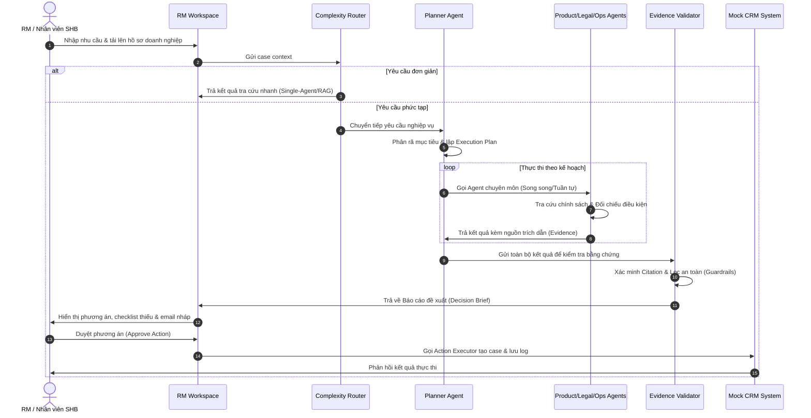
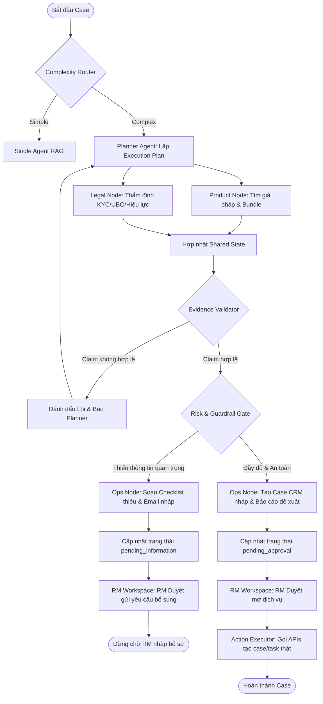
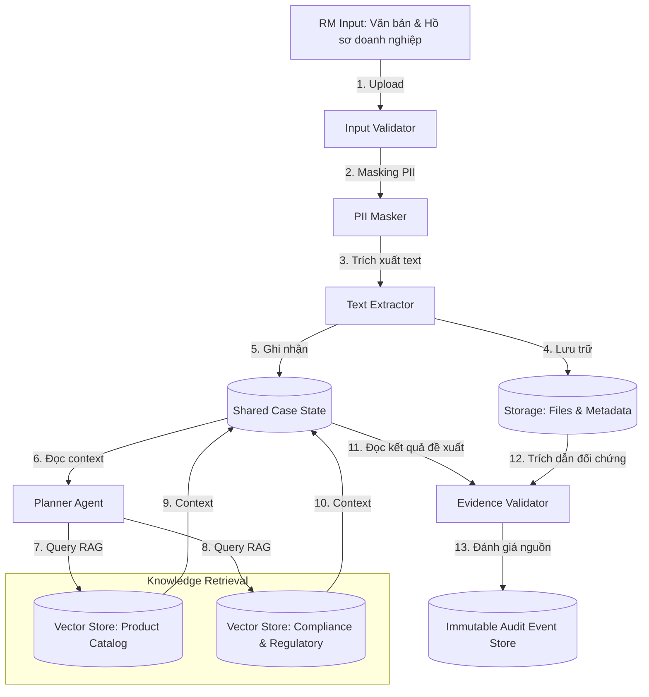

> Trích từ [`SHB_MULTI_AGENT_IMPLEMENTATION_PLAN.md`](../SHB_MULTI_AGENT_IMPLEMENTATION_PLAN.md) (dòng 103-272). Đây là bản trích để AI/dev chỉ cần load đúng module đang làm, không cần load toàn bộ 1156 dòng. Xem [`INDEX.md`](../INDEX.md) để biết thứ tự đọc và bản đầy đủ khi cần đối chiếu.

## 10. End-to-End Workflow
`[PROPOSED DESIGN]`

### Sơ đồ 1: End-to-End Workflow


---

## 11. Logical Architecture
`[PROPOSED DESIGN]`

Hệ thống được tổ chức thành 7 phân lớp logic tách biệt để đảm bảo tính module hóa và bảo mật:

```text
+-------------------------------------------------------------------------------+
|                            USER EXPERIENCE LAYER                              |
|   [RM Workspace]   [Case Detail Page]   [Timeline Trace]   [Approval Panel]   |
+-------------------------------------------------------------------------------+
                                      ↓ ↑
+-------------------------------------------------------------------------------+
|                            API APPLICATION LAYER                              |
|        [Case API]        [Document API]        [Workflow API]                 |
+-------------------------------------------------------------------------------+
                                      ↓ ↑
+-------------------------------------------------------------------------------+
|                          AGENT ORCHESTRATION LAYER                            |
|  [Complexity Router] -> [Planner Agent] -> [Product / Legal / Ops Agents]    |
|                                                     ↓                         |
|                         [Evidence Validator] & [Guardrail Gate]               |
+-------------------------------------------------------------------------------+
                                      ↓ ↑
+-------------------------------------------------------------------------------+
|                                 TOOL LAYER                                    |
|   [search_product_catalog]   [validate_business_reg]   [create_case_in_crm]   |
+-------------------------------------------------------------------------------+
                                      ↓ ↑
+-------------------------------------------------------------------------------+
|                                KNOWLEDGE LAYER                                |
|   [Product catalog KB]    [Compliance policy KB]    [SOP & Template KB]       |
+-------------------------------------------------------------------------------+
                                      ↓ ↑
+-------------------------------------------------------------------------------+
|                            STATE & STORAGE LAYER                              |
|     [Shared Case State]      [Relational DB]       [Vector DB (Chroma)]       |
+-------------------------------------------------------------------------------+
                                      ↓ ↑
+-------------------------------------------------------------------------------+
|                          SECURITY & GOVERNANCE LAYER                          |
|         [RBAC Gate]         [PII Masker]         [Immutable Audit Log]        |
+-------------------------------------------------------------------------------+
```

---

## 12. Runtime Architecture
`[PROPOSED DESIGN]`

### Sơ đồ 2: Agent Orchestration Graph (LangGraph)
Đồ thị biểu diễn luồng điều phối động, quản lý vòng lặp khi thiếu thông tin:



---

## 13. Data Architecture
`[PROPOSED DESIGN]`

### Sơ đồ 3: Data Flow Diagram
Biểu diễn đường đi của dữ liệu từ khi RM nhập vào cho đến khi lưu trữ và hậu kiểm:



---

## 14. Security Architecture
`[PROPOSED DESIGN]`

### Ranh giới Tin cậy (Trust Boundaries)
*   **User Space Boundary:** Giao diện RM Workspace chạy trên thiết bị đầu cuối của nhân viên SHB. Xác thực thông qua Single Sign-On (SSO).
*   **Application Boundary:** FastAPI App triển khai trên máy chủ nội bộ của SHB. Mọi kết nối ra ngoài (như gọi API LLM) đều phải đi qua Model Gateway bảo mật.
*   **System Integration Boundary:** Kết nối giữa Action Executor và hệ thống CRM/Core Banking mô phỏng. Bắt buộc sử dụng token phê duyệt tạm thời (`Approval Token`) được sinh ra sau khi RM nhấn nút duyệt.

---

