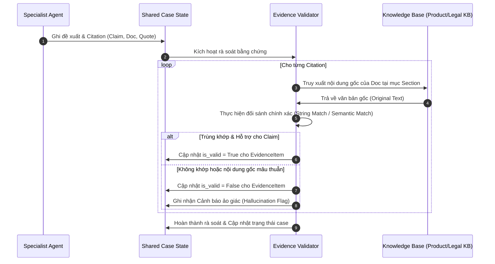
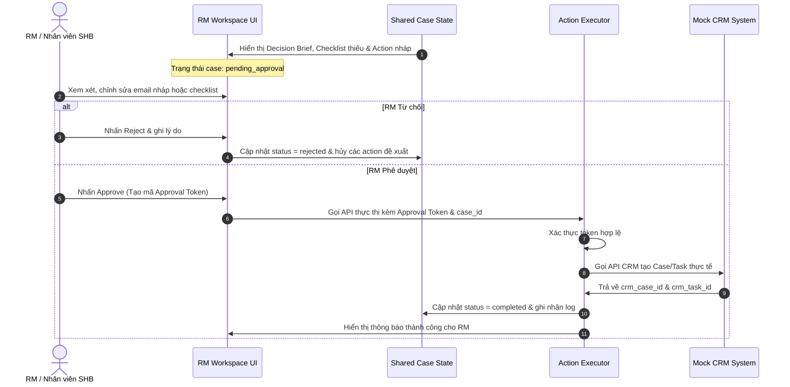

> Trích từ [`SHB_MULTI_AGENT_IMPLEMENTATION_PLAN.md`](../SHB_MULTI_AGENT_IMPLEMENTATION_PLAN.md) (dòng 486-572). Đây là bản trích để AI/dev chỉ cần load đúng module đang làm, không cần load toàn bộ 1156 dòng. Xem [`INDEX.md`](../INDEX.md) để biết thứ tự đọc và bản đầy đủ khi cần đối chiếu.

## 19. Evidence Validator
`[PROPOSED DESIGN]`

### Sơ đồ 4: Tool Calling & Evidence Validation Sequence
Sơ đồ biểu diễn quá trình xác thực độc lập các claim của Agent đối chiếu với tài liệu gốc:

### Phương thức kiểm tra kết hợp (Hybrid Validation)
Để tránh ảo giác hoàn toàn, hệ thống kết hợp 3 lớp xác thực:
1.  **Lớp 1 (Deterministic Check):** Sử dụng các biểu thức chính quy (Regex) và thuật toán so khớp chuỗi chính xác (String matching) để xác thực các thông số như tỷ lệ phí, hạn mức hoặc điều khoản được trích dẫn trong `quote` có tồn tại chính xác trong văn bản nguồn hay không.
2.  **Lớp 2 (Semantic Matching):** Sử dụng embedding để đo khoảng cách cosine giữa câu claim của Agent và văn bản gốc của điều khoản. Nếu độ tương đồng dưới $0.85$, đánh dấu cảnh báo nghi ngờ ảo giác.
3.  **Lớp 3 (LLM-as-a-Judge hỗ trợ):** Chỉ sử dụng một mô hình ngôn ngữ nhỏ được tối ưu để trả lời câu hỏi nhị phân: *"Nội dung trích dẫn này có trực tiếp hỗ trợ cho tuyên bố của Agent hay không?"* với rubric chấm điểm nghiêm ngặt.

---

## 20. Risk & Guardrail Gate
`[PROPOSED DESIGN]`

Hệ thống triển khai các bộ lọc an toàn đa tầng bảo vệ hoạt động nghiệp vụ:

### 20.1 Input Guardrails
*   **Prompt Injection Filter:** Sử dụng thư viện bảo mật chuyên dụng quét nội dung yêu cầu của RM và tài liệu tải lên để phát hiện và ngăn chặn các mã độc prompt injection nhằm thay đổi hướng đi của Graph.
*   **PII Detection & Masking:** Tự động phát hiện số tài khoản thẻ, mã PIN, hoặc các thông tin cá nhân nhạy cảm khác trong yêu cầu thô và thay thế bằng các thẻ ẩn danh trước khi gửi cho LLM.

### 20.2 Output Guardrails
*   **Deterministic Block Rules:** Chặn đứng mọi hành động gửi thông tin ra ngoài hoặc cập nhật cơ sở dữ liệu nếu case đang ở trạng thái lỗi pháp lý mức độ `Blocking` hoặc chưa có chữ ký duyệt điện tử của RM.
*   **Allowed-tool Allowlist:** Ràng buộc chặt chẽ quyền gọi tool ở mức độ API Gateway. Ví dụ: *Product Agent gọi API tạo case CRM sẽ bị hệ thống gateway chặn và ghi nhận log cảnh báo bảo mật*.

---

## 21. Human Approval
`[PROPOSED DESIGN]`

### Sơ đồ 5: Human Approval Sequence
Quy trình phê duyệt có chữ ký điện tử của RM trước khi hệ thống thực thi tác vụ nghiệp vụ:

---

