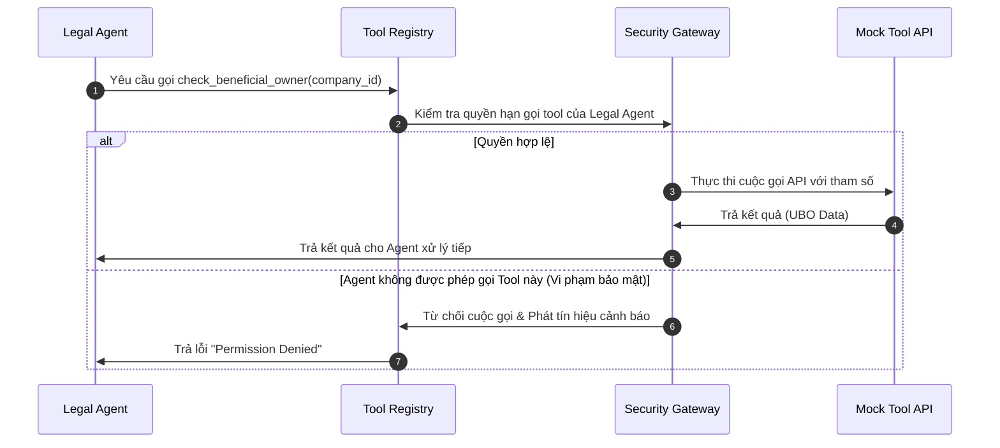
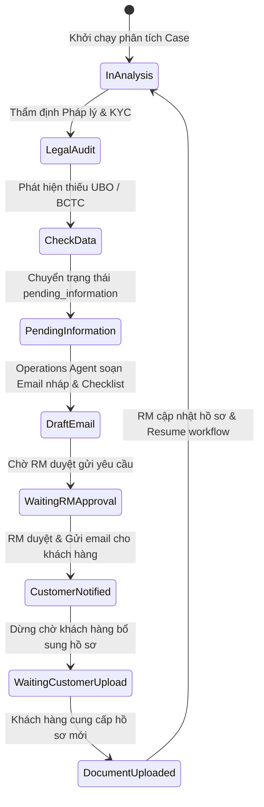
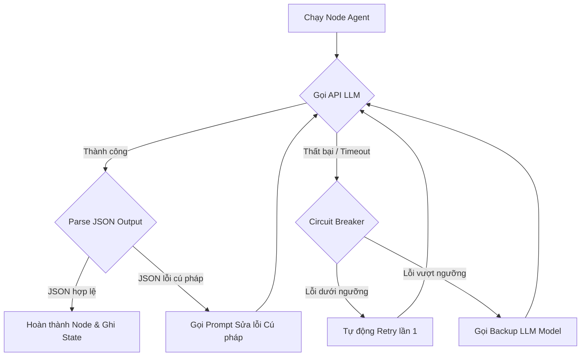

> Trích từ [`SHB_MULTI_AGENT_IMPLEMENTATION_PLAN.md`](../SHB_MULTI_AGENT_IMPLEMENTATION_PLAN.md) (dòng 1014-1156). Đây là bản trích để AI/dev chỉ cần load đúng module đang làm, không cần load toàn bộ 1156 dòng. Xem [`INDEX.md`](../INDEX.md) để biết thứ tự đọc và bản đầy đủ khi cần đối chiếu.

## 43. Acceptance Criteria
`[PROPOSED DESIGN]`

Hệ thống MVP được coi là đủ điều kiện nghiệm thu khi đáp ứng 5 tiêu chuẩn cốt lõi:
1.  RM tạo thành công case nghiệp vụ, hệ thống phân loại đúng độ phức tạp (Complexity Router hoạt động ổn định).
2.  Planner Agent lập được Execution Plan hợp lệ và phân phối đúng đầu việc cho các Agent.
3.  100% các kết luận sản phẩm và pháp lý hiển thị trên Workspace bắt buộc phải đi kèm trích dẫn văn bản chính sách hợp lệ được xác thực bởi Evidence Validator.
4.  Khi phát hiện lỗi chặn (như thiếu UBO hoặc tài liệu hết hạn), hệ thống tự động tạm dừng workflow nghiệp vụ và Operations Agent tạo thành công email nháp yêu cầu bổ sung thông tin chuẩn xác.
5.  Action Executor chỉ được gọi Mock APIs nghiệp vụ sau khi RM bấm nút Approve xác nhận trên giao diện.

---

## 44. Definition of Done
`[PROPOSED DESIGN]`

Đầu việc phát triển mã nguồn của một tính năng/Agent được coi là hoàn thành (Done) khi:
*   Mã nguồn đã đi qua khâu rà soát chéo (Code Review) và không chứa API keys hoặc secrets.
*   Đã viết đầy đủ Unit Tests và Integration Tests đạt tỷ lệ bao phủ dòng code (Code Coverage) tối thiểu 80%.
*   Đã chạy thử nghiệm ổn định trên toàn bộ 40 test cases của Golden Dataset.
*   Toàn bộThought Trace, logs và audit events hoạt động bình thường, ghi nhận đầy đủ vào cơ sở dữ liệu.
*   Tài liệu hướng dẫn triển khai và vận hành được cập nhật đầy đủ.

---

## 45. Appendix
`[PROPOSED DESIGN]`

### 45.1 Sơ đồ 7: Tool Calling Sequence Diagram
Chi tiết luồng gọi API và kiểm tra quyền hạn của Agent:



### 45.2 Sơ đồ 8: Missing-Information Loop State Machine
Luồng xử lý khi phát hiện thiếu thông tin hồ sơ của khách hàng:



### 45.3 Sơ đồ 9: Error Handling Flow
Luồng xử lý sự cố mạng hoặc lỗi mô hình khi đang chạy đồ thị:



### 45.4 Sơ đồ 10: Security Trust Boundaries
Ranh giới an toàn thông tin và cô lập dữ liệu của hệ thống:

```mermaid
graph TD
    subgraph User Zone (Untrusted Device)
        RM_Browser[RM Web Browser / Workspace UI]
    end
    
    subgraph SHB Secure Network (Trusted Zone)
        direction TB
        subgraph Application Gateway Boundary
            SSO[SSO Auth Handler]
            RBAC[RBAC Filter]
        end
        
        subgraph Core Multi-Agent App
            FastAPI[FastAPI Backend]
            LangGraph[LangGraph Engine]
            Validator[Evidence Validator]
        end
        
        subgraph Storage & DBs
            StateDB[(Shared State DB)]
            VectorDB[(Chroma Vector DB)]
            AuditStore[(Immutable Logs)]
        end
    end
    
    subgraph External Systems
        ModelGateway[SHB Model Gateway] --> CloudLLM[Cloud LLM Provider API]
    end
    
    RM_Browser -->|HTTPS + Authorization| SSO
    SSO --> RBAC
    RBAC --> FastAPI
    FastAPI --> LangGraph
    LangGraph --> StateDB
    LangGraph --> VectorDB
    LangGraph --> Validator
    Validator --> AuditStore
    FastAPI -->|Secured Proxy Connect| ModelGateway
```

---

## No-Hallucination Verification Checklist
`[PROPOSED DESIGN]`

Trước khi đưa kế hoạch này vào triển khai thực tế, đội ngũ phát triển bắt buộc phải kiểm tra và xác nhận đạt 100% các tiêu chí chống ảo giác sau:

*   [ ] **1. Không tự bịa thông tin SHB:** Xác nhận toàn bộ các tên sản phẩm cụ thể, hạn mức vay, mức phí dịch vụ, chính sách KYC/AML nội bộ và sơ đồ API của SHB đều đang được giữ dưới dạng biến placeholder (ví dụ: `<SHB_PRODUCT_CATALOG_DATA_REQUIRED>`) hoặc được gắn nhãn rõ ràng là `SYNTHETIC DEMO DATA`.
*   [ ] **2. Phân loại thông tin rõ ràng:** 100% các phần nội dung trong tài liệu đã được gắn nhãn phân loại chính xác: `CONFIRMED INPUT`, `PROPOSED DESIGN`, `ASSUMPTION`, `DATA REQUIRED`, hoặc `SYNTHETIC DEMO DATA`.
*   [ ] **3. Bảng đăng ký giả định đầy đủ:** Bảng Assumption Register đã ghi nhận đầy đủ các giả định về API CRM và dữ liệu tri thức của SHB kèm rủi ro và người chịu trách nhiệm xác minh.
*   [ ] **4. Khung câu hỏi mở rõ ràng:** Các câu hỏi nghiệp vụ và kỹ thuật cốt lõi cần SHB giải đáp đã được liệt kê chi tiết trong Open Questions Register.
*   [ ] **5. Trích dẫn nguồn (Traceability):** Đảm bảo cơ chế hoạt động của `Evidence Validator` đã được đặc tả kỹ lưỡng, kết hợp giữa đối khớp chuỗi cứng (Deterministic) và chấm điểm semantic thay vì chỉ phụ thuộc vào phán quyết của LLM Judge.
