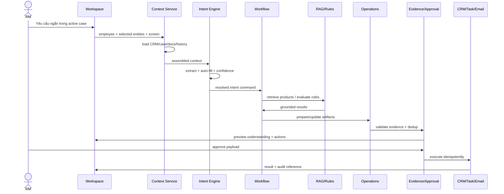

# 02 — Target Architecture

## 1. Logical architecture

```text
┌────────────────────────────────────────────────────────────────────┐
│ Experience: RM Workspace / Context Header / Intent Preview / HITL │
└──────────────────────────────┬─────────────────────────────────────┘
                               │
┌──────────────────────────────▼─────────────────────────────────────┐
│ API: Context / Case / Document / Workflow / Approval / Search     │
└──────────────────────────────┬─────────────────────────────────────┘
                               │
┌──────────────────────────────▼─────────────────────────────────────┐
│ Understanding: Context Assembler / Intent / Slots / Confidence    │
└──────────────────────────────┬─────────────────────────────────────┘
                               │
┌──────────────────────────────▼─────────────────────────────────────┐
│ Orchestration: Router / Planner / State Machine / Resume Planner  │
└───────────────┬─────────────────────┬──────────────────────────────┘
                │                     │
┌───────────────▼──────────┐  ┌───────▼─────────────────────────────┐
│ Knowledge & Rules        │  │ Operations & Safety                │
│ Product RAG / Legal RAG  │  │ Draft / Dedup / Evidence / HITL   │
└───────────────┬──────────┘  └───────┬─────────────────────────────┘
                │                     │
┌───────────────▼─────────────────────▼─────────────────────────────┐
│ Integration: SSO / IAM / CRM / DMS / Task / Email / Model GW     │
└──────────────────────────────┬─────────────────────────────────────┘
                               │
┌──────────────────────────────▼─────────────────────────────────────┐
│ Storage & Ops: PostgreSQL / Vector DB / Cache / Audit / Metrics   │
└────────────────────────────────────────────────────────────────────┘
```

## 2. Runtime flow



## 3. Synchronous versus asynchronous

| Operation | Mode | Reason |
|---|---|---|
| Context from workspace/cache | Sync | UI response nhanh |
| CRM profile read | Sync with timeout | Cần cho intent slots |
| Document ingestion/index | Async job | Có thể dài/OCR |
| Product/Legal retrieval | Sync | Phục vụ analysis request |
| Long multi-branch analysis | Async workflow | Retry/resume/trace |
| External writes | Sync acknowledgement + async safe retry | Idempotency |
| Eval/monitoring | Async | Không chặn user |

## 4. Trust boundaries

- Browser/employee device: untrusted input, authenticated session.
- Application boundary: API, workflow, validation.
- Knowledge boundary: ACL-filtered document access.
- Integration boundary: signed service calls to CRM/DMS/task/email.
- Model boundary: only sanitized/minimized context through model gateway.

## 5. Deployment profiles

### Local MVP

- FastAPI process.
- In-memory/mock CRM.
- Local/PostgreSQL optional state.
- Local vector index or synthetic catalog.
- No external writes.

### Pilot

- PostgreSQL + Redis.
- Persistent vector DB.
- Internal model gateway.
- SSO/IAM integration.
- Sandbox CRM/task/email.
- OpenTelemetry collector.

### Production target

- HA API/workers.
- Network segmentation and secrets manager.
- Immutable audit store.
- Backup/DR and retention controls.
- SLO/alerting and security certification.

## 6. Cross-module data rule

Mọi module giao tiếp qua typed state/command. Không chuyền dict tùy ý giữa node. Mọi adapter external chuyển response về internal domain model trước khi workflow sử dụng.

