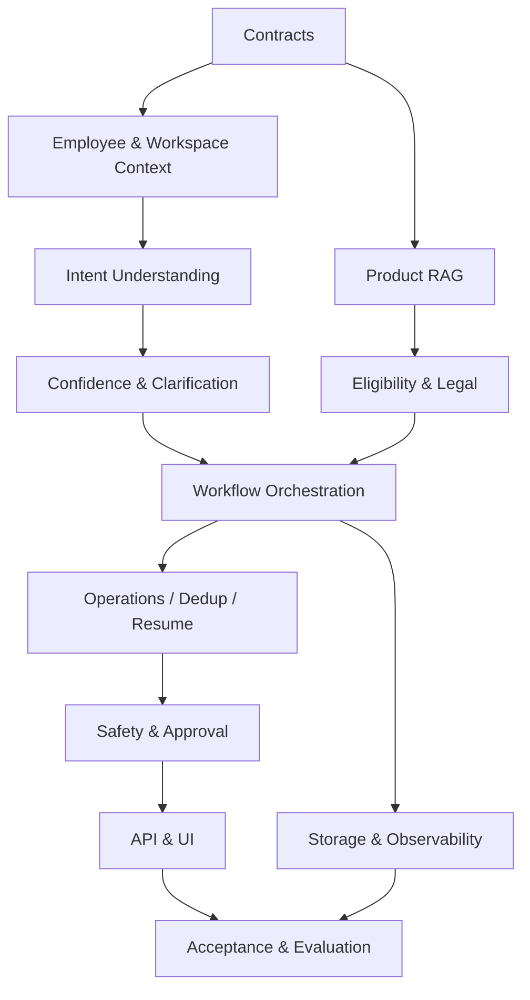

# INDEX — Context-Aware RM Workspace V2

Đây là điểm vào bắt buộc cho mọi phiên AI coding. Bộ plan này thay thế việc đọc rời rạc nhiều tài liệu và được thiết kế để các phiên AI build nối tiếp nhau mà không lệch schema, trạng thái hoặc trách nhiệm module.

## 1. Mục tiêu hệ thống

```text
Nắm bắt context nhân viên
→ hiểu intent và tự điền dữ liệu có sẵn
→ tìm sản phẩm có nguồn
→ kiểm tra điều kiện
→ tạo draft case/task/phản hồi
→ RM phê duyệt
→ thực thi có kiểm soát
```

Hai chỉ tiêu cốt lõi:

- `Unnecessary clarification rate < 5%`.
- `Unsafe external action rate = 0%`.

## 2. Quy tắc đọc bắt buộc

Trước khi code, AI phải đọc theo thứ tự:

1. `INDEX.md` — biết module và dependency.
2. `PROGRESS.md` — biết code hiện tại đã làm/chưa làm.
3. `00_AI_BUILD_PROTOCOL.md` — quy tắc sửa code và báo cáo.
4. Contract liên quan trong `contracts/`.
5. Chỉ các module trực tiếp liên quan đến task.
6. `15_ACCEPTANCE_TRACEABILITY.md` trước khi báo hoàn thành.

Không đọc và sửa toàn bộ repo theo suy đoán. Không thêm field vào state nếu chưa cập nhật contract trung tâm.

## 3. Source of truth

| Nội dung | File duy nhất được quyền định nghĩa |
|---|---|
| Shared state và status | `contracts/shared_case_state.schema.json` |
| Employee/workspace/customer context | `contracts/context_snapshot.schema.json` |
| Intent output | `contracts/intent_result.schema.json` |
| Tool input/output và quyền gọi | `contracts/tool_contracts.json` |
| Trách nhiệm module | Module plan tương ứng |
| Thứ tự triển khai | `14_BUILD_ORDER.md` |
| Tiêu chí hoàn thành | `15_ACCEPTANCE_TRACEABILITY.md` |
| Trạng thái build | `PROGRESS.md` |

Nếu markdown và JSON contract mâu thuẫn, JSON contract thắng. Nếu code cần khác contract, cập nhật contract + migration + tests + `PROGRESS.md` trong cùng thay đổi.

## 4. Danh mục module

| File | Phạm vi | Dependency chính |
|---|---|---|
| `00_AI_BUILD_PROTOCOL.md` | Quy tắc cho AI coding | — |
| `01_SCOPE_AND_PRODUCT.md` | Người dùng, phạm vi, KPI | — |
| `02_TARGET_ARCHITECTURE.md` | Kiến trúc và data flow tổng | 01 |
| `03_SHARED_CONTRACTS.md` | Cách sử dụng schema/tool contracts | contracts |
| `04_EMPLOYEE_WORKSPACE_CONTEXT.md` | Employee/workspace/customer context | 03 |
| `05_INTENT_UNDERSTANDING.md` | Intent, entity, provenance | 04 |
| `06_CONFIDENCE_CLARIFICATION.md` | Auto-fill, confidence, hỏi làm rõ | 05 |
| `07_PRODUCT_RAG.md` | Ingestion, retrieval, citation | 03, 05 |
| `08_ELIGIBILITY_LEGAL.md` | Rule engine, KYC/UBO, legal RAG | 03, 07 |
| `09_WORKFLOW_ORCHESTRATION.md` | Router, DAG, state machine | 04–08 |
| `10_OPERATIONS_DEDUP_RESUME.md` | Checklist, draft, dedup, resume | 08, 09 |
| `11_SAFETY_APPROVAL.md` | Guardrails, RBAC, approval, executor | 03, 09, 10 |
| `12_API_UI.md` | API và RM Workspace | 03–11 |
| `13_STORAGE_OBSERVABILITY_RELIABILITY.md` | DB, trace, metrics, fallback | 03, 09, 11 |
| `14_BUILD_ORDER.md` | Backlog, dependency, file mapping | tất cả |
| `15_ACCEPTANCE_TRACEABILITY.md` | Test, acceptance, DoD | tất cả |
| `16_EVALUATION_DATASETS.md` | Dataset schema, labeling, regression | 04–13 |
| `17_ASSUMPTIONS_OPEN_QUESTIONS.md` | Giả định, data required, quyết định mở | 01–16 |

## 5. Dependency graph



## 6. Trạng thái chuẩn

Chỉ dùng các trạng thái trong `shared_case_state.schema.json`:

```text
new → understanding → clarification_required → planned → in_analysis
→ pending_information | pending_review | pending_approval
→ executing → completed | rejected | failed
```

## 7. Quy tắc chống lệch giữa module

- ID trong mọi module dùng chung: `case_id`, `trace_id`, `employee_id`, `customer_id`, `task_id`, `document_id`.
- Mọi output có `schema_version`.
- Mọi field suy luận có `source`, `confidence`, `confirmed`.
- Mọi tool call phải qua Tool Registry.
- Mọi external action phải qua Approval Service và idempotency gate.
- Product/Legal claim quan trọng phải có Evidence Item.
- Không module nào tự gửi email hoặc tạo CRM record.
- Không tạo task mới trước khi chạy deduplication.
- Resume chỉ chạy lại node bị ảnh hưởng.

## 8. Cách bắt đầu một task

1. Chọn task ID trong `14_BUILD_ORDER.md`.
2. Đánh dấu `In Progress` trong `PROGRESS.md`.
3. Đọc contract và module liên quan.
4. Viết test từ acceptance criteria trước hoặc đồng thời với code.
5. Implement đúng file mapping.
6. Chạy unit + integration + regression liên quan.
7. Cập nhật `PROGRESS.md`, deviation và evidence of working code.
